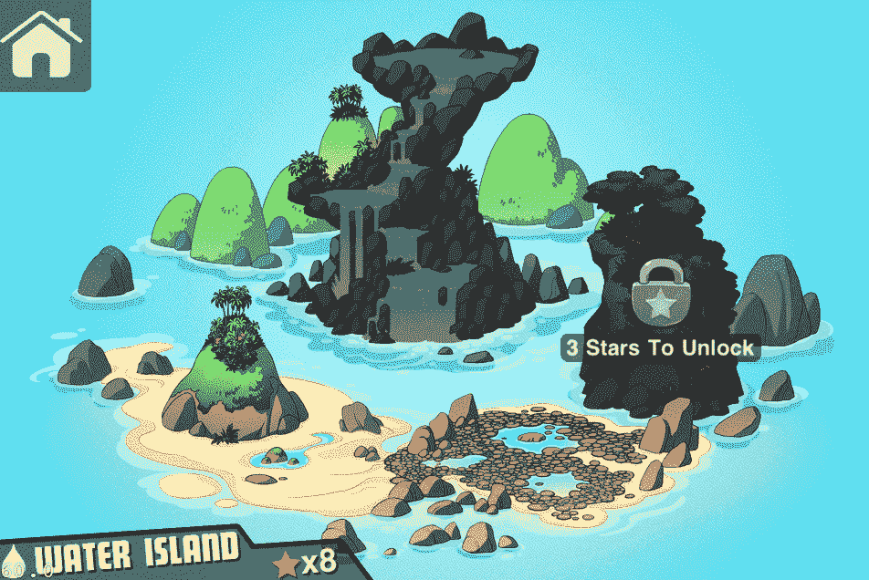
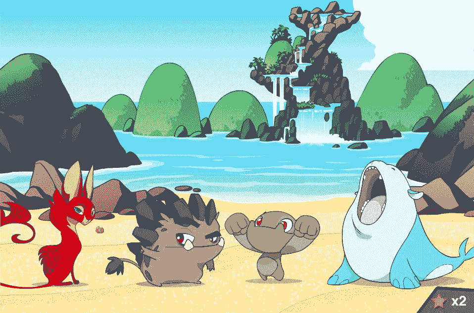

# MinoMonsters 从 Andreessen Horowitz、SV Angel 等公司获得 100 万美元，用于移动怪物大战 TechCrunch

> 原文：<https://web.archive.org/web/https://techcrunch.com/2011/11/10/minomonsters-nabs-1-million-from-andreessen-horowitz-sv-angel-and-more-for-mobile-monster-battles/>

今年年初，乔希·巴克利和泰勒·迪亚兹在 Y Combinator 的春季创业班中，忙于打造他们新的受口袋妖怪启发的社交游戏 [MinoMonsters](https://web.archive.org/web/20221206041749/http://minomonsters.com/) 。YC 创始人兼合伙人保罗·格拉厄姆当时表示，巴克利和迪亚兹分别只有 18 岁和 17 岁，是加速器有史以来接受的最年轻的一对创始人。今天，巴克利可以在这份名单上再添一项荣誉，因为他现在是迄今为止[安德森·霍洛维茨](https://web.archive.org/web/20221206041749/http://www.crunchbase.com/financial-organization/andreessen-horowitz)投资过的最年轻的首席执行官。

没错。MinoMonsters 团队今天宣布，它在 2011 年期间从一群令人印象深刻的投资者那里筹集了总计 100 万美元的种子资金，其中包括安德森·霍洛维茨、 [SV Angel](https://web.archive.org/web/20221206041749/http://www.crunchbase.com/financial-organization/sv-angel) 、 [Y Combinator](https://web.archive.org/web/20221206041749/http://www.crunchbase.com/company/y-combinator) 、[尤里·米尔纳](https://web.archive.org/web/20221206041749/http://www.crunchbase.com/person/yuri-milner)、 [General Catalyst](https://web.archive.org/web/20221206041749/http://www.crunchbase.com/financial-organization/general-catalyst-partners) 、 [Ignition Partners](https://web.archive.org/web/20221206041749/http://www.crunchbase.com/financial-organization/ignition-partners) 、[雷蒙德·汤辛](https://web.archive.org/web/20221206041749/http://www.crunchbase.com/person/raymond-tonsing)和 Reddit 联合创始人[亚历克西斯·奥哈尼安](https://web.archive.org/web/20221206041749/http://www.crunchbase.com/person/alexis-ohanian)

在新资本注入的支持下，MinoMonsters 在旧金山市中心开设了办事处，将其团队扩大到 11 人，并将完成其同名旗舰社交游戏 MinoMonsters 的开发，该游戏将于 12 月 6 日在 App Store 上首次亮相。(安卓和 Windows 版本正在路上。)

当我们在 3 月份第一次介绍 MinoMonsters 时，Buckley(现在 19 岁)告诉我们，这家初创公司刚刚从“业内最大的公司之一”聘请了一名最年轻的工程师。

今天，MinoMonsters 官方透露，它已经增加了 25 岁的 TJ Murphy 作为联合创始人和技术主管。墨菲是 Zynga 的前产品经理，是社交游戏网络(SGN)T1 的联合创始人，他在那里帮助创建了 Warbook，这是早期以脸书为核心平台的社交游戏之一。(SGN 后来被 Myspace 收购。)创始人表示，墨菲将领导 MinoMonsters 的发展以及公司的技术战略——最初的创始人泰勒·迪亚兹(Tyler Diaz)选择了酷，并完成了高中学业。

早在 3 月份，MinoMonsters 推出了网络客户端，并在 Zynga 的带领下，进军脸书。但是移动游戏和移动技术的飞速发展已经不容忽视，所以创始人决定转向，将游戏从脸书移除，并忙于将 MinoMonsters 转变为一个纯移动游戏。

然而，游戏的核心仍然存在，因为这款售价 1 美元的 iOS 应用程序将向玩家介绍一系列疯狂的生物，他们必须捕捉并训练这些生物，以便在一系列一对一的战斗中使用，以保护“传奇的赞卡迪王国”的和平。故事是这样的，在过去的一千年里，一些巨大的灾难震撼了金杜姆，创造了所谓的小怪物，并赋予他们特殊的力量，让他们在一系列的岛屿上独自生活。但是，正如经常发生的情况一样，邪恶正在降临这片土地，游戏玩家必须训练这些怪物来驾驭他们的力量，并击败，嗯，我的猜测是:邪恶的侵蚀力量。

基本上，为了在一系列的战斗中取得成功，游戏玩家必须学会如何训练和控制这些怪物，它们都有自己鲜明的个性。目标是控制怪物的特殊能力(火、水、土等等)。)，随着玩家越来越擅长管理他们的野兽，他们在游戏中的进步就越大。

该游戏提供单人和多人模式，但后者显然是该团队的重点，因为他们希望 MinoMonsters 成为首批几乎迫使玩家与朋友一起玩的 iOS 游戏之一。

不仅如此，创始人告诉我，他们的目标不仅仅是建立一家移动游戏开发公司或社交游戏企业，他们希望将 MinoMonsters 打造成为愤怒的小鸟系列中的一个大型品牌。因此，目前的重点不是在一套游戏中增加更多的游戏，(尽管这仍然是可能的)而是推出一款引人入胜、社交化的游戏，这可能会导致填充动物玩具、动画卡通等。沿着这条路。

这真的完全是出自 Rovio/愤怒的小鸟的剧本。而且，随着这些千禧一代看到口袋妖怪将其品牌专注于主机游戏的开发，他们认为他们通过将注意力集中在移动领域(口袋妖怪游戏尚未真正起飞的领域)而在任天堂的优步特许经营中占据优势。

当然，最终，大牌投资者的投资和对 Zynga 战略的深入了解只是成功的一半。关键是提供引人入胜的游戏，原创的叙事，避免重复的角色，关卡和控制。根据早期的观察，这部动画似乎很流行，而且学习控制你的宠物怪物的特殊能力是一件非常有趣的事情。问题是，这是否会对年轻和年长的观众产生广泛的吸引力，以及多人移动游戏是否准备好将怪物战斗广泛采用并超过临界点。

这还有待观察，但目前为止，一切顺利。当 MinoMonsters 登陆 App Store 时，绝对值得一试。请插话让我们知道你的想法。

