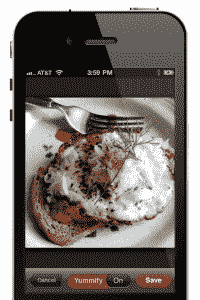

# 食谱搜索和分享服务 Foodily 登陆 iPhone TechCrunch

> 原文：<https://web.archive.org/web/https://techcrunch.com/2011/11/10/recipe-search-sharing-service-foodily-arrives-on-iphone/>

# 食谱搜索和分享服务 Foodily 登陆 iPhone

食谱搜索引擎 [Foodily](https://web.archive.org/web/20230203110000/http://www.foodily.com/) 今天将登陆手机，一款全新的 iPhone 应用程序将允许用户在旅途中搜索食谱，查看他们的朋友喜欢什么食谱，并通过 iPhone 摄像头拍摄的照片分享他们自己的推荐。

除了社交功能，该应用程序还提供对 Foodily 食谱搜索引擎的移动访问，因此当你外出时，你可以找到你需要的食材。

新的 Foodily iPhone 应用程序有一点点[美食发现](https://web.archive.org/web/20230203110000/http://www.foodspotting.com/)的感觉，因为它还可以让你拍摄和分享美味佳肴的照片，并与朋友分享。食谱和照片可以直接分享到 Foodily 的网站上，也可以通过应用程序的脸书集成分享到你更广泛的社交网络上，这充分利用了 F8 推出的新“开放图表”功能。但是，虽然 Foodspotting 是关于寻找和分享当地餐馆的美味菜肴，但 Foodily 的拍照功能是关于分享你自己创造的菜肴。

 不过，这不仅仅是吹牛。你通过 Foodily 拍摄的照片被附在网上的食谱上，这样人们就可以看到它实际上是如何制作的。甚至还有一个所谓的“Yummify”功能，可以增强手机照片，使它们在网络上共享时看起来更像高质量的照片。(具体来说，该应用程序增加了白点的对比度优化，锐化了图像并增加了颜色饱和度，如果你必须知道的话)。

为了发现新的食谱，有一个支持电子邮件的 Foodily 食谱搜索引擎，以防你需要提醒自己、朋友或家人你以后需要购买的食材。

尽管在菜谱搜索领域有很多竞争者，Foodily 还是有一些势头，它已经从 Index Ventures 那里为[筹集了 500 万美元。这项服务是由前雅虎人(Yahooligans？)安德里亚·卡特莱特和希拉里·米克尔。](https://web.archive.org/web/20230203110000/https://techcrunch.com/2011/02/01/foodily-brings-social-goodness-and-menu-sharing-to-recipe-search-engine/)