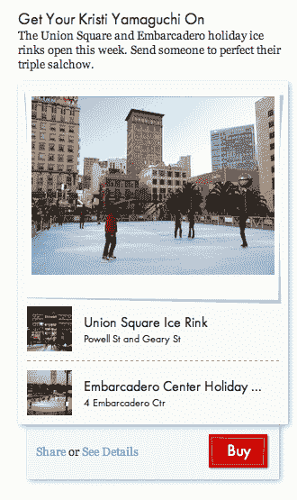

# Giftly 现在允许你赠送发现的礼物(和一些钱)

> 原文：<https://web.archive.org/web/https://techcrunch.com/2011/11/11/giftly-now-lets-you-give-the-gift-of-discovery-and-some-money-too/>

总部位于旧金山的初创公司 Giftly 正寻求帮助你一石二鸟:通过网络快速给你的朋友和家人送礼品卡，并向他们介绍他们(或你)从未听说过的有趣的新餐馆和场所。该公司还宣布，继去年 3 月的 180 万美元融资之后，它又筹集了 60 万美元。

自推出以来，Giftly 使向朋友发送虚拟礼品卡变得很容易。但是它不仅仅关注于寄钱——你应该告诉你的朋友他们应该把钱花在哪里。如果你住在另一个城市，这可能是个问题。因此，本周该网站推出了一个“礼物创意”栏目:Giftly 现在正在聘请策展人，他们将你的朋友可能会喜欢的各种活动和餐馆捆绑在一起。

对于那些没有尝试过 Giftly 的人来说，下面是这个过程是如何进行的:

假设你想给你的朋友 20 美元作为生日礼物。首先，你要去 Giftly.com，选择你想捐多少。接下来，你可以指定最多三个你的朋友可以兑换礼物的地方——无论是餐馆、零售店还是任何你喜欢的地方。最后，你通过脸书或电子邮件发送礼物。你也可以附上一张图片和一条信息来帮助美化一下。

礼物可以通过智能手机应用程序兑换——你只需点击一个按钮，你的信用卡就会收到礼物的金额。该服务不使用任何商户 API 或与您的信用卡公司的接口，因此您不必弄清楚使用哪张卡或向商户显示任何内容。这也意味着你可以立即兑现你的礼物，并把金额加到你的信用卡里，而不用在你朋友最初建议的地方使用它。

这似乎有点违反直觉。那么 Giftly 为什么要用这个设置呢？

首席执行官蒂莫西·本特利说这个系统有几个好处。第一，因为 Giftly 实际上不与任何商家打交道，它不需要销售团队，它可以在任何地方工作——你可以指定任何你喜欢的地点、活动或餐馆。第二，他说将购物卡的使用限制在特定的商家是一种对商家有价值的做法，但对消费者没有任何价值。

这项服务最初是*用来检查你手机的位置数据，以验证你的购买是在你朋友之前选择的地点，但它决定，如果人们想在其他地方花钱，他们可以。他说，虽然你可以在任何地方使用礼物，但大多数人最终还是会在他们朋友最初建议的地方使用(我怀疑这是因为该网站暗示他们*有*可以这样做)。*

Giftly 有几个竞争对手也在试图围绕礼物和礼品卡进行创新，包括 [Giftiki](https://web.archive.org/web/20230205010931/http://www.giftiki.com/) (让朋友们聚在一起赠送一份大礼)和 [Treatful](https://web.archive.org/web/20230205010931/https://secure.treatful.com/) (专注于餐厅)。

