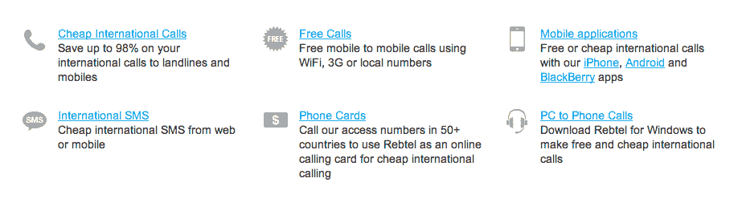

# TC Gadgets 周末赠品:一部 iPhone 4S TechCrunch

> 原文：<https://web.archive.org/web/http://techcrunch.com/2011/11/12/tc-gadgets-weekend-giveaway-an-iphone-4s/>

# TC Gadgets 周末赠品:一部 iPhone 4S

我给了我的爱人一朵红红的玫瑰，但她实际上想要一部 iPhone 4S，现在你也可以把这些令人兴奋的产品之一交给你的爱人，这要感谢 Rebtel。本周末的 TC Gadgets 赠品是一部全新的 iPhone 4S(你的运营商选择)和价值 100 美元的通过 [Rebtel 的 VOIP 解决方案](https://web.archive.org/web/20230203065730/http://www.rebtel.com/)拨打电话。引起你的注意了吗？很好。

比赛将持续到东部时间 11 月 14 日星期一中午。我会联系获胜者，并在下周更新帖子。要参赛，请在下面评论，用诗的形式描述为什么你值得拥有一部 iPhone 4S。打油诗可以接受，但必须涉及来自楠塔基特岛的男子。自由或具体的诗句是鼓励的。

仅输入一次。我将随机挑选一个获胜者，在我自己的时间里嘲笑你的参赛作品。我保留在地铁上出售你的诗集的权利，称它们为我的“城市民间诗歌”和“诗歌缪斯的祈祷”

特别感谢 Rebtel 获得大奖。

更新——祝贺史蒂夫·马克特和他的诗:

我觉得我配得上那个 4S，
我做了多少都不为过。
我现在能对你说的就是，我的手机是黑莓手机，
我真的很想摆脱这个困境。