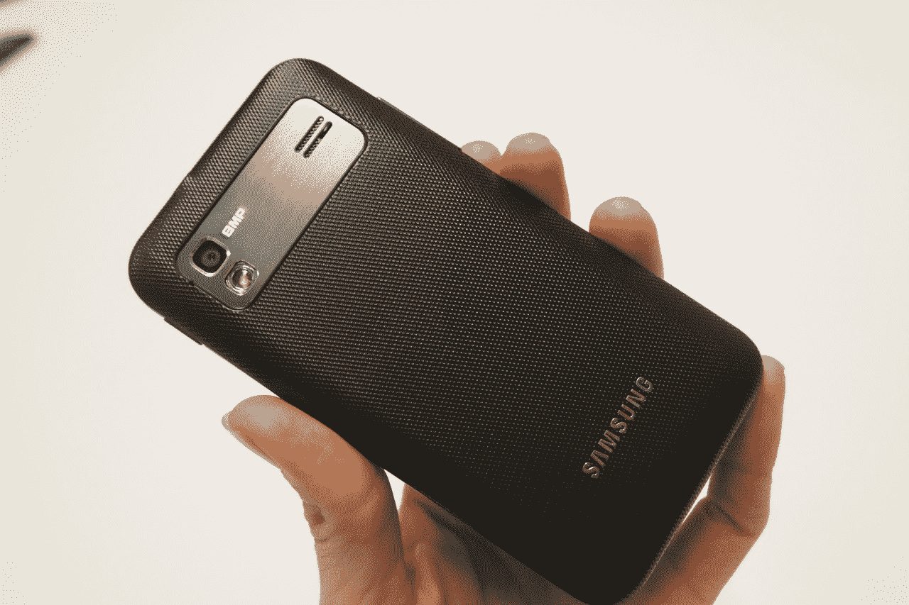

# 美国电话电报公司 TechCrunch 三星 Captivate Glide 的实际操作

> 原文：<https://web.archive.org/web/https://techcrunch.com/2011/11/14/hands-on-with-the-samsung-captivate-glide-for-att/>

你可能已经对三星 Captivate Glide 有所了解，但它并没有得到应有的关注。今天，这种情况发生了变化。我有机会近距离接触新的 Android slider，并发现它对于任何无法忍受触摸屏键盘的人来说都是一款坚固的小手机。

更新一下，三星 Captivate Glide 将在美国电话电报公司的 4G HSPA+网络上运行，并运行 Android 2.3 姜饼。它配备了 4 英寸的 Super AMOLED 触摸屏，引擎盖下有一个双核 1GHz 处理器。你会发现背面有一个 800 万像素的闪光灯，能够以 1080p 拍摄视频，还有一个 130 万像素的前置摄像头，用于视频聊天。它有 1GB 的内存，8GB 的内部内存，支持高达 32GB 的 microSD 卡。当然，Captivate Glide 支持 HDMI out，当然还配备了滑动式四排 QWERTY 键盘。

乍一看，Captivate Glide 并不一定出众。它很像你以前见过的任何其他 Android 滑盖手机，但在性能方面可以与 Droid RAZR 和 HTC Rezound 竞争。事实上，如果你正面看它，Captivate Glide 让我想起了许多[三星 Galaxy S II](https://web.archive.org/web/20230210005052/https://techcrunch.com/2011/08/30/hands-on-samsungs-galaxy-s-ii-for-att-t-mobile-and-sprint/) ，有圆角和非常(抱歉这么说，三星)类似 iPhone 的形状。

然后你拿起手机，发现它厚了很多(当然，是为了给 QWERTY 键盘腾出空间)，背面有一层漂亮的纹理。它可能会比你的标准塑料背板拾取更多的碎屑，但它也更舒适，握感更好，感觉有点贵。键盘摸起来很结实，来回滑动很顺畅。480×800 的显示屏还好，但没有像 SGS II 上的 Super AMOLED Plus 显示屏那样让我刮目相看。

Captivate Glide 实际上比它看起来更轻，但我仍然不一定称它为轻。虽然它与外面的一些大家伙有一些共同的规格，但你肯定是在为 QWERTY 滑动键盘放弃一个薄的小腰线。大多数滑块都是这种情况，喜欢物理键盘的文字爱好者往往已经知道这是等式的一部分，但它仍然值得注意。

总而言之，三星 Captivate Glide 是一个智能的小滑块，应该可以为目前主导市场的无键盘糖果提供一个可靠的、强规格的替代品。价格和可用性尚未公布。