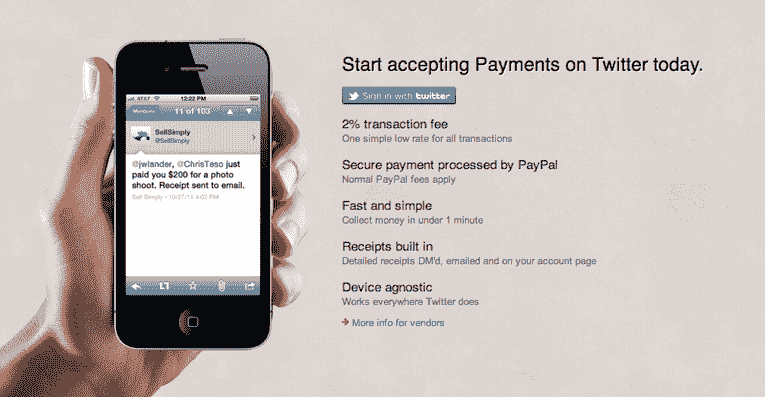
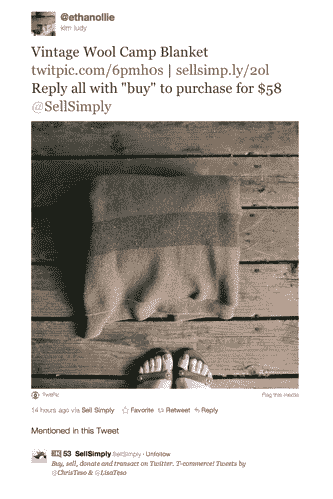

# Sell Simp.ly 希望你在 Twitter 上直接购买、出售和捐赠(通过任何设备)

> 原文：<https://web.archive.org/web/https://techcrunch.com/2011/11/14/sell-simply-wants-you-to-buy-sell-and-donate-direct-on-twitter-from-any-device/>

品牌正越来越多地转向脸书，既作为一个做广告的地方，也作为一个补充平台，借此建立自己的在线存在，并开始进行社交商务。例如，有很多解决方案可以让大公司和小公司在脸书经营零售店面，销售商品，并在一定程度上管理交易。

但是另一个流行的社交网络 Twitter 呢？“微博”平台无疑已经成为名人和品牌兜售产品、提高品牌知名度以及与客户互动的工具，所以问题就来了:为什么 Twitter 不能也提供一些与脸书相同的电子商务功能呢？

这有很多原因，但首先，Twitter 主要专注于做好一件事:建立互联网必须提供的最好的实时交流平台。还有一个事实是，Twitter 有“一致的用户体验”的特权，并不总是与第三方开发者有最好的关系。

因此，品牌通常将 Twitter 作为一个间接的广播平台，列出待售商品，但这样做的目的只是为了将客户从 Twitter 吸引到他们自己的电子商务平台。(脸书还努力让商业和交易在其平台上进行，而不是被重定向到零售商的主页。)

但是 [Chris Teso](https://web.archive.org/web/20230204235333/http://www.linkedin.com/in/christeso) 看到了 Twitter 上直接电子商务的巨大机会，这就是为什么他在 7 月份推出了[Sell Simply](https://web.archive.org/web/20230204235333/http://www.crunchbase.com/company/sell-simply)——一种让消费者和品牌能够在 Twitter 上购买、出售和交易的简单方式。本质上，Sell 只是把 Twitter 变成了一个 eMarketplace，允许用户通过回复“购买”来买卖 Twitter 上的任何东西。

用户可以在 Sell 上简单地列出一件待售商品，或者从其他商业平台(如 Etsy、Ebay、Craigslist、ArtFire 或 Bonanza)导入他们的商品，并自动将这些商品发布出去出售。用户只需将他们的 Sell Simply 帐户与 Twitter 和 PayPal 连接，这样当有人用“购买”回复该推文时，Sell Simply 就会通过 PayPal 促进交易，使用户能够通过一条推文购买和出售一件商品。(转发也是可交易的。)

除了允许消费者和品牌在 Twitter 上直接向他们的客户销售，这家初创公司还为其用户提供了创建自己店面的机会。通过 Sell Simply 的“简单商店”,用户可以将 Twitter 上正在出售的商品的所有列表聚合在一起，这样用户就可以在一个地方找到它们。他们还可以添加描述、标签、照片，并编辑每个列表的许多其他字段。更重要的是，该平台有一个全自动的运费计算器，例如，允许卖家在价格中设置自己的运费选项，以便购物成本可以包括在列表价格中，或者可以设置为“仅本地取件”等。

而且，如上所述，Sell 只是有一个 [Chrome 扩展](https://web.archive.org/web/20230204235333/https://chrome.google.com/webstore/detail/ojaeikpecldleicicnjdbmlabkgfnkmn)，让那些已经在 Etsy、Ebay 等网站上出售商品的人可以轻松导入他们的商品。

为了使 Twitter 上的直接买卖过程不受设备限制，Sell Simply 推出了 [Chirp](https://web.archive.org/web/20230204235333/http://sellsimp.ly/chirp) ，现在允许用户在任何地方用任何设备支付。要进行 Chirp 支付，用户只需发送一条类似于*" @ sell simply # pay @ the payee $ 200 for[所述项目]"* 的推文。用户可以支付少至 1 美元或高达 2000 美元的费用。(这就是 Sell 赚钱的简单方式:创业公司对每一笔交易收取 2%的交易费。)

这使得品牌和卖家可以在不到 1 分钟的时间内将钱直接汇入他们的贝宝账户。然后，详细的 PayPal 收据会通过直接信息自动发送给买家，以便他们有额外的方式来确保交易已经完成。

 此外，在安全性方面，由于所有交易都是通过 PayPal 进行的，因此当客户满足 PayPal 的要求时，他们对未经授权的购买不承担任何责任，反过来，他们可以利用错误订单或从未到达的商品的退款。

自 7 月份推出以来，该平台已经积累了超过 1000 名成员，在 Twitter 上列出了超过 10，000 种待售商品，Teso 表示，Sell Simply 的 75%的成员已经将他们的 PayPal 和 Twitter 账户连接到该平台，他认为这是一个令人鼓舞的证据，表明人们已经准备好迈出这一大步，开始将 Twitter 用作一个直接销售平台。到目前为止，平均交易价格为 35 美元，最常见的商品是复古服装和摄影作品(因为许多用户来自 Etsy)，但他预计随着越来越多的人开始连接到该平台，商品将变得多样化。

至于未来的道路，Teso 计划推出一个“T-commerce”平台，旨在扩大 Sell Simply 对品牌的可能用途，其功能将包括与后台电子商务工作流程、分析和推荐引擎的集成，例如，推荐引擎将根据用户的推文推荐商品。Teso 说，对于对此类功能感兴趣的品牌，将收取许可费。

显然，对于品牌而言，Sell Simply 目前的产品和将于今年年底推出的市场功能的价值定位可能是巨大的。如果你是一个品牌，Twitter 是传播闪购和时效性交易的完美平台，Sell Simply 的一推即买服务将使这变得更加容易。

对于非营利组织，Sell 简单地使用相同的交易公式将 Twitter 转变为一个捐赠平台，允许人们通过一条推文捐赠他们选择的慈善机构。

正如品牌希望利用脸书作为一个社交商务平台可以帮助创造规模，以便更多的观众会看到很酷的产品或销售，因为用户会将这些产品贴在他们的墙上或与朋友分享，Teso 说他在 Twitter 上看到了类似的电子商务机会。

如果一个人碰巧在 Twitter 上通过 Sell Simply 出售他们的自行车，那么用户的朋友很有可能会转发该列表，他们的追随者也会效仿。如果这些人转而转发给他们的粉丝，那么，你就明白了。突然之间，你的商品清单可能会吸引第五度分离者的眼球，他们可以回复并立即购买该商品。有了 Chirp，这一切都可以在您外出时实现。

它就像 Square，但你不需要额外的设备(一个正方形)——或者信用卡。相当酷。

[点击这里查看《在家简单销售》,让我们知道你的想法](https://web.archive.org/web/20230204235333/http://sellsimp.ly/)。