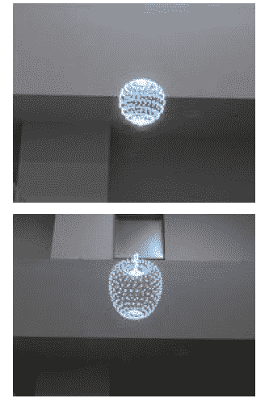

# 空中 3D:令人惊叹的系统在半空中显示 3D 物体，没有屏幕(视频)

> 原文：<https://web.archive.org/web/http://techcrunch.com/2011/11/15/aerial-3d-amazing-system-shows-3d-objects-in-mid-air-with-no-screen-video/?utm_source=dlvr.it&utm_medium=twitter>

# 空中 3D:令人惊叹的系统在半空中显示 3D 物体，没有屏幕(视频)

自 2006 年以来，总部位于东京的 [Burton](https://web.archive.org/web/20230204135113/http://www.burton-jp.com/en/index.htm) 一直致力于空中 3D，这项技术使得在空中或水下制作 [3D](https://web.archive.org/web/20230204135113/https://techcrunch.com/tag/3d) 图片成为可能——不使用屏幕(这就是我所说的“真正的 3D 技术”)。伯顿说他们的激光系统是同类中唯一的。

目前的系统以每秒 50，000 点(从 2006 年的大约 1，000 点)和 10-15 的帧速率投影 3D 物体。Aerial 3D 的工作原理是聚焦激光，产生“空气中氧气和氮气的等离子体激发”。

 正如你在下面的视频中看到的，该技术在画质方面仍有一定的改进空间(伯顿目前正在尝试提升帧率)，但可以清晰地看到 3D 物体漂浮在半空中:
【YouTube = http://www . YouTube . com/watch？v = EndNwMBEiVU&w = 560&h = 315】

*视频由 [Diginfo TV](https://web.archive.org/web/20230204135113/http://www.diginfo.tv/2011/11/14/11-0231-r-en.php)* 提供