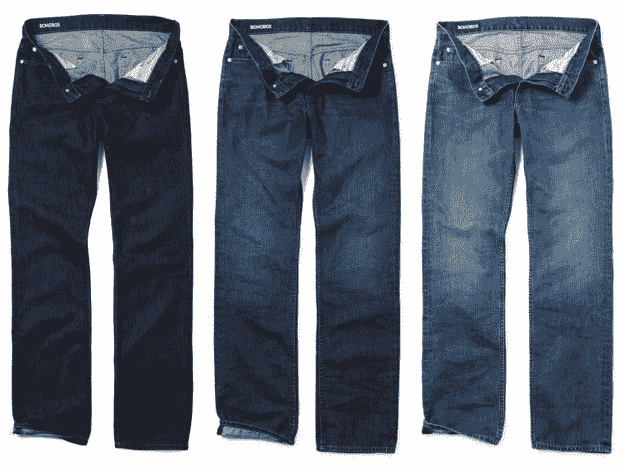

# 服装品牌 Bonobos 网罗网飞工程总监 TechCrunch

> 原文：<https://web.archive.org/web/http://techcrunch.com/2011/11/15/clothing-brand-bonobos-snags-netflix-director-of-engineering/?utm_source=dlvr.it&utm_medium=twitter>

# 服装品牌 Bonobos 网罗网飞工程总监

仅在网上销售的高级男装品牌 Bonobos 刚刚宣布聘请网飞前社交系统工程总监 Michael Hart 担任首席技术官。哈特表示，他希望“领导一家早期公司”，并很高兴能在个性化和社交网络方面应用他在网飞学到的东西。

Hart 拥有 Bowling Green 州立大学的工商管理学士学位，曾在微软担任产品部门经理。在那家公司工作期间，他发起了网飞的社会融合和网飞 API。

“现在我正在做标准的 CTO 工作，比如保持服务器运行，”他说。“我们正在确保我们的商店在网络星期一正常运营。”

哈特说，然而，真正的机会是利用倭黑猩猩客户群的社交图谱来评估他们的需求，并围绕即将到来的时尚趋势进行规划。“根据客户的个人资料，你可以对他们了解很多，”他说。“他们的年龄，他们的关系状况，他们会去找第一份工作吗？他们是东海岸、西海岸还是中西部？”那么，目标将是向 Bonobos 客户销售更多个性化商品。

该公司还为他们的新[牛仔系列](https://web.archive.org/web/20230204230126/http://www.bonobos.com/denim)推出了一个“预购微型网站”，以比几乎任何其他高级牛仔供应商都低得多的价格出售锥形牛仔([锥形显然是一件大事](https://web.archive.org/web/20230204230126/http://www.conedenim.com/))牛仔裤。预购系统已经有 3400 人注册。人们谁进入他们的电子邮件将收到早期获得牛仔裤。

 
*不穿裤子*

倭黑猩猩首席执行官兼联合创始人安迪·邓恩(Andy Dunn)表示，哈特将帮助该品牌利用社交媒体。“我们认为，随着时间的推移，购物将变得更加社会化。我们称之为“社会商业”“邓恩说，倭黑猩猩将于 1 月份在帕洛阿尔托开设办事处，该公司正在西海岸招聘员工。

哈特说，在一家服装初创公司工作与在网飞工作没有太大不同。“在很多方面，网飞以像一家大型初创公司一样运营而自豪。这种转变不会那么不和谐，”他说。至少他能穿得很好。