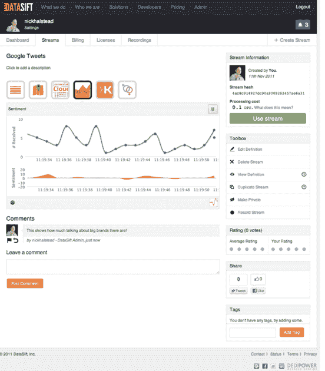
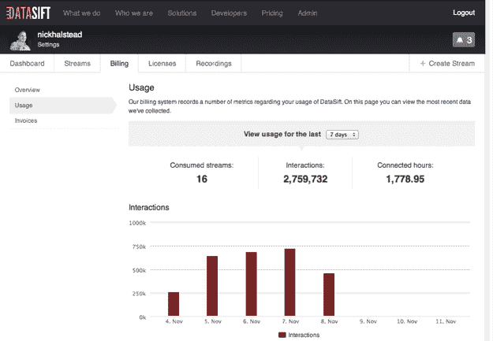

# DataSift 推出强大的 Twitter 数据分析和商业智能平台| TechCrunch

> 原文：<https://web.archive.org/web/http://techcrunch.com/2011/11/16/datasift-launches-powerful-twitter-data-analysis-and-business-intelligence-platform/>

Twitter 的大数据商业智能和分析平台 DataSift 今天终于向美国公众开放了。DataSift 诞生于 Tweetmeme，一年前在 TechCrunch Disrupt San Francisco 上宣布了[。由](https://web.archive.org/web/20230407040906/https://techcrunch.com/2010/09/27/tweetmeme-founders-datasift-helps-you-find-a-needle-in-a-tweetstack/)[尼克·霍尔斯特德](https://web.archive.org/web/20230407040906/http://www.crunchbase.com/person/nick-halstead)创立的 DatSift 是有权[重组 Twitter 每日超过](https://web.archive.org/web/20230407040906/https://techcrunch.com/2011/04/04/twitter-and-mediasift-announce-partnership/)[2 . 5 亿条推文](https://web.archive.org/web/20230407040906/https://techcrunch.com/2011/10/17/twitter-is-at-250-million-tweets-per-day/)的两家公司之一(另一家是 [Gnip](https://web.archive.org/web/20230407040906/http://gnip.com/) )。

开发者、企业和组织基本上可以使用 DataSift 来挖掘 Twitter 的社交数据。但 DataSift 的特别之处(除了对 Twitter 数据的首要访问)在于，它可以过滤这些社交媒体数据，以获得人口统计信息、在线影响和情绪，无论是积极的还是消极的。

因为 DataSift 可以使用推文中包含的元数据来搜索 Twitter 帖子和信息，所以在非常特定的级别上挖掘数据的可能性是无限的。DataSift 不限制基于关键字的搜索，允许任何规模的公司定义极其复杂的过滤器，包括位置、性别、情感、语言，甚至基于 Klout 分数的影响力，以提供快速和非常具体的洞察和分析。DataSift 的技术还可以将数据过滤过程应用于帖子本身中以链接形式呈现的任何内容。

例如，用户可以看到 Twitter 个人资料中所有描述中包含“爱狗人士”字样的推文。然后，用户可以根据地理、情感、性别等因素对数据进行分类。

由于该公司对 Twitter 信息流的深入了解，许多企业已经开始表示有兴趣测试挖掘这些数据的产品。社交媒体监控、金融服务、医疗保健、零售、政治、电视和新闻媒体的客户都在使用 DataSift 的 API。

在定价方面，DataSift 采用基于云的定价模式，提供现购现付或订阅选项。该公司表示，一家初创公司可以开始使用 DataSift，每月仅需 200 美元。

当然，我们希望 Twitter 不会自己进入这个数据聚合市场。DataSift 与 Twitter 有长期合同，但正如我们过去所写的那样，这并不保证 Twitter 不会复制任何它认为特别有利可图的服务。另一方面，如果 DataSift 实现了这一目标，它可能会成为 Twitter 的收购目标。

然而，目前 DataSift 得到了 Twitter 的支持。Twitter 平台总监 Ryan Sarver 谈到该公司的推出时说:“DataSift 的扩张表明，洞察 Twitter 实时数据的市场正在增长，并产生了蓬勃发展的业务……现在，比以往任何时候都多的开发者可以通过将每天 2.5 亿条推文过滤成即时可操作的信息来满足日益增长的市场需求。”

在推出时，DataSift 还解析来自 MySpace 和许多论坛的社交数据。该公司计划在未来 30 至 60 天内增加来自 Google+和脸书的数据流。

新[任命的首席执行官罗伯·拜利](https://web.archive.org/web/20230407040906/https://techcrunch.com/2011/11/14/datasift-founder-passes-ceo-torch-on-to-former-simplegeo-vp-rob-bailey/)(前雅虎 bizdev 高管，最近在 [SimpleGeo](https://web.archive.org/web/20230407040906/http://www.crunchbase.com/company/simplegeo) 担任业务发展副总裁)告诉我们，该公司正试图“在我们变宽之前变深”，并已经通过该平台提供的当前数据量为客户提供了大量的洞察力。

DataSift 刚刚在旧金山开设了总部，最近从 GRP 和 IA Ventures 获得了 600 万美元的资金。该公司还将《卫报》和 BBC 视为客户。

