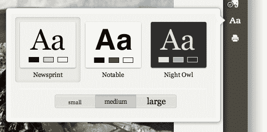
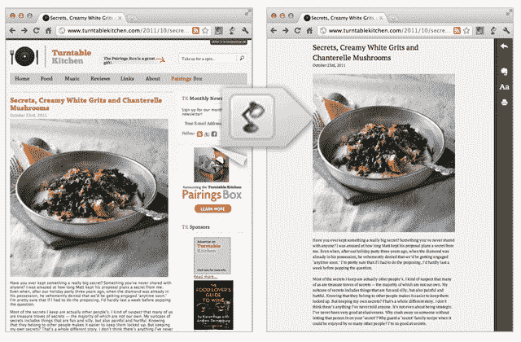

# Evernote 显然知道如何让网络阅读、剪辑变得更容易

> 原文：<https://web.archive.org/web/http://techcrunch.com/2011/11/16/evernote-clearly-knows-how-to-make-web-reading-clipping-easier/>

# Evernote 显然知道如何让网络阅读、剪辑变得更容易

Evernote 今天推出了自 [Peek](https://web.archive.org/web/20230203080117/http://www.evernote.com/about/download/peek.php) 以来的第一款独立产品:一款名为[的浏览器扩展，可以实现“不受干扰的在线阅读”。Evernote 目前只作为 Chrome 的一个插件提供，它明显地从你想在网上阅读的任何文本块中删除了广告、链接、导航元素等等，并让你轻松地将其保存到 Evernote 以便以后阅读。](https://web.archive.org/web/20230203080117/http://www.evernote.com/about/download/clearly.php)

如果这听起来很像是像[可读性](https://web.archive.org/web/20230203080117/http://www.readability.com/)或 [Instapaper](https://web.archive.org/web/20230203080117/http://www.instapaper.com/) 这样的核心功能，那么你的想法可能是对的。

当你在一个页面上只有一篇文章时，Evernote 显然工作得最好，就像[这篇](https://web.archive.org/web/20230203080117/https://techcrunch.com/2011/11/16/of-course-twitter-is-a-social-network/)。只需一次点击，您就可以隔离文本块以方便阅读，并在完成后“滑动”回去。

该扩展还允许您更改角色的外观和大小，因此您可以定制体验(见下面的第一个截图)。此外，你可以点击一个按钮将文章剪辑到 Evernote，以保存文章或供以后阅读。还有一个“打印”按钮。

根据 Evernote 的博客帖子，Clearly 甚至会自动将一篇多页文章变成单页，这样你就不再需要从一页点击到下一页了，但这对我来说并不奏效，就我收到的扩展而言(我尝试了[这篇帖子](https://web.archive.org/web/20230203080117/http://venturebeat.com/2011/11/15/the-making-of-the-xbox-part-2/))。

Evernote 显然也将很快适用于 Firefox。

【YouTube http://www.youtube.com/watch?v=hgVPobaTyr0&w=640&h=400]

