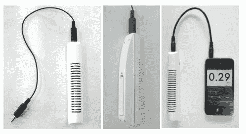

# 福岛盖革:iPhone TechCrunch 的辐射和盖革计数器

> 原文：<https://web.archive.org/web/http://techcrunch.com/2011/11/16/geiger-fukushima-radiation-and-geiger-counter-for-the-iphone/>

# 福岛盖革:iPhone 的辐射和盖革计数器

总部位于日本的三和公司宣布了所谓的[Geiger Fukushima](https://web.archive.org/web/20230203125150/http://www.3wa-corp.jp/geiger.html)【JP】，这是一款便携式轻型(70g) geiger 计数器，使用 iPhone 来测量你环境中的β和γ射线。只需将 14 厘米长的探针连接到 iPhone，启动支持该设备的[应用](https://web.archive.org/web/20230203125150/http://itunes.apple.com/us/app/id427728355)，查看手机显示屏以跟踪辐射读数。

有许多便携式盖革计数器，但这里的想法是利用 iPhone 的功能来降低价格:只要手机和盖革福岛就足够了。居住在日本以外的人也可以订购这款设备(在日本潮流商店售价[203](https://web.archive.org/web/20230203125150/http://www.japantrendshop.com/geiger-fukushima-iphone-p-1244.html)美元)。

Sanwa 表示，Geiger Fukushima 的测量范围为每小时 0.04-20 微西弗，一节 AAA 电池可持续约 200 小时。