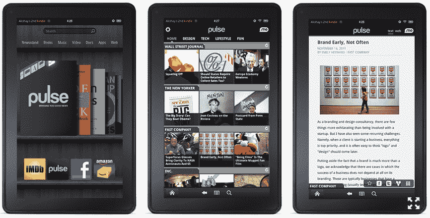

# Pulse 在 Kindle 的主页上占据重要位置；联合创始人表示，今年用户数量可能超过 1000 万

> 原文：<https://web.archive.org/web/http://techcrunch.com/2011/11/16/pulse-scores-key-spot-on-kindles-home-shelf-co-founder-says-it-may-pass-10m-users-this-year/>

因此， [Kindle Fire](https://web.archive.org/web/20230204164648/http://www.amazon.com/Kindle-Fire-Amazon-Tablet/dp/B0051VVOB2) 于周一发货，早期评论也全面出炉。像往常一样，反应各不相同。但是，不管它值不值得，Fire 已经是亚马逊上最畅销的商品，许多人现在说，这家电子商务巨头可能会在今年年底前[售出 500 万台新设备。不，它不是 iPad 杀手，但人们对 Kindle 的触摸和基于 Android 的进化感到兴奋，200 美元毫无疑问亚马逊会卖出更多。](https://web.archive.org/web/20230204164648/http://money.cnn.com/2011/11/15/technology/kindle_fire_sales/)

但更有趣的是(至少对我来说),如果 Kindle 热销，亚马逊市值的潜在增长，或者苹果回头看看，Kindle 销售如何可能成为一个小人物的巨大胜利。

[Pulse](https://web.archive.org/web/20230204164648/http://www.crunchbase.com/company/pulse) ，正如许多人现在所熟悉的，是一个为平板电脑一代打造的 RSS 风格的新闻聚合器。由于其基于触摸的界面(易于滑动/滚动)、简洁的设计和视觉吸引力，该应用程序在 iPad 和 Honeycomb 上获得了大量播放。这家初创公司还与 ESPN 等大型媒体和 Groupon 等交易网站达成了战略合作关系。

现在，Pulse 的前景更加光明，因为该应用程序被亚马逊选为 Kindle Fire 上少数几个预装的原生应用程序之一。当 Kindle 用户访问该设备的主货架时，有四个应用程序似乎是该设备的原生应用程序:IMDB、Pulse、脸书和亚马逊商店。标签中还有 15 个应用，其中 10 个是预装的，5 个是“建议”应用，用户必须主动下载。例如，大多数安装的应用程序是联系人、电子邮件、音频、图库、帮助等。

考虑到脸书的 Kindle 应用程序[实际上只是一个网络应用程序，甚至不是完全由脸书设计的](https://web.archive.org/web/20230204164648/http://idealab.talkingpointsmemo.com/2011/11/facebook-app-for-kindle-fire-actually-just-mobile-site.php)(点击它只会带你到 m.facebook.com)，亚马逊拥有 IMDB，是的，亚马逊商店，这使得 Pulse 成为 Kindle Fire 上少数几个原生应用程序之一——也是该设备上唯一一个非脸书/亚马逊原生应用程序。

在今天的博客文章中，Pulse 表示，它实际上是“唯一一款在发货时就预装在设备上的应用”。显然，这并不完全正确，该帖子后来被修改为“唯一一款在发货时预装在设备上的应用程序”，但重点仍然存在。

【T2

这是亚马逊令人惊讶的信任投票，它基本上已经使 Pulse 成为其自己设备的官方新闻阅读器，根据定义，这是一个阅读器。当然，Kindle Fire 有很多新功能，超越了旧的“阅读器”,进入了多媒体领域，但它仍然是 Kindle。

更重要的是，这款设备的报摊非常显眼，但其中的大部分内容你都必须付费才能阅读。这使得 Pulse 成为事实上的免费新闻阅读选项，只要这款应用的用户体验足够强大，能够吸引用户的注意力，它就会吸引大量眼球。

此外，当 Pulse 与其他前沿应用程序(IMDB，脸书)和推荐下载的应用程序(Pandora，Weather Channel，ESPN，等等)并列时，人们会进一步理解为什么这对 Pulse 如此重要。IMDB 每月有 1 亿独立访客，脸书有 8 亿全球用户，潘多拉的市值超过 20 亿美元，ESPN 是 ESPN。

相比之下，Pulse 在去年 5 月刚刚在 iPad 上首次亮相，并且只筹集了大约 1000 万美元的外部资金。对于一家成立不到两年的初创公司来说，这算是较高的价格，但在整个行业和 Kindle 的家庭英雄的背景下，这只是微不足道的。

因此，Fire 是否真的与 iPad 正面竞争并不重要——即使 Kindle 的销量停止在 100 万，这仍然是 100 万潜在的新用户。

*“今年年初，我们的用户还不到 100 万”，* Pulse 联合创始人阿克谢·科塔里周二告诉彭博，*“今年年底，我们的用户可能会超过 1000 万”。在任何其他情况下，这种说法都会引起一些严重的眼球转动或下巴脱落，但如果 Kindle Fire 起飞，这种预测甚至可能是适度的。(今天，Pulse 拥有 700 万用户。)*

换个角度来看，科技博客 TechCrunch 几乎每隔一天就要写一篇关于 Foursquare 的文章，[在 6 月份](https://web.archive.org/web/20230204164648/https://techcrunch.com/2011/06/20/foursquare-now-officially-at-10-million-users/)(推出 27 个月后)就达到了 1000 万用户，并筹集了超过 7000 万美元的资金。

因此，尽管 Kindle Fire 是亚马逊的赚钱机器，但对 Pulse 来说，它可能是纯金的。