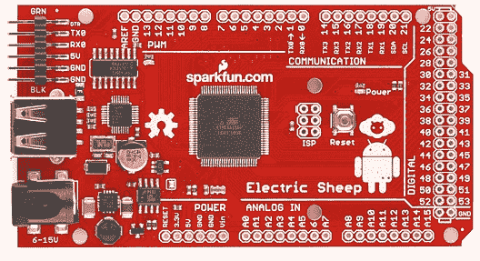

# SparkFun 的电动绵羊:给你这个痴迷安卓的修补匠

> 原文：<https://web.archive.org/web/http://techcrunch.com/2011/11/16/sparkfuns-electric-sheep-for-the-android-obsessed-tinkerer-in-you/>

# SparkFun 的电动绵羊:给你这个痴迷于机器人的修补匠

如果你仔细想想，你的智能手机里面有一些非常漂亮的东西。里面有 GPS 芯片，更不用说加速度计了，偶尔甚至(喘气！)一个指南针。SparkFun 公司的人希望将所有这些组件公之于众，他们打算用一种叫做[电动羊的小东西来实现这一目标。](https://web.archive.org/web/20230314094154/http://www.sparkfun.com/products/10745)

电动绵羊是一个基于 Arduino 的小型分线板，允许用户创建自己的自制附件，并将它们连接到 Android 设备上。

想在早上不用起床就能打开百叶窗吗？装配一些马达和滑轮，让它发生。想变得雄心勃勃，创造一个[鲁布·戈德堡式的怪物](https://web.archive.org/web/20230314094154/http://www.youtube.com/watch?v=SolyTCP8gj0)，当你倾斜手机时，它会打开你的咖啡机？开始吧。

当然，组装你自己的 Android 驱动的百叶窗控制器需要的不仅仅是 IO 技术。用户还应该熟悉编写 Android 应用程序，因此它的吸引力可能会在一开始就受到限制。不过这种情况可能很快就会改变——电动绵羊最近的发布意味着还没有太多的示例项目或代码，但 SparkFun 认为他们的社区很快就会开始用它做一些疯狂的事情。

那么，为什么有抱负的配件工匠会使用电动绵羊而不是普通的 Arduino 呢？嗯，除了时髦的红色配色方案和可爱的标志，电动绵羊还内置了 USB 主机功能，所以用户不必支付额外的 USB 主机保护罩。

如果你已经沉迷于 Arduino，它可能不会有太大的吸引力(尽管电子羊与大多数电子羊兼容)，但它是一个漂亮的多功能套件，可以帮助你实现 DIY 的雄心。黑客快乐！

