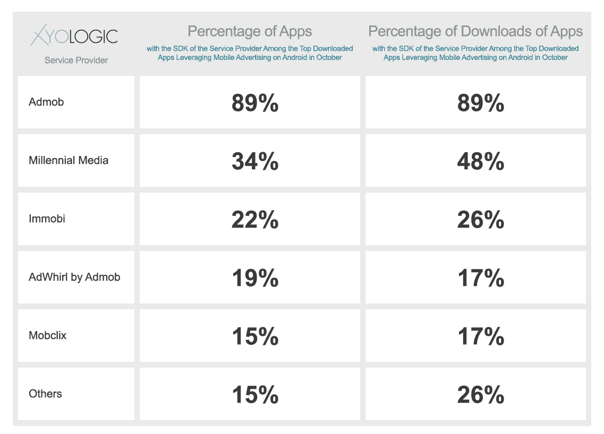

# AdMob 主导 Android 广告网络市场份额 TechCrunch

> 原文：<https://web.archive.org/web/https://techcrunch.com/2011/11/17/admob-dominates-android-ad-network-market-share/>

移动分析公司 [Xyologic](https://web.archive.org/web/20230204000652/http://www.xyologic.com/) 发布了一份市场份额分析，估计了 Android 上移动广告和广告交换网络的细分情况。根据其研究，根据对 10 月份所有下载的广告支持的 Android 应用程序的分析，AdMob 是 Android 平台上的主导者，拥有 89%的市场份额。

千禧传媒、Inmobi、AdMob [收购](https://web.archive.org/web/20230204000652/https://techcrunch.com/2009/08/27/admob-rumored-to-have-acquired-adwhirl/) AdWhirl 和 Mobclix 进一步落后。

Xyologic 的联合创始人 Matthaus Krzykowski 解释说，尽管 IDC 每年都会发布一份关于移动广告生态系统的[报告](https://web.archive.org/web/20230204000652/http://www.mobilemarketer.com/cms/news/research/8367.html)，但这份报告经常引起争议。此外，IDC 研究没有深入操作系统或应用程序级别的数据。Xyologic 的研究确实如此。

根据其调查结果，10 月份 Android 上下载量最高的 1，000 个应用中，有 50%至少有一个移动广告网络或移动广告交换 SDK。其中 22%拥有两个或更多移动广告网络 SDK。

在仅包含前 1000 个广告支持应用的组中，89%使用 AdMob 的 SDK，34%使用 Millennial Media 的 SDK，22%使用 Inmobi，19%使用 AdWhirl，15%使用 Mobclix。

在所有支持广告的安卓应用中，89%使用了 AdMob，48%使用了 Millennial Media，26%使用了 Inmobi，17%使用了 AdWhirl，17%使用了 Mobclix。

需要明确的是，像 AdWhirl 这样的广告交易所维护着包括 AdMob、Millennial 和 Inmobi 在内的其他广告网络的库存。

其余 15%的顶级广告支持应用由其他广告交易组成，其吸引力要小得多。其中包括 AdMarvel、Smaato、Burstly、Mopub、Nexage、Fiksu 和 Jumptap。这些应用中的每一个都只占整体市场份额的不到 3%，但是加在一起，它们代表了 10 月份所有广告支持应用的 26%。

它说，Xyologic 使用专有技术结合可靠的第三方来源收集数据。该公司还制作关于全球应用下载的综合报告,每月发布 220 份报告，涵盖 29 个国家的 4 大移动平台。最近，Xyologic 开始免费发布这些报告。

关于今天研究的更多信息可以在 Xyologic 的博客[这里](https://web.archive.org/web/20230204000652/http://www.xyologic.com/blog/admob-leads-market-share-of-mobile-ad-networks-on-android)获得。