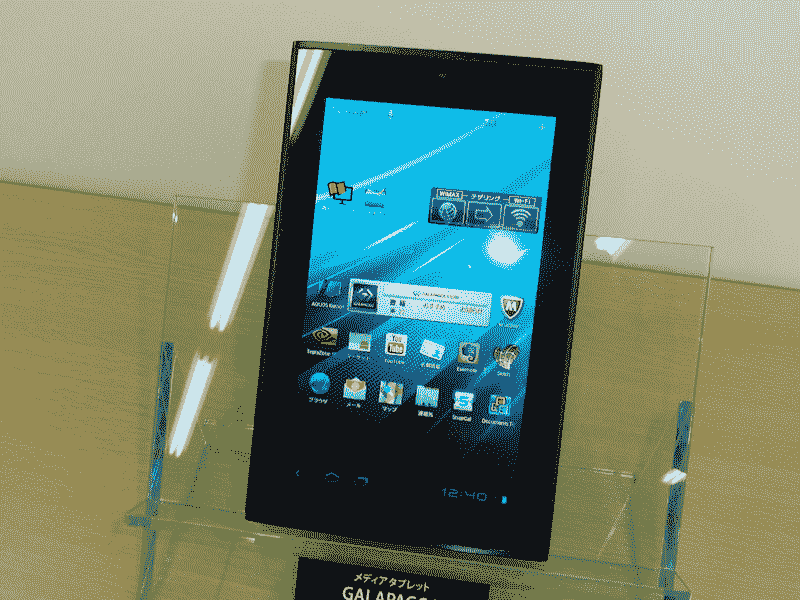
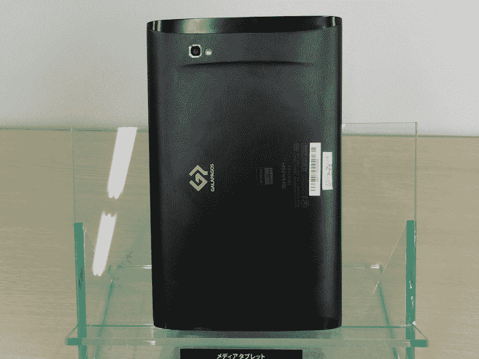
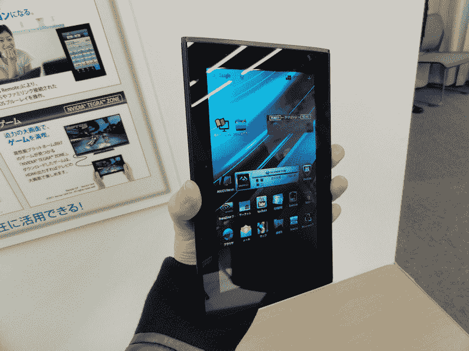

# 另一个加拉帕戈斯:夏普不会放弃平板电脑 TechCrunch

> 原文：<https://web.archive.org/web/http://techcrunch.com/2011/11/17/another-galapagos-sharp-doesnt-give-up-on-tablets/>

# 另一个加拉帕戈斯:夏普不会放弃平板电脑

2010 年 9 月，夏普[为日本市场发布了](https://web.archive.org/web/20230205025243/https://techcrunch.com/2010/09/27/galapagos-sharp-announces-5-5-inch-and-10-8-inch-android-tablets-video/)一款 5.5 英寸和 10.8 英寸的安卓[平板电脑](https://web.archive.org/web/20230205025243/https://techcrunch.com/tag/tablets)，随后在今年 8 月发布了 7 英寸版本。在看到他们没有机会对抗 [iPad 2](https://web.archive.org/web/20230205025243/https://techcrunch.com/tag/ipad) 后，夏普[停止](https://web.archive.org/web/20230205025243/https://techcrunch.com/2011/09/15/sharp-discontinues-2-of-3-galapagos-tablet-models-only-the-7-inch-version-lives-on/)前两款“加拉帕戈斯”型号，业界押注的不是他们是否会，而是*何时*停止生产 7 英寸平板电脑。

但夏普并不准备放弃蓬勃发展的平板电脑市场:该公司昨天宣布了另一款面向日本市场的 Android Galapagos 机型 Galapagos EB-A71GJ-B。

 

规格看起来相当不错:

*   安卓 3.2 操作系统
*   7 英寸液晶显示屏，分辨率为 1024×600
*   NVIDIA Tegra2 CPU
*   1GB 内存
*   8GB 内部存储
*   全球微波接入互操作性
*   无线网络 IEEE 802.11b/g/n
*   可能的拴系
*   蓝牙 2.1+EDR
*   200 万像素内置摄像头，500 万像素外置摄像头，带 LED 闪光灯
*   microHDMI 插槽
*   USB、microSD 端口
*   尺寸:195×122×11.9-12.6 毫米，重量:396 克

夏普计划于 12 月 9 日开始在日本销售这款手机，售价为 780 美元。

Via [PC 手表](https://web.archive.org/web/20230205025243/http://pc.watch.impress.co.jp/docs/news/20111116_491098.html) [JP]