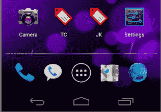
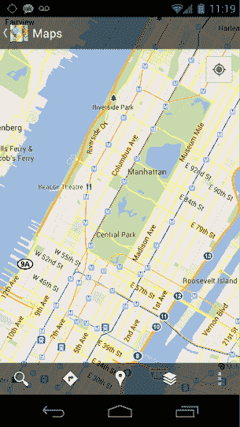

# 我使用 Galaxy Nexus 和冰淇淋三明治的第一天(这真的很大)

> 原文：<https://web.archive.org/web/http://techcrunch.com/2011/11/17/my-first-day-with-the-galaxy-nexus-and-ice-cream-sandwich-this-is-really-big/>

Galaxy Nexus 很大。

好了，我们已经解决了这个问题(不要担心，我们很快会再次讨论这个问题)。现在来看更重要的消息:搭载在 Galaxy Nexus 上的新版安卓系统“冰激凌三明治”( Ice Cream Sandwich)代表着向正确的方向迈出了一大步:它让一直被指责为比 iOS 更混乱的安卓系统变得更容易使用。

大约 24 小时前，我收到了从谷歌借来的 Galaxy Nexus(其中 7 小时我都在幸福的睡眠中度过)，所以这篇文章不能被视为评论。更确切地说，这是我早期的印象。我知道什么是新的，我想我知道我喜欢哪些变化，但我仍然在蜜月中-斜线-'为什么这是不同的？!'阶段。说完了，我们开始吧。

正如我之前提到的，ICS 的一个大主题是推动 Android 让非“超级用户”更容易使用，这是完全可以理解的，有时也有点令人沮丧。一些按钮不见了。其他的已经变得更容易被看见。在很大程度上，谷歌已经实现了它的目标。

最大的变化涉及导航。自从 Android 首次在 G1 上推出以来，几乎所有设备的屏幕下方都有四个专用按钮:返回、主页、菜单和搜索。他们有一个学习曲线(例如，花了一段时间才明白，如果你想要的选项不是立即可见的，它可能藏在菜单按钮下)。但是一旦你掌握了窍门，它们就起作用了。

不幸的是，许多人从来没有弄明白它们。

因此，谷歌完全取消了两个按钮:搜索和菜单按钮都被删除，取而代之的是一个应用切换按钮。这一变化首先出现在 Honeycomb 中，但因为 Honeycomb 仅适用于平板电脑，所以它看起来更像是一块空白的 UX 石板。既然变化发生在手机上，那就更加明显了。

我对三按钮布局的第一反应是:它让我抓狂。我早就习惯了点击 Android 的专用搜索按钮——特别是因为你以前可以通过按住按钮一两秒钟来启动 Android 方便的语音搜索和语音操作，无论你使用的是哪个应用程序。

不会了。现在，启动语音搜索的唯一方法是到你的一个主屏幕上，点击(现在不可移动的)谷歌搜索小工具中显示的麦克风。

不过，谷歌改变背后的逻辑是有道理的。旧的四按钮系统可能会令人困惑，因为它不一致:两个按钮，主页和后退，适用于系统范围的导航。其中两个，搜索和菜单，与你正在看的应用程序相关。

谷歌说，根据用户研究，许多人从来没有真正理解搜索按钮是干什么的，更不用说长按它会做什么了。这尤其糟糕，因为许多应用程序在你点击搜索按钮之前不会显示搜索栏——这是合乎逻辑的，但当人们不知道他们应该首先点击按钮时，这就成了问题。类似的原理解释了为什么专用菜单按钮被取消了:人们不知道什么时候点击它，所以他们经常会错过关键功能。

当然，现在这两个按钮都没有了，Android 必须找到另一种方式来展示这些选项。这个解决方案被称为 Action Bar，它也是在 Honeycomb 中首次引入的。

如果你以前用过 iOS，操作栏会让你有宾至如归的感觉。简而言之，这是应用程序展现功能和帮助你在屏幕间导航的最一致的方式。打开地图应用程序，您会在屏幕底部看到一个操作栏，其中有搜索、方向、地点和地图图层的图标。换句话说，你真的不需要再去寻找任何东西——核心特性就在那里。

当然，有些应用程序提供的功能比屏幕上一次显示的要多。谷歌的解决方案是一个新图标，由三个垂直排列的小方块组成。点击它，你通常会看到高级选项和设置。这个由三个正方形组成的图标基本上和以前的专用菜单按钮做的是一样的事情，但是它更容易被找到，因为它总是显示在屏幕的某个地方。

更明显的是，新的菜单按钮属于你正在查看的应用程序，而不是人们可能会错误地与旧的硬件按钮联系在一起的某种全系统菜单。

除了省略的搜索按钮，我想念它只是因为它让我心爱的语音控制变得更难达到，这个新的设置感觉像是在正确的方向上迈出了一大步。大多数人会对冰淇淋三明治更华丽的功能感到兴奋，但这是一个基本而重要的变化，将使 Android 对许多人来说更容易使用——这就是为什么我花了这么多的话。

哦，如果你像我一样是一个喜欢搜索按钮的超级用户，不要太生气——毫无疑问，在不久的将来，你可以安装一个定制的启动器应用程序，让你根据自己的喜好调整这三个主要的导航按钮。

好了，有趣的时间到了。

ICS 中备受吹捧的功能之一是一种使用面部检测的新手机锁定机制——只需将手机的前置摄像头对准你的面部，它就会解锁，而无需你输入 PIN 码或屏幕图案。

这肯定很棒，但实际上在设置过程中你会被警告，看起来像你的人可能会解锁你的手机，YouTube 上有一些人解锁的视频，上面有一些人的照片。那么这有什么意义呢？

谷歌承认有其他更安全的方法来锁定你的手机。但是有很多很多人根本不使用任何种类的 PIN 或模式锁，因为输入它们很繁琐。这些就是 Face Unlock 迎合的人群。一旦设置好了，它通常不费吹灰之力(面部检测在正常照明下工作良好，尽管它不能处理黑暗的房间)。事实是，如果你在某个地方丢了手机，找到它的人很可能不知道你长什么样。

如果你传输机密信息或诽谤性短信，你会想用这个吗？一点也不。但是如果你还没有使用屏幕锁定，它绝对值得一试。

**应用升级和检修**

联系人应用程序已经完全重做，现在被称为“人”。它非常巧妙，在一个地方列出了你所有的联系人，这些联系人来自可以包括 Google+和 Twitter 的服务。每个联系人的名字下面都会显示他们最近的状态更新，点击其中一个会把你带到一个漂亮的个人资料页面，上面有大字体和大照片。首先，我不是一个真正的联系人应用程序(我更喜欢点击“搜索”按钮来找到我要找的人)，但这绝对是一个进步。

相机应用程序有了一些重大改进。现在可以点击缩放了(暗示成千上万的苹果粉丝嘲笑)。有一种全景模式，可以让你移动相机拼接成一张巨幅照片。现在，您可以在录制视频时点击屏幕，拍摄高分辨率的静态照片。

不过，最重要的是，你可以快速连续地拍摄照片。谷歌零快门延迟的承诺没有令人失望，尽管如果你在不同的事情上旋转手机，你会希望在拍摄之间给手机一点时间聚焦(另外，如果你的照片使用闪光灯，会有短暂的停顿)。

该浏览器有一些新功能，包括一个保存网页供离线浏览的选项。Gmail 也有了很好的改进——但我仍然能感觉到这两点。我很快会对它们有更多的想法。

**声音**

你可能早就注意到了，我是安卓深度集成语音功能的忠实粉丝。谷歌在这方面的改进远没有我希望的那么多——我不明白为什么语音操作仍然提供一年多前推出时的相同功能，尤其是当苹果的 Siri 是 iPhone 4S 最大的卖点之一时。但是 ICS 确实对声音转录的工作方式进行了重大改进。

在此之前，在 Android 上输入语音输入一直是一件压力非常大的事情。你可以通过敲击麦克风(或者握住我那倒霉的搜索按钮)来启动它，然后有几秒钟时间说出你的想法——没有任何停顿。单词之间等待太久，Android 会认为你已经完成了。

新版本解决了这个问题，还有其他一些问题。当你开始说话时，你会看到 Android 开始近乎实时地转录文本。在你完成一个句子之前，你可以想停顿多久就停顿多久。除非你使用过，否则很难体会到它的价值，但它让这些语音功能使用起来更加愉快。

此外，现在在 Android 转录文本后修改文本要容易得多——如果你被误译了，你可以点击带灰色下划线的单词来查看发音相似的短语，这些短语可能是正确的。也就是说，这个界面有点漫无目的(有时我会点击一个不正确的单词，但它会选择一个短语，反之亦然)。

**硬件**

我有意识地隐藏了这一部分。我没有足够长的时间来使用手机进行任何类型的电池测试，虽然我的大脑似乎很快适应了用户界面，但我的手显然有点不太灵活。换句话说，这个设备感觉真的……*不同*。

手机很大。它很薄很轻，本身并不笨重。但我发现自己在使用它的时候会做手指体操:当我需要点击手机底部的“后退”按钮时，我会将小指滑到手机下方；当我需要点击屏幕顶部的搜索框时，我会将小指滑回手机侧面。我不能在不移动我的手的情况下浏览 UI。

现在，我是一个手很小的人，多年来我一直把小得多的 Nexus One 作为我的主要设备。所以这种差异对我来说可能比其他人更不和谐。有人告诉我要等几天，我很有可能会习惯。但我仍然持怀疑态度——在未来几周内，我会有更多这方面的想法。

谢天谢地，这款设备的大屏幕也有一个好处:看起来很美。文本看起来棒极了。相对较大的屏幕空间意味着应用程序可以容纳更多的按钮和内容，而不会感到局促。哦，还记得我之前讨论的三个软件导航按钮吗？当你在看电影时，这些完全消失了，这意味着几乎整个手机正面都变成了视频显示器。真的很好。

最后，还有性能问题，我也将在以后的文章中讨论。通常 Galaxy Nexus 会嗡嗡作响，但我有一两次想起了我的 Nexus One，在奇怪的时刻暂停，显然忽略了手指的敲击。这种情况不常发生——谷歌表示，我看到的问题中至少有一个是已经在客户将收到的设备上修复的已知缺陷。所以我们将在接下来的几周内看看它的表现。

**下面是一些功能的视频演示:**

*从左至右:Nexus One、Nexus S、Galaxy Nexus*
