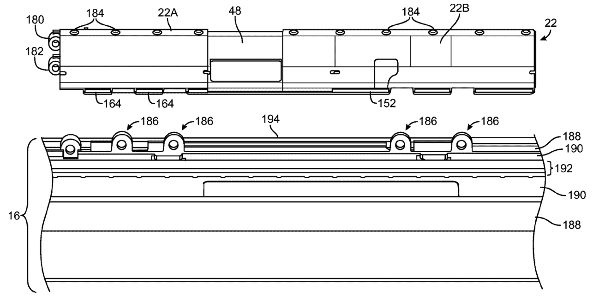

# 希望你的 MacBook 变成 iPad？有一天可能 TechCrunch

> 原文：<https://web.archive.org/web/http://techcrunch.com/2011/11/17/wish-your-macbook-transformed-into-an-ipad-one-day-it-might/>

# 希望你的 MacBook 变成 iPad？有一天可能会

你有时会不会希望你可以把 MacBook 的显示屏撕下来，当作 iPad 来用？好吧，也许这有点暴力，但仍然值得梦想。苹果公司的人显然同意我的观点，因为 Cupertino 刚刚被美国专利和商标协会批准了一项“用于无线电子设备的离合器桶形天线”的申请

显然，这个标题并不一定意味着“可变形的 iPad/MacBook 混合”，但在我们解析这个专利发言时，请耐心等待一秒钟。

因此，整个“离合器桶”位必须与连接两个设备的方式有关*和*将天线安装到装置中。如果你想悠闲地阅读，显示器可以旋转，也可以完全分离。

将平板电脑和电脑结合起来的想法似乎是苹果的发展方向。如果你稍微想想 [OS X 狮子](https://web.archive.org/web/20230204205939/https://techcrunch.com/2011/07/21/os-x-lion-new-features/)的话，很明显 iOS 在开发过程中就被考虑在内了，如果不是一个可以借鉴的具体来源的话。

并不是每个人都喜欢这个新平台，但很明显，苹果对触摸的重视程度不亚于键盘，如果不是更多的话。也就是说，苹果已经申请了许多与这种 iPad/MacBook 混合产品相关的专利，所以在接下来的几年里看到这一概念成为现实并不奇怪。

[via [Patently Apple](https://web.archive.org/web/20230204205939/http://www.patentlyapple.com/patently-apple/2011/11/apple-wins-patent-for-telephonic-macbook-with-rotatable-display.html)