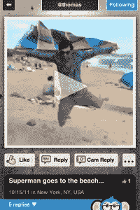

# Chumkee 推出社交照片和视频对话新应用 TechCrunch

> 原文：<https://web.archive.org/web/http://techcrunch.com/2011/11/18/chumkee-launches-new-app-for-social-photo-video-conversations/>

一个奇怪但有趣的新照片和视频分享 iPhone 应用程序被称为 [Chumkee](https://web.archive.org/web/20230203210911/http://www.chumkee.com/) 今天正式宣布公开发布。我知道，我知道。*另一款*照片和视频分享应用——正是你所需要的。但 Chumkee 在概念、用户界面和设计方面做了一些不同的事情。这款应用不仅仅是“与你的朋友分享照片”这是一种公开分享的方式，几乎类似 Twitter 的格式，包括@用户名和“回复”功能。换句话说，基于照片和视频的社交对话。

但这还不是全部。该应用还抛弃了传统的 Twitter 时间轴式的照片堆设计，允许你在屏幕上移动图片和视频，或者在完成后将它们拖离屏幕。

当你第一次加载 [Chumkee](https://web.archive.org/web/20230203210911/http://www.chumkee.com/) 时，你会看到“每个人”的视图，这是一堆照片和视频。不过，这些视频有实时缩略图，这给了这款应用一种“实时”的感觉。看起来那些人现在都在现场聊天，尽管事实并非如此。

虽然这款应用支持照片，但我第一次启动时看到的大部分缩略图都是视频。你可以在屏幕上移动这些缩略图来发现隐藏在下面的缩略图，或者你可以在完成后将它们从屏幕上拂去。虽然这不是一个让你一眼就能使用大量媒体的设计，但实际上使用起来很有趣。Chumkee 有一种当今许多应用程序所缺乏的滑稽和好玩。

 也就是说，如果你不喜欢照片堆，屏幕底部一只拿着操纵杆的猴子(是的，我告诉过你那是傻瓜)可以让你切换到平铺布局。

当你找到一个你想看的视频(或照片)时，你只需点击它，然后点击“缩放”即可观看。您还可以“喜欢”该项目或点击附带的“关注”按钮来关注其创建者。该应用的用户被赋予@用户名，就像在 Twitter 上一样。若要查看您关注的人，请点击屏幕顶部的下拉框，在“每个人”、“关注”、“我的个人资料”和“搜索”之间切换

与 YouTube 一样，该应用支持视频回复，以提示用户之间的对话。这是通过每个项目底部的“Cam 回复”按钮完成的。(也支持测试回复)。

尽管它不是建立在实时聊天的基础上，但 Chumkee 有着 Chatroulette 在事情变糟之前曾经提供的那种随机、偶然发现和窥淫癖的氛围。如果在未来的某个时候，你也可以“直播”并进行实时聊天，那就太好了。当然，那时它将面临同样的聊天轮盘色情问题。与此同时，你现在不太可能在这里看到 Chatroulette(清理之前)的淘气，但是如果你遇到一些奇怪的事情，有一个“标志”按钮。

Chumkee 是总部位于纽约的 C-Vibes，Ltd .创建的，它之前出于测试目的进行了试运行，在全球范围内获得了 15，000 名用户，其中 85%现在每天都在使用。这款应用是由 David Aumoier 和 Thomas Prevot 开发的，他们的背景是创意、设计和投资。目前，Chumkee 在几个天使的支持下囊中羞涩。

你可以在 iTunes [这里](https://web.archive.org/web/20230203210911/http://itunes.apple.com/app/chumkee/id470588547?mt=8)下载这个应用。

【YouTube = http://www . YouTube . com/watch？v=a0UZv7tG8r4&w=640&h=360]