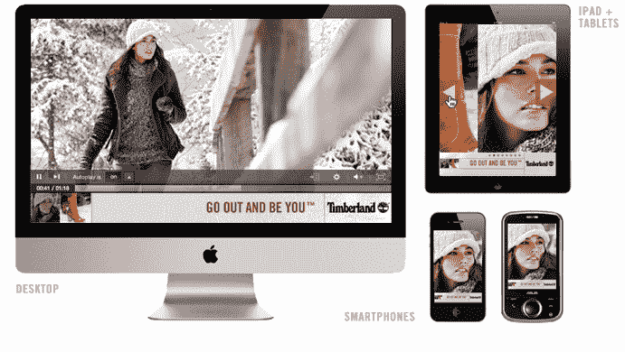

# Glam Media 推出富媒体广告创作平台 glam splash TechCrunch

> 原文：<https://web.archive.org/web/http://techcrunch.com/2011/11/18/glam-media-launches-rich-media-ad-creation-platform-glamsplash/>

# Glam Media 推出富媒体广告创作平台 GlamSplash

全球最大的出版和广告网络之一 Glam Media 正在为广告商推出一个新的富媒体广告制作平台，名为 GlamSplash。根据 Glam 的说法，新的画布允许品牌广告商在 Glam 的所有物业中传递“30 秒”电视广告的效果。

作为背景，Glam 的各种垂直出版业务在全球每月有 2 亿独立访问者，在女性读者中尤其受欢迎。Glam Media 拥有超过 2，500 家出版商，涵盖多个在线垂直类别，包括面向女性的 Glam.com、面向成人的 Glam Entertainment、面向男性的 Brash.com 以及面向健康和福利的 Bliss.com。Glam 也于 9 月宣布收购宁公司。

Glam 运营一个基于网络的广告服务平台 Glam Adapt，以及[最近推出的移动广告平台](https://web.archive.org/web/20230203151147/https://techcrunch.com/2011/08/17/glam-media-takes-on-apples-iad-with-new-brand-focused-mobile-ad-network/)，GlamMobile。以前，该公司通过这些广告服务平台提供富媒体广告，但有了 GlamSplash，代理商现在可以在整个 Glam properties 中构建和提供富媒体广告。

GlamSplash 的广告活动跨越许多平台，包括桌面、移动和平板电脑。广告客户可以在画布上展示品牌制作的特色视频、动态图像和高质量的社论。广告商可以包括 GlamVideo，这是一个流内、显示中和移动视频广告平台；用 HTML5 优化；并在广告单元中集成社交共享功能。

随着假日购物季的临近，许多品牌已经在使用 GlamSplash，包括 Timberland 和 BestBuy。

众所周知，Glam 正在为 2012 年的首次公开募股做准备(该公司的年收入也达到了 1 亿美元)。然而，在预计将于未来几周完成的对宁的收购完成之前，IPO 进程一直处于停滞状态。

