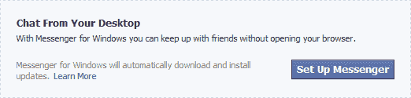

# 脸书测试 Messenger for Windows Ticker+聊天桌面客户端| TechCrunch

> 原文：<https://web.archive.org/web/https://techcrunch.com/2011/11/21/messenger-for-windows/>

# 脸书测试 Messenger for Windows Ticker+聊天桌面客户端

脸书今天开始允许有限的测试用户群下载新的 Windows 桌面客户端 Facebook Messenger。它提供了对聊天、Ticker feed 和通知的访问。脸书正在评估人们对桌面访问这些实时功能的兴趣，这些功能可以让用户全天使用该服务，而不必打开浏览器窗口。该客户端可能会变得流行，因为脸书集成的 Windows Live Messenger 桌面客户端可以让你与朋友以及第三方即时消息联系人聊天，是 Facebook 平台上最热门的应用，拥有[1820 万](https://web.archive.org/web/20230326022213/http://appdata.com/leaderboard/apps?metric_select=dau)日活跃用户。

我已经确认了客户与脸书的有限测试版发布，这让我看到了新的帮助中心文章的细节和截图。通过主页提示通知随机选择加入测试组的用户总数。没有公开的下载链接，客户端只兼容 Windows 7，尽管它完全由脸书开发，并不构成与微软的新合作关系。

脸书正努力让更多用户使用其聊天服务。今年夏天，它发布了用于 iOS、Android 和黑莓的[独立信使应用](https://web.archive.org/web/20230326022213/https://techcrunch.com/2011/08/09/facebook-launches-standalone-mobile-messenger-app-and-it%E2%80%99s-beluga/)，作为新的聊天分发点。通过 Messenger，脸书正在挑战即时通讯、短信以及某种程度上的电子邮件。然而，其他的 Messenger 客户端都没有包含 Ticker，它显示返回 Facebook.com 的链接。

通过将聊天和自动收报机结合起来，脸书可以在其产生大量持续关注的通信系统上吸引用户，然后通过点击自动收报机和通知链接让他们频繁返回网站。由于这些[广告今天已经整合到 Facebook.com 的自动收报机中](https://web.archive.org/web/20230326022213/https://techcrunch.com/2011/11/21/sponsored-stories-ticker/)，我正在等待来自脸书的关于赞助故事是否也会出现在客户端的回复。如果他们这样做了，集成了 Ticker 的 Messenger 客户端可能会成为一个收入来源和一个吸引力。

通过将脸书削减到实时元素，用户可以全天打开 Messenger for Windows。这将让他们看到关于脸书活动的桌面通知，这比让浏览器窗口开着更能增加他们对网站的参与度。如果 Windows 7 版本获得支持，Mac 和其他操作系统的客户端可能会出现。

