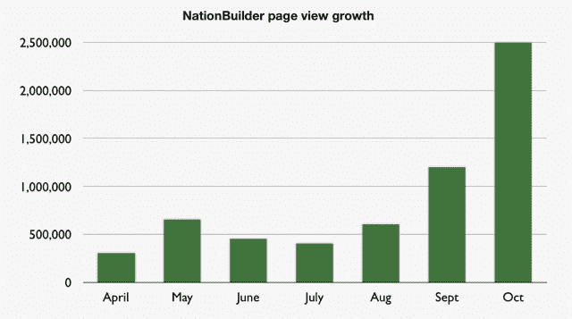
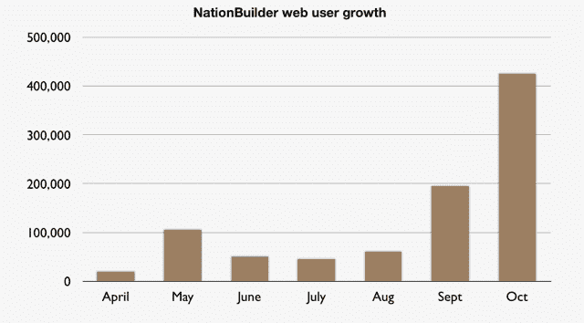

# 随着流量激增，NationBuilder 向大型组织敞开了大门 TechCrunch

> 原文：<https://web.archive.org/web/https://techcrunch.com/2011/11/21/with-traffic-surging-nationbuilder-opens-its-doors-to-larger-organizations/>

# 随着流量激增，NationBuilder 向更大的组织敞开了大门

如果你正在经营一场政治运动、一个慈善机构或任何其他团体，其中与社区成员保持联系——和/或向他们委派任务——是至关重要的，那么你可能会对一家名为 [NationBuilder](https://web.archive.org/web/20221206121124/http://www.nationbuilder.com/) 的初创公司感兴趣。

这项服务于 4 月份推出，次月完成了由[克里斯·休斯](https://web.archive.org/web/20221206121124/http://www.crunchbase.com/person/chris-hughes)牵头的 50 万美元种子资金。休斯最为人所知的是联合创立了脸书，并在 2008 年领导了奥巴马总统的网上竞选活动(换句话说，他正是这种创业公司需要的那种支持者)。

今年秋天，它开始获得一些强大的牵引力。9 月份，该网站有近 20 万独立访客，浏览量为 120 万次，而在接下来的一个月，这个数字跃升至 40 万，浏览量为 250 万次。这项服务现在有 300 个团体，共有大约 100 万支持者注册。该网站的核心功能之一是筹款，到目前为止，各团体已经通过该平台筹集了 330 万美元。

现在它已经站稳脚跟，NationBuilder 已经准备好了。到目前为止，这项服务仅限于成员少于 20 万的群体，但现在它正在向更大的群体开放，这显然将为更多的增长铺平道路。

虽然该网站目前的许多团体都围绕着政治活动或非盈利组织，但其他团体也在使用它，如[比尔小学家长会](https://web.archive.org/web/20221206121124/http://www.beallpta.org/)和围绕纪录片[干细胞革命](https://web.archive.org/web/20221206121124/http://www.stemcellrevolutions.com/)的社区。Gilliam 说，最终该网站的目标市场比政治和非营利组织要广泛得多——它是“每个人都在网上建立一个社区”。

你可能也有兴趣看看社交筹款平台[Rally.org](https://web.archive.org/web/20221206121124/http://www.rally.org/)(你可以在这里找到我们之前对它的报道[)。](https://web.archive.org/web/20221206121124/https://beta.techcrunch.com/2011/06/16/social-fundraising-platform-piryx-is-reborn-as-rally-org-with-top-investors-in-tow/)

【vimeo 23455664】

