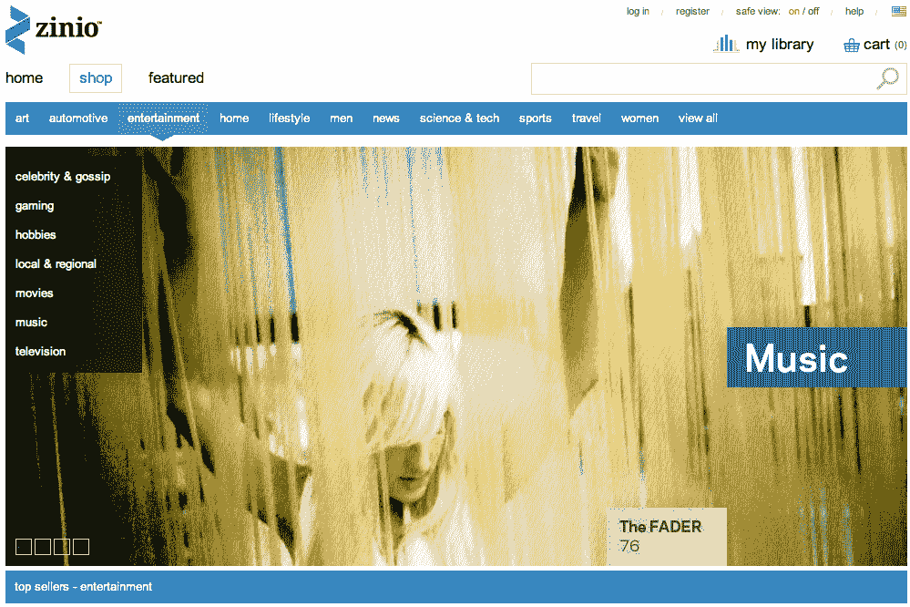

# Zinio 为数字报刊亭 TechCrunch 筹集了 2000 万美元

> 原文：<https://web.archive.org/web/https://techcrunch.com/2011/11/23/zinio-raises-20-million-for-digital-newsstand/>

# Zinio 为数字报刊亭筹集了 2000 万美元

Zinio 宣称自己是世界上最大的数字报刊亭和书店，根据一份提交给 [SEC 的文件](https://web.archive.org/web/20221211043003/http://sec.gov/Archives/edgar/data/1517707/000151770711000001/xslFormDX01/primary_doc.xml)，它已经[筹集了 2000 万美元](https://web.archive.org/web/20221211043003/http://www.crunchbase.com/company/zinio)的新资金。

Zinio 在全球范围内提供各种语言的来自大多数主要出版商的数千种杂志。该公司的网站允许在台式电脑(Windows、Mac OS X 和 Linux)和移动设备(如 iPad、iPhone、iPod Touch、WebOS 和 Android 手机)上在线或离线阅读出版物(他们刚刚推出了他们的 [Kindle Fire 产品](https://web.archive.org/web/20221211043003/https://beta.techcrunch.com/2011/11/15/zinios-magazine-newsstand-hits-kindle-fire-gives-new-users-25-shopping-perk/))。

Zinio 最初成立于 2000 年，由亿万富翁企业家大卫·h·吉尔摩(David H. Gilmour)所有，董事总经理道格·卡尔森(Doug Carlson)(仅列在监管备案文件上)和 Zinio 创始人兼首席执行官理查德·马格乔托(Richard Maggiotto)负责运营业务。该公司最近还任命前 Jigsaw(现为 Salesforce 公司)高管 Virendra Vase 为新的首席运营官。

Zinio 总部位于旧金山，在纽约、伦敦、巴黎、巴塞罗那和台北设有办事处。

我们上次听说 Zinio 筹集资金是在 2005 年，当时该公司完成了由北桥风险投资公司和英联邦资本公司牵头的一轮 700 万美元的增长融资，部分是为了资助一项收购。

目前还不清楚他们或哪些新投资者参与了最近的 2000 万美元融资，但我们已经联系了该公司以了解更多信息，并将在收到回复后更新。

