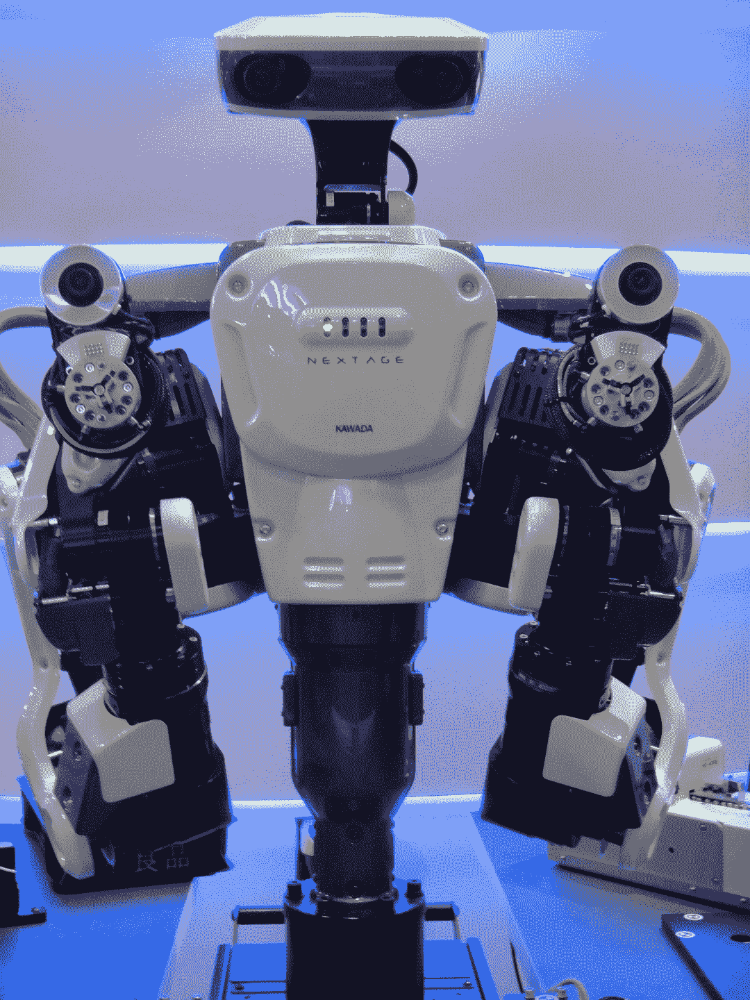

# 日本公司展示机器人与人类合作(视频)

> 原文：<https://web.archive.org/web/https://techcrunch.com/2011/11/28/japanese-company-shows-robot-co-working-with-humans-video/>

# 日本公司展示机器人与人类合作(视频)

我们离机器人技术又近了一步:总部位于 T2 的川田工业公司已经开发出一种人形机器人，它是专门设计来和人类一起工作的。所谓的 Nextage 当然不是这种类型的第一个机器人，但他的规格令人印象深刻，而且他已经商业化了。

Nextage 配备了一个高速立体摄像机和两个手臂，每个手臂有 12 个关节，可以定位在 30 微米内。当人类工人靠近时，出于安全原因，机器人会立即停止工作。

川田解释道:

> 我们创造了这些机器人与人一起工作，并在相同的环境中与人合作。人们所做的工作不涉及搬运大型物体或快速移动。我们的目标是让工业机器人像那样做人类的工作，因此人们可以通过与机器人一起工作来提高生产率。

然而在下面的视频中，你可以看到三个联网的 Nextage 机器人在东京的一个展览上自己组装物品(并向人群展示成品)——不需要人类的帮助:
【YouTube = http://www . YouTube . com/watch？v = jb5a 4 wugy 4 q&w = 560&h = 315】

*视频由 [Diginfo TV](https://web.archive.org/web/20221010231455/http://www.diginfo.tv/2011/11/25/11-0246-r-en.php)* 提供