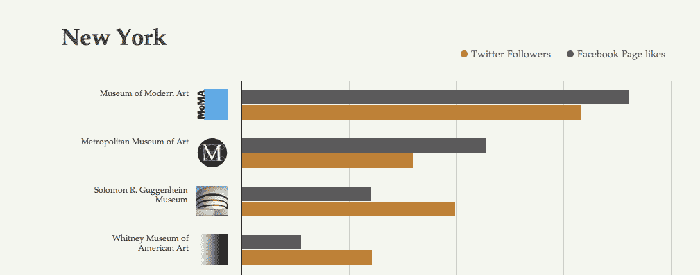

# 是时候在推特上发布艺术了:Museum-Analytics.org 密切关注策展社交媒体 TechCrunch

> 原文：<https://web.archive.org/web/https://techcrunch.com/2011/11/28/time-to-tweet-the-art-museum-analytics-org-keeps-tabs-on-curatorial-social-media/>

# 是时候在推特上发布艺术了:Museum-Analytics.org 密切关注策展社交媒体

套用 Cracker 的话，我怀疑这个世界现在需要的是另一种方法来评估世界各地各种博物馆的社会指标，就像我需要一个脑袋上的洞，但想必这些信息对外面的某人很重要，所以就这样吧。

Museum-Analytics.org[T3 是一个有着简单使命的网站:计算各种博物馆的社会影响力。这项服务使用各种各样的资源，以及 Twitter 和脸书来查找世界各地近 3000 个博物馆的新闻和信息。

例如，你可以在](https://web.archive.org/web/20221205173238/http://www.museum-analytics.org/)[梵高博物馆](https://web.archive.org/web/20221205173238/http://www.museum-analytics.org/van-gogh-museum)(座右铭:“进去不需要花一只耳朵和一条腿！”)包括新脸书赞、推文、提及博物馆的评论，以及为博物馆创建的吸引人的内容。我可以把这看作是对策展人和导演的一种恩惠，对试图把这些古板的组织至少推向 20 世纪的博物馆迷来说也是有价值的。

它现在正在测试中运行。在“关于”页面中:

> 博物馆分析是由荷兰的 INTK 发起的。INTK 主要为文化组织研究和开发在线策略，并创造反映艺术、技术和社会的批判性干预。

这可能是了解即将到来的事件和有趣的展览的一个很好的来源，这对游客来说很棒。我可以肯定地看到这个网站和一个城市旅游网站之间的融合(例如，[这里是纽约，](https://web.archive.org/web/20221205173238/http://www.museum-analytics.org/city/new-york))，最终将高潮和低谷融合在一起。