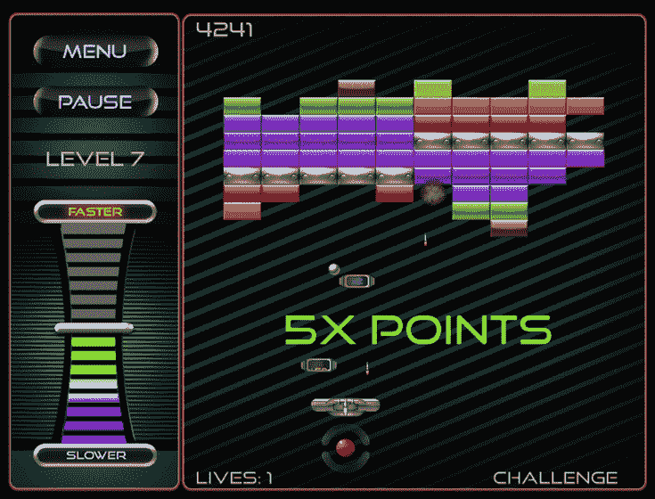

# 雅达利希望将自己重塑为一家手机游戏公司；聘请前 iWON/漫威高管担任 TechCrunch 执行副总裁

> 原文：<https://web.archive.org/web/https://techcrunch.com/2011/11/29/atari-looks-to-reinvent-itself-as-a-mobile-games-company-hires-former-iwonmarvel-exec-as-evp/>

由诺兰·布什内尔和特德·达布尼于 1972 年创立的雅达利公司[在电子游戏的早期历史中发挥了核心作用，继续创造了这个星球上仍然最知名的一些街机游戏，如蜈蚣、突围和乒乓，仅举几例。更不用说它的操纵杆控制的 Atari 2600 游戏机在 20 世纪 80 年代几乎是“视频游戏”的同义词。](https://web.archive.org/web/20221203082427/http://www.atari.com/)

尽管雅达利仍然是全球公认的品牌，但该公司在 1983 年的视频游戏崩溃中苦苦挣扎，财务问题以及各种资产在许多不同的所有权和领导制度下下跌，包括华纳通信和孩之宝等。

如今，雅达利是一家拥有 65 名员工的公司，总部位于纽约和法国。该公司看起来与 20 年前有很大不同，但目前的领导团队正专注于利用雅达利的资产、其强大的品牌认知度和全球分销，将它重塑为一家移动和社交游戏公司。

但是这样做并不容易。EA 是最大和最知名的视频游戏公司之一，也有强大的品牌认知度和许多成功和受欢迎的游戏，如战地，速度的需要，质量效应，国际足联和马登，仅举几例。艺电已经认识到，它不能指望仅仅通过保持游戏机公司的地位和推出热门游戏的续集来与 Zynga 这样的公司竞争。在过去的几年里，EA 一直忙于将其旗舰游戏移植到社交和移动渠道。当然，这还不够。([更此处](https://web.archive.org/web/20221203082427/https://beta.techcrunch.com/2011/10/29/ea-wants-to-take-on-zynga-but-does-this-just-mean-more-madden/))。)

正如雅达利首席执行官吉姆·威尔逊所说，任何公司成功的关键是创造高质量的原创产品。“没有其他方法可以保持长期的生存能力”，他说。“雅达利不能固步自封，我们必须保持相关性”。

为了将移动和社交重新聚焦为游戏的双头未来，雅达利在 4 月份发布了 iOS 版的“最热门游戏”，这是雅达利经典游戏的 18 个标题的样本课程。本月早些时候，雅达利在安卓系统上推出了最受欢迎的产品。两周前，[公司将它的小行星系列带到了 iOS](https://web.archive.org/web/20221203082427/https://beta.techcrunch.com/2011/11/11/ataris-classic-asteroids-franchise-finds-new-life-on-ios/) ，为一种新的媒介量身定制了这款复古游戏。

《小行星:枪手》在头两周成为 App Store 上的十大畅销书，自 4 月份发布以来，《点击数》在各平台上的下载量已超过 350 万次。因此，这家老牌游戏公司在将其经典游戏转移到手机上方面取得了一些成功，就像 EA 和其他公司在它之前所做的那样。

12 月 8 日，雅达利将继续在手机上发布其经典游戏，因为它将在 iOS 上推出“突围:助推”，这是 1976 年街机经典游戏的放大版。该游戏将包括传统的五个级别，以及 200 个额外的砖块打破级别，可以通过应用内购买解锁。

Breakout 还将看到新的控制功能，允许游戏者改变球的速度以增加难度，以及通电，“手榴弹球”(和球升级)，砖块品种，保存进度的能力，以及 OpenFeint 和游戏中心的集成。

为了支持为移动设备改造游戏，雅达利还增加了一些高管，包括最近聘请游戏和娱乐业资深人士 Gui Karyo 担任开发和运营副总裁。Karyo 之前曾在 Mindspark、Majesco 和漫威担任高级管理职位，并接管了公司产品开发、运营和 Atari.com 的日常监管工作，以加速其移动和在线战略的发展。

随着雅达利追求新的免费增值、微交易驱动的品牌重塑，在社交和移动游戏开发以及围绕这些不断增长的渠道重组业务流程和产品方面拥有丰富经验的领导力是关键。雅达利要想在社交游戏领域与大公司竞争还有很长的路要走，但作为一家相对精简的公司，它可能比之前的一些大型公司更容易过渡到移动和休闲游戏领域。

当然，领导力只是开始。为了建立一个成功的现代手机游戏公司，Atari 必须在内部成为一个由专注于手机的开发者、工程师和设计师组成的公司。他们正在路上，雅达利的首席执行官说，该公司正在制定计划，将增加对开发者社区的外联，以激起对雅达利游戏现代化的兴趣。

雅达利很高兴拥有和/或管理着一个超过 200 款游戏和特许经营的庞大图书馆，其中包括蜈蚣、导弹司令部、Pong、试驾、后院运动和猎鹿人等品牌。展望未来，威尔逊表示，公司正在寻求为新一代游戏玩家改进这些游戏，更新他们的外观，同时保持游戏身份。

但更重要的是推出新的原创游戏。雅达利可以继续经营其品牌和经典街机游戏，并可能继续利用品牌认知度赚钱，为多年来出现的所有新渠道改造其游戏。但是，如果不创造新的相关产品，雅达利作为一家移动公司的重塑真的只是皮毛。

看看雅达利目前的财务状况，这种作为移动和数字业务的再创造似乎是必须的。该公司的数字收入(上半年)占其总净收入的 63.6%，而去年上半年为 20.1%。今年上半年，数字收入为 1050 万美元，同比增长 630 万美元。这使得该公司将其运营亏损削减至约 260 万美元，比去年同期提高了 61.2%。

收入仍然很低，但专注于数量更少、利润更高的游戏帮助该公司看到了毛利率的提高；虽然增加在 R&D 的支出和新数字游戏的营销导致了较低的数字，但 Wilson 和他的团队希望这种投资可以帮助推动其移动转型。

为此，这位首席执行官还表示，该公司目前正在招聘，现在正在寻找“最优秀和最聪明的人”，以帮助引导其新的移动/社交轨迹。如果该公司能够学习 Zynga 的指标驱动的客户保持方法，同时将免费增值、位置和社交元素融入他们的新游戏，雅达利可能会摆脱重播模式。

你怎么想呢?