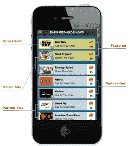

# Burstly 为应用内广告管理筹集了 550 万美元；为 iOS 和 Android 推出移动报价中介 TechCrunch

> 原文：<https://web.archive.org/web/https://techcrunch.com/2011/11/30/burstly-raises-5-5m-for-in-app-ad-management-launches-mobile-offer-mediation-for-ios-android/>

应用开发者并没有太多的盈利选择，这就是为什么除了应用内购买，他们越来越依赖移动广告。出于这个原因，他们想从广告中获得最大收益，而且，事实上，他们想直接向顾客销售。不幸的是，对于大多数小团队来说，这是不可能的。这就是像[这样的初创公司突然进入市场的原因。](https://web.archive.org/web/20221006202512/http://www.burstly.com/)

虽然有很多移动广告中介解决方案可供选择，但 Burstly 首席执行官埃文·里夫金认为，目前的一批解决方案还不足以让开发者完全控制货币化机会。例如，初创公司[为开发者](https://web.archive.org/web/20221006202512/https://beta.techcrunch.com/2010/10/06/burstly-lets-mobile-app-developers-set-up-storefronts-to-sell-their-own-ads/)提供了一个店面，使他们能够建立自己的品牌门户，广告商可以直接购买他们应用程序中的位置。

至于空间的走向，里夫金说，开发者希望从一个仪表板上控制和管理他们所有的收入渠道，这样他们就可以进行比较，看什么能带来最多的钱，无论是广告网络，优惠提供商，交叉促销还是直接销售。为了推进这一目标，这家初创公司今天推出了 Burstly Rewards，这是一款在 iOS 和 Android 上协调移动产品的产品。

简而言之，Rewards 使开发者能够在一面墙内协调多个提供商，混合内部和直接活动，并能够将 UI 与应用的外观和感觉相匹配，以及支持多种优惠类型，无论是视频、优惠、下载(仅限 Android)还是共享。

 Burstly 的产品旨在将控制权交给开发人员，这样他们就可以立即做出改变，而不必更新 SDK——例如，如果他们需要关闭某个不合规的合作伙伴，他们可以快速完成，或者在不更新 SDK 的情况下添加新的合作伙伴。

该产品有两个基本组件:奖励墙，允许应用程序开发人员在一个地方混合和匹配第三方网络、内部和直接销售的优惠，以及选择要显示的提供商(和优惠数量)。第二个是奖励页面，允许他们通过一个可定制的品牌页面来运行奖励驱动的活动，该页面占据了应用程序的整个屏幕。用户可以通过应用程序中的自定义按钮和/或横幅访问奖励页面。

这些新产品和 Burstly 现有功能集背后的想法是试图为开发者的应用程序提供一切可以想象的赚钱机会。里夫金表示，随着广告中介领域的发展，这家初创公司不会将该领域的其他公司视为竞争对手，而是努力将其他公司纳入他们的解决方案，例如，Smaato、Mobclix、Nexage 和 MoPub 都在名单上。更多即将推出。

为了支持新产品的推出和店面产品的进一步发展，Burstly 今天宣布从 GRP Partners、Rincon Venture Partners 和 SoftBank Capital 获得了 550 万美元的 B 轮融资。这些现有投资者是该公司去年 3 月 180 万美元首轮融资的主要贡献者。该公司的总投资现在刚刚超过 730 万美元。

Burstly Rewards 从今天开始测试，开发者可以申请加入。里夫金说，公司将在假期前推出几款“知名”游戏和奖励产品。

更多信息，[请点击](https://web.archive.org/web/20221006202512/http://www.burstly.com/)在家中查看。