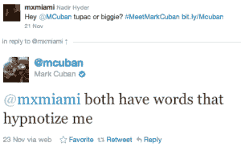

# 创业、投资和日常交易:马克·库班 TechCrunch 的五个问题

> 原文：<https://web.archive.org/web/https://techcrunch.com/2011/11/30/startups-investing-and-daily-deals-five-questions-with-mark-cuban/>

有些人认为马克·库班是个天才，有些人认为他很幸运。不管怎样，这家伙有本事在别人看不到的地方看到价值，找到长期投资，并最终站在交易的正确一方。有些人可能不同意他的方法，但马克·库班是一个亿万富翁，虽然当你有一堆钱可以玩时，赚钱会容易得多，但成为亿万富翁并不是偶然的。(不包括乐透中奖者。)

对于那些还没有赚到第一个 10 亿的年轻人来说，这位投资者的早期故事应该是令人欣慰的:大学毕业后，库班开始了他的酒保生涯(足够幸运)。接下来，他在一家个人电脑软件零售商做了一年的销售，年薪 18000 美元，[，之后因为会见新客户](https://web.archive.org/web/20221205110458/http://blogmaverick.com/2004/04/25/success-and-motivation-part-2/)以达成交易而不是开设零售店而被解雇。

他后来创建了系统集成商和软件经销商 MicroSolutions，但直到获得文凭八年后，他才卖掉了自己的第一家企业，1990 年 CompuServe 以 600 万美元收购了这家企业。然后，更出名的是，他基于对大学篮球和网络直播的共同爱好创建了一家公司(Audionet)，将它变成了 Broadcast.com，并在互联网繁荣的高峰期以 59 亿美元的股票价格将其出售给雅虎。

从那以后，他参与了许多项目，最显著的是帮助建立达拉斯小牛队，他在 2000 年购买了这支球队的多数股权，成为年度季后赛竞争者，并在 2011 年击败勒布朗成为 NBA 冠军。

在过去的十年里，他也成为越来越活跃的科技初创公司天使投资人，(你可以在[的 CrunchBase 个人资料](https://web.archive.org/web/20221205110458/http://www.crunchbase.com/person/mark-cuban)上简单了解一下他投资的公司)，他花了相当多的时间辅导年轻的企业家。

因此，看到他花了不止几分钟的时间发展业务，投资初创公司，并就如何发展、何时转向以及如何赚钱向公司提供建议([他最近甚至写了一本关于这个主题的书](https://web.archive.org/web/20221205110458/http://www.amazon.com/How-Win-Sport-Business-ebook/dp/B006AX6ONI/ref=sr_1_1?s=books&ie=UTF8&qid=1322557416&sr=1-1))，我们借此机会就科技行业面临的一些热门话题向这位投资者提出了几个问题。看看下面他的回答:

> **关于初创公司是否估值过高/资金过剩，人们正在进行一场大辩论……真的存在首轮融资危机吗？你认为这会以糟糕的结局收场吗？**
> 
> 这真的取决于你住在哪里。硅谷对待创业的方式与世界其他地方有很大不同。硅谷的初创公司起步很大。在其他任何地方，我们都采用精益、平均的启动机器方法。
> 
> 前者可能会遇到周期性融资问题，因为它们的成功首先取决于退出，其次才是运营盈利能力。如果 IPO 市场再次关闭，外国投资枯竭，硅谷初创公司的资本可能会受到影响。
> 
> 至于资金过剩，在我看来，西方流行的观点是，退出大公司的唯一途径是从大公司起步。有了这种心态，就没有所谓的过度投资。但这不是我曾经采取的方法。我每个季度都资助全国多家公司。相信我，没有人资金过剩。如果他们执行，他们会得到他们需要的现金。
> 
> 你认为 Groupon 被高估了吗？
> 
> 我喜欢 Groupon。他们的估价是市场所说的那样。他们不可能注意到那噪音。他们必须坚持不懈，专注于在消费者和零售端不断为客户增加价值。如果他们能做到，他们会一路笑到银行。
> 
> **我们已经看到了 Pandora 的崛起，以及 Spotify 等一系列有趣的网络广播/音乐服务的兴起。好奇作为投资者/顾问，你如何看待这些玩家。你认为亚马逊/谷歌音乐/Spotify 等有可能取代 iTunes 吗？**
> 
> 这一切都归结于直接和法定的标签许可费。我在 Broadcast.com 犯的最大的职业错误之一是没有更努力地对抗 DMCA。有这么多荒谬和武断的限制，每个音乐公司都有这一点作为他们业务的威胁。
> 
> 我也担心专利钓鱼者会进来扼杀这个行业。
> 
> **作为一个比大多数人更了解数字视频的人，你认为我们应该关注哪些最有趣的公司和趋势？**
> 
> 只要记住一点:电视的未来就是电视。电视仍然是无聊的最佳替代品。如果你看看所有试图补充电视的互联网视频公司，他们都做得很好。如果你看看那些试图取代电视的人，他们是在放屁。我认为网飞做得很好，是一个补充。他们犯了一个大错误，但他们仍然是大人物。
> 
> 你认为脸书有机会成为互联网的操作系统吗？或者社交/交友真的只是一个泡沫吗？
> 
> 现在他们是重要的平台。所以，是的，他们有机会结束一切，继续前进。它们已经成为我们许多人的主页。也就是说，他们的移动解决方案作为一个平台很糟糕。他们很容易受到某个人的攻击，他会让基于移动设备的社交变得比脸书现在更好、更吸引人。

更重要的是，作为对读者的奖励，库班也同意回答一些在这篇文章评论部分的“热门”问题。收到最多“喜欢”的三个将被选中，所以请提出您自己的问题并“喜欢”离开。另外，给你一个警告:他不会回答与篮球相关的问题，所以你的问题应该集中在技术和商业上。

 这位投资者兼小牛老板最近一直处于问答状态的部分原因是，他同时担任投资者和顾问的一家初创公司——[jungle cents](https://web.archive.org/web/20221205110458/http://www.junglecents.com/)——最近推出了一项赠品，获胜者将获得与库班的免费午餐。一旦用户注册了 JungleCents 的时事通讯，他们就可以向投资者发推文，就他们选择的任何话题向他提问，对此库班一直以同样的方式回应。

小牛的老板是个好人，但显然 JungleCents 的模式是库班认为很有价值的模式——足以让他允许这家初创公司利用自己的个人品牌进行推广。当然，这符合他的最佳利益，但有多少投资者同意这么做呢？

去年 10 月，库班向 JungleCents 投资了 150 万美元，董事会成员包括好莱坞制片人彼特·萨法兰、盖伊·川崎和 Garage Ventures 的比尔·赖克特。库班相信这家总部位于旧金山的初创公司的原因是什么？除了在不到一年的时间里，这家初创公司的交易量达到了 220 万个电子邮件地址(包括出版商)，用户注册率在过去 3 个月里增长了两倍之外，该公司正在采取一种替代方法来处理日常交易。

 JungleCents 使用了一种潜在客户生成模式——类似于 Orbitz 等航空公司和旅游公司为 Kayak 等网站带来新客户而支付费用的方式——为出版商提供补充收入来源。

为了做到这一点，JungleCents 接受公司的礼品卡，而不是现金，然后将其作为日常交易，并提供折扣。([你可以在这里](https://web.archive.org/web/20221205110458/https://beta.techcrunch.com/2010/10/22/mark-cuban-junglecents/)阅读我们对这家初创公司的初步报道。)例如，在最近与男性生活方式杂志 AskMen 的合作中，这家初创公司与男性零售商 Bonobos 合作，为他们的产品提供折扣，然后在 JungleCents.com 和 AskMen.com 展示。

这使得 AskMen 的读者可以利用与杂志内容相关的交易，而不必离开网站。顾客可能会花 48 美元购买一张 100 美元的优惠券，在 Bonobos 消费，用户可以随时兑现——一次性兑现，或者分时段兑现。

当我问店主是什么吸引了他，他说:*“我喜欢白标交易解决方案的想法，它允许网站利用自己的流量。大多数网站的核心竞争力是很少，如果有的话，来源交易。Junglecents 可以为他们代劳，并从中分一杯羹。这是低开销，大量的汗水资产，所以不是一个大的现金投资，但如果他们能够将正确的交易匹配到高流量的网站，则具有高杠杆作用。*

这就是了。

#### 更新:

以下是库班对一些热门问题的回答。看看他们。

> **Mitesh Bilimoria:
> 你职业生涯最大的错误是什么，你从中学到了什么？**
> 
> 从专业角度来说，在 DMCA 的谈判中，它并没有积极地追赶美国电影协会和 RIAA。另一个错误是没有申请专利。我个人认为，专利在很大程度上是没有价值的，不能保护你的业务，但在 Broadcast.com，我们在流媒体、组播和内容上传方面做了很多原创和独特的事情，现在诉讼环境已经改变，这些产品组合将会值很多钱。
> 
> **本杰明·沃克:
> 我们都知道 Broadcast.com，但是是什么让微软取得了成功呢？**
> 
> 我们是该国最先开始销售/安装/集成局域网的 5 家公司之一。早在人们知道它们是什么之前。
> 
> 安德鲁·普拉特金:
> 嘿，马克，你在找实习生吗？
> 
> 关于无薪实习的规定是致命的。这太麻烦了，不值得。
> 
> Joe McMackin:
> 如果你又回到了 22 岁，没有钱，你会在哪个行业创办自己的第一家公司？
> 
> 我会从开发允许人们微调家中无线技术的应用程序开始。无线路由器的最佳位置。测试两者之间的连通性。向 Siri 提供智能，告诉它应该集成哪些部分以及如何集成。
> 
> **帕特·奥布莱恩:
> 寻求融资的公司接触你的最佳方式是什么？如果你没有主要的关系，或者如果你不能有一个热情的介绍…**
> 
> 电子邮件。直截了当地告诉我，为什么你所拥有的与竞争对手不同，你想从我这里得到什么，如果我给你，我会得到什么。简单。