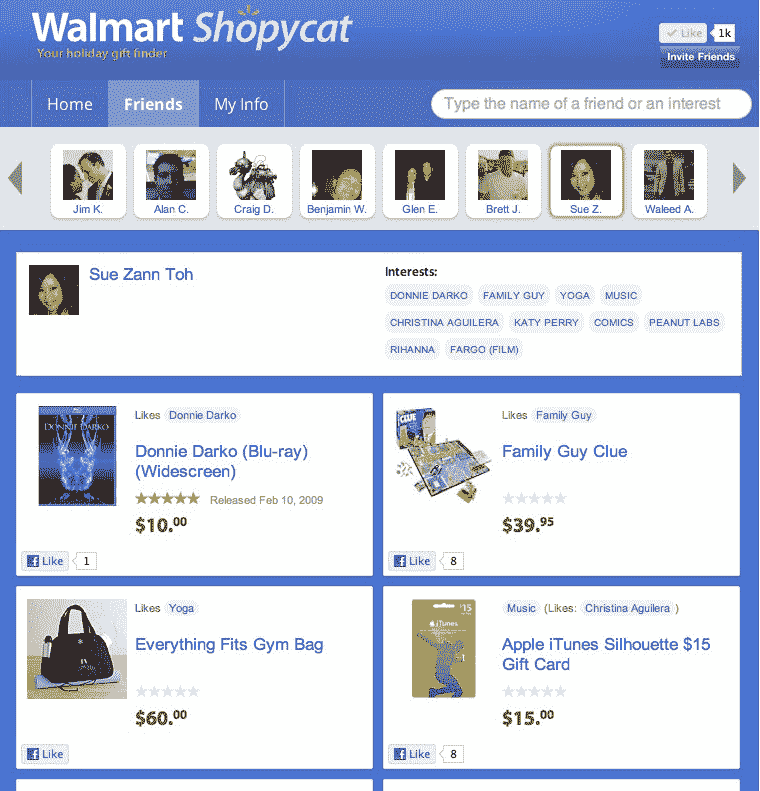

# 沃尔玛推出 Shopycat，这是一款基于脸书| TechCrunch 的社交礼品搜索工具

> 原文：<https://web.archive.org/web/https://techcrunch.com/2011/11/30/walmart-launches-shopycat-a-social-gift-finder-built-on-top-of-facebook/>

零售业巨头沃尔玛今晚将推出其首个社交礼品平台，名为“ [Shopycat](https://web.archive.org/web/20230403233358/http://www.facebook.com/shopycat) ”这项服务之前处于测试阶段，最初是作为脸书的一个应用程序提供的，在那里它还将被推广给近 1100 万“喜欢”[沃尔玛粉丝页面](https://web.archive.org/web/20230403233358/https://www.facebook.com/walmart)的脸书用户。这款应用程序根据脸书的使用情况为朋友推荐礼物，它是由沃尔玛[今年早些时候从社交媒体初创公司 Kosmix(现为@WalmartLabs)收购的](https://web.archive.org/web/20230403233358/https://techcrunch.com/2011/04/18/walmart-ventures-into-the-social-media-space-with-acquisition-of-kosmix/)技术开发的。

有趣的是:这款新应用不仅会让你看到 Walmart.com 的礼物推荐页面。它还推荐了二十几家其他零售商的产品，包括 Barnes & Noble、ThinkGeek、RedEnvelope、NBC Universal、Hot Topic 等。(只是当然不是亚马逊)。

沃尔玛礼物推荐背后的技术源于 Kosmix 的社交基因组，这是一个语义技术平台，最初用于支持主要建立在 Twitter 之上的社交媒体发现服务。现在 Kosmix 的平台是沃尔玛的一部分，这些相同的算法被用来根据人们在脸书的帖子、个人资料更新和“喜欢”来分析他们的兴趣

这个系统足够聪明，能够理解脸书状态更新背后的情绪，而不仅仅是相关的关键词。所以，比如你发了*“我讨厌暮光之城！”*作为脸书状态更新，Shopycat 不会建议你的朋友给你买《破晓》蓝光。它还知道哪些物品比其他物品更“适合送礼”，使用的算法可以检查许多信号，包括新近性、独特性(例如，珍藏版优于标准版)以及 Walmart.com 购物者的总体购买行为。

虽然明显的目标是通过沃尔玛的电子商务网站鼓励流量和购买，但该公司采取了一种独特的方法，没有使它成为沃尔玛独有的应用程序。也就是说，如果沃尔玛没有库存的完美礼物，无论是在网上还是在你当地的商店，它会给你指出另一个零售商有。首先，这包括大约 20 个第三方的名单，但该公司计划明年增加这一数字。这一努力还包括 iTunes、星巴克和 Zynga 的礼品卡。

这些外部推荐是一种聪明的策略，用来提升脸书应用程序本身的病毒性质(也就是说，它不仅仅是沃尔玛，所以它实际上有点酷)。但这种设计也有助于沃尔玛应对其主要的在线零售商:几乎无限的在线仓库，即亚马逊。沃尔玛是否会利用这些推荐(据我们所知，它没有获得任何附属收入)，来通知自己以后的购买决定，还有待确定。

我们知道，该公司确实计划在未来的某个时候将脸书连接整合到自己的电子商务网站中，允许用户通过脸书认证来查看朋友的社交推荐。当然，这可以服务于更有价值的目的，将脸书用户的在线身份与他们的实际交易数据相关联，但是这是否会发生(或者会发生到什么程度)仍然是未知的。

在不久的将来，他们的计划是将 Walmart.com 在线商店搬到脸书。该应用程序目前会在购物时将用户带出脸书，但到了 2012 年年中，Shopycat 本身将发挥在线商店的功能，允许用户在沃尔玛购物，而不必离开脸书。

当然，沃尔玛并不是第一个利用脸书的社交信号推荐礼物的公司。自制商品商店 Etsy 最近推出了其[礼品搜索器](https://web.archive.org/web/20230403233358/http://www.etsy.com/gifts)，也是基于脸书的数据，[易贝最新收购的 Hunch](https://web.archive.org/web/20230403233358/https://techcrunch.com/2011/11/21/ebayshunch/) ，它以通过提问构建推荐的“品味图”而闻名，[早在 2010 年就发布了自己的脸书应用](https://web.archive.org/web/20230403233358/https://techcrunch.com/2010/09/11/you-are-so-predictomatic-play-the-hunch-facebook-predictor-game/)。然而，作为世界上最大的实体零售商，沃尔玛进军社交商务的努力不容忽视。

值得一提的是，亚马逊从 2010 年 7 月就已经有了[类似的技术，并且早在 2008 年](https://web.archive.org/web/20230403233358/https://techcrunch.com/2010/07/27/amazon-now-taps-into-facebook-for-social-product-recommendations/)[就已经开始试验脸书社交礼物应用](https://web.archive.org/web/20230403233358/https://techcrunch.com/2008/03/12/amazons-latest-product-launch-is-a-couple-of-facebook-apps/)。但亚马逊最近的重点更多地放在了移动设备上，有过多的应用程序和 Kindle 设备，而不是开发脸书推荐技术。事实上，其脸书支持的推荐在亚马逊主页上仍被列为“测试版”。坦率地说，自去年发布以来，它们的准确性并没有提高多少。在早期测试中，沃尔玛的 Shopycat 应用程序似乎至少与亚马逊的推荐不相上下，也就是说，只是公平。(例如，不要给我买《星球大战》中的绝地浴袍。)但除了“取消链接”脸书页面以调整应用程序使用的信号之外，Shopycat 不允许你定制推荐。

尽管像这样的技术已经存在多年，但它仍然是社交电子商务的早期。利用脸书获得推荐、礼物和其他方面的许多缺陷和问题都将被及时克服。要亲自体验 Shopycat，请访问这里的脸书应用程序。

【T2