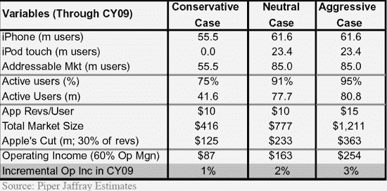
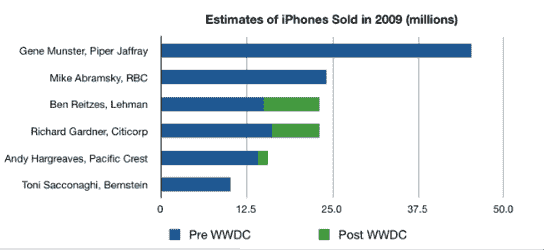

# 2009 年 iPhone 应用程序的销售额为 12 亿美元。吉恩·蒙斯特在抽什么？TechCrunch

> 原文：<https://web.archive.org/web/https://techcrunch.com/2008/06/11/12-billion-for-iphone-apps-in-2009-what-is-gene-munster-smoking/>

我和下一个人一样是 iPhone 的狂热崇拜者，但是 Piper Jaffray 分析师吉恩·蒙斯特有点过分了。他估计，到 2009 年底，将会有 5500 万 iPhone 用户，仅 iPhone 应用商店一项就能带来 12 亿美元的收入。不管他在抽什么，我都想抽一点。

别误会我的意思。我认为[新的 iPhone 应用](https://web.archive.org/web/20221209120748/http://www.beta.techcrunch.com/2008/06/09/here-come-the-new-iphone-apps/)将是购买 3G iPhone 的最大原因，但他们不可能在 2009 年获得 12 亿美元的收入。让我们仔细看看明斯特的假设，这是今天早些时候[AppleInsider](https://web.archive.org/web/20221209120748/http://www.appleinsider.com/articles/08/06/11/apples_app_store_could_emerge_as_1_2b_business_by_2009.html)讨论过的。

公平地说，12 亿美元是明斯特最大胆的设想。iPhone 应用商店收入的保守方案是 4.16 亿美元，“中性”方案是 7.77 亿美元。但不管你怎么看，他的整个分析都基于两个错误的假设。第一个是，一定比例的“活跃”iPhone 和 iPod Touch 用户每年会从 iPhone 应用商店下载一个免费的应用程序，并购买一个 10 美元的应用程序。

虽然乍一看这似乎很合理，但明斯特自己知道这是一派胡言。在最近的苹果开发者大会上，他对 iPhone 开发者进行了一次非正式调查，发现 70%的 iPhone 应用程序可能是免费的，而那些待售的价格将很快降至 3 美元或更低。当然， [Appleinsider 也报道了](https://web.archive.org/web/20221209120748/http://www.appleinsider.com/articles/08/06/11/wwdc_survey_suggests_70_of_planned_iphone_apps_may_be_free.html)这些发现，但没有指出它们与早先帖子中的明斯特数学相矛盾。如果 70%的应用程序是免费的，那么每个活跃用户购买至少一个待售应用程序的机会就会大大降低。

让我们来看看明斯特的中立案例。他估计，7770 万活跃用户将每人获得两个应用程序(总计 1.554 亿)。但如果其中 70%是免费的，那将只带来 4.662 亿美元的收入，而不是 7.77 亿美元。如果价格从 10 美元下降到 3 美元，那么收入将进一步减少到 1.4 亿美元。对于他的激进场景(他基本上假设 1.21 亿个应用程序以每台 10 美元的价格出售)，总花费将从 12 亿美元下降到 3.64 亿美元。

但是等等。我们仍然没有解决他的第二个主要的有问题的假设。到明年年底，将上市的苹果手机总数。他对 5500 万英镑的“保守”估计一点也不靠谱。自近一年前推出以来，苹果迄今已售出 600 万部苹果手机，预计到 2008 年底将售出 1000 万部。明斯特认为 2009 年它将能卖出 4500 万台，是第一年销量的 7 倍多。是的，价格下调(T2，如果你可以称之为)至 199 美元将刺激更多的销售。但销售额不会增加 7 倍。

明斯特在这里的边缘。正如我在苹果 2.0 博客的前商业 2.0 同事菲利普·埃尔默-德威特在下面转载的图表中所显示的，大多数其他华尔街分析师认为 2009 年苹果手机的销量不到 2500 万部。这与新定价公布后的修订数字是一致的。贝尔斯登的托尼·萨科纳吉认为苹果只会卖出 1000 万。因此，这可能会很容易地将明斯特的苹果应用商店收入再次减半。

如果苹果应用商店明年只赚 1.5 亿美元，我仍然会认为它是成功的。苹果从手机和订阅中赚了很多钱。实际上，免费应用程序越多越好。这只是购买苹果手机的又一个原因。

