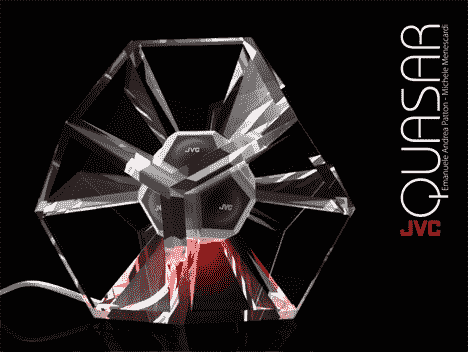
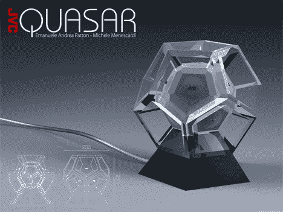
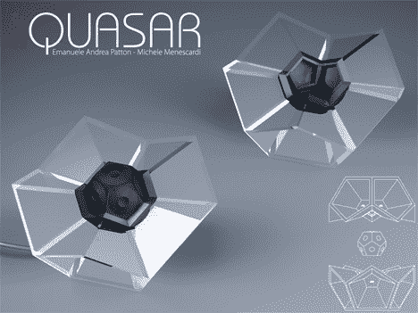

# 12 面 360 度扬声器概念:请有一天真实 

> 原文：<https://web.archive.org/web/http://techcrunch.com/2007/08/27/12-sided-360-degree-speaker-concept-please-be-real-one-day/>

# 12 面，360 度音箱概念:请有一天是真实的

一家工业设计公司最好雇佣负责 Quasar 12 面扬声器的人。由于其时尚的外形，这款扬声器可以 360 度全方位发声。

假设他们听起来不像泥，我不介意看到他们直接进入大规模生产。当然，与这些概念相比，[实际上](https://web.archive.org/web/20221005132751/http://crunchgear.com/category/n-gage/)发布的设备通常很糟糕。

向[设计师](https://web.archive.org/web/20221005132751/http://www.copenmilan.com/)脱帽致敬。

[360 度音箱](https://web.archive.org/web/20221005132751/http://www.yankodesign.com/index.php/2007/08/27/360-degree-speaker/)【Yanko 设计】