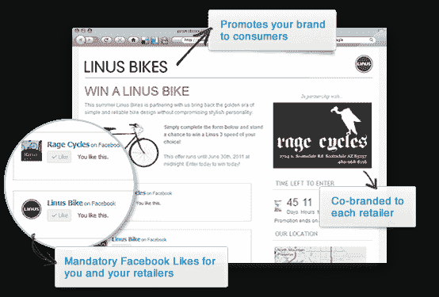

# TechStars 2011 毕业生 Promoboxx 为品牌对零售商营销平台 TechCrunch 筹集了 56.5 万美元

> 原文：<https://web.archive.org/web/https://techcrunch.com/2011/12/02/techstars-2011-grad-promoboxx-raises-565k-for-brand-to-retailer-marketing-platform/>

专注于品牌到零售商营销的 TechStars Boston 2011 公司 Promoboxx ，刚刚完成了 56.5 万美元的种子融资。资金来自个别天使戴夫巴尔特，彼得博德斯，亚当贝里，让哈蒙德和其他人。此外，包括 SK Ventures、Brand Ventures 和 Launch Capital 在内的机构也做出了承诺。

该公司的在线服务允许零售商快速建立在线促销活动，同时也允许品牌建立自动定制的促销活动，供当地零售商使用。

如今，品牌每年花费近 300 亿美元支持零售商使用线下材料，包括店内标牌、黄页广告和报纸广告。但是几乎没有一笔营销资金花在网上，尽管 90%的产品仍然通过实体店销售。

“品牌没有意识到他们零售商的营销潜力，”Promoboxx 联合创始人兼首席执行官 Ben Carcio 说，“随着消费者的激增和本地购物的流行，许多零售商在脸书、推特等网站上创造了大量的追随者。当两者结合在一起时，它们的影响力往往比它们所销售的品牌更大，”他解释道。

【T2

这就是 Promoboxx 的用武之地。使用其在线服务，商店可以在几分钟内建立零售促销活动，包括抽奖、优惠券、赠品和其他旨在增加商店客流量的促销活动。在线仪表板允许零售商在任何地方发布促销信息，包括通过电子邮件或脸书等社交网站。它还支持自定义脸书标签和脸书“喜欢”需求来收集线索。

在后端，该服务提供了拖放式促销生成器、实时转化报告、自定义参赛表格创建工具、数据导出、模板化法律竞赛规则和隐私政策表格等。

另一方面，品牌也可以利用这项服务来建立一个为无限数量的零售商自动定制的促销活动，使用所有相同的工具来挖掘零售商的本地客户群。从仪表板上，品牌可以跟踪所有相关零售商的促销印象、销售线索和转换率。

Promoboxx 总部位于马萨诸塞州剑桥市的肯德尔广场，目前正在与 Primesport、Cat shootes、Bates shootes、Vertx 和 Mattingly Sports 等品牌合作。该公司的创始人本·卡西奥(Ben Carcio)、[索尼里·洪诺尔(Sonciary Honnoll)](https://web.archive.org/web/20221206111749/http://www.crunchbase.com/person/sonciary-honnoll "Sonciary Honnoll")和[丹·科兹亚克](https://web.archive.org/web/20221206111749/http://www.crunchbase.com/person/dan-koziak "Dan Koziak")都有深厚的营销背景，这让他们能够将自己的专业知识带到这家新公司。