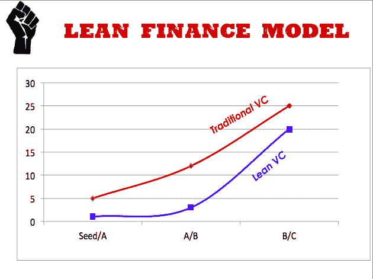
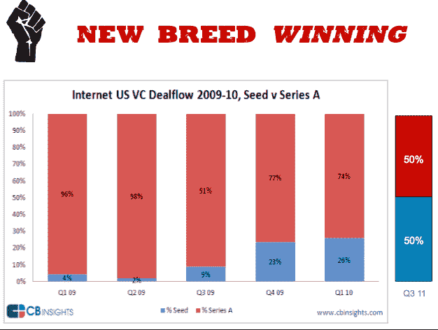

# 风险投资的精益财务模式 TechCrunch

> 原文：<https://web.archive.org/web/https://techcrunch.com/2011/12/04/lean-finance-model-venture-capital/>

# 风险投资的精益财务模式

风险投资行业最近经历了一系列的混乱。我最近听到的关于正在发生的事情的一个更好的解释来自邓肯·戴维森，他是 [Bullpen Capital](https://web.archive.org/web/20221009055819/http://bullpencap.com/) 的管理合伙人，他上周在东京 TechCrunch 上就这个主题做了一个很好的演讲。我在后台对他进行了视频采访，他总结了自己的观点。

正如现在有大量的“精益创业公司”需要较少的资本来制造产品一样，戴维森认为也需要一种“精益财务模式”。“我们处在廉价的时代。整个概念是让公司尽可能保持精简，直到公司验证了它的市场，然后你再投入资金。”

科技创业公司不需要 500 万美元，200 万到 300 万美元就够了。所以 A 轮融资现在被绕过，直到一家公司证明了自己，然后你就会看到这些大型的后期融资。或者有时初创公司以 3000 万到 5000 万美元的价格被出售，这没什么，因为它一开始就不需要成长为一个巨大的估值。

从这个角度来看，我们并没有真正看到[首轮融资危机](https://web.archive.org/web/20221009055819/https://beta.techcrunch.com/2011/11/09/crunchcrunch/)(越来越多的种子基金公司未能找到首轮融资)。相反，他们获得的资金越来越少，直到被收购，或者在随后的大规模融资中，大型风投公司开始施展他们的影响力。“我称之为铲入轮，”他说。“我们在 a 下面。”

他指出，现在进入创业公司的第一批机构资金中，有一半“来自新一代超级天使”与两年前相比，这是一个巨大的变化，当时只有不到 10%的资金来自超级天使(见下面的幻灯片)。

大牌风投依然会做得很好。今年上半年，7 家顶级公司控制了 80%流向风险投资的资金。为生存而挣扎的是中层企业。

