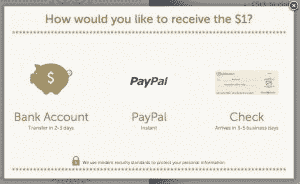
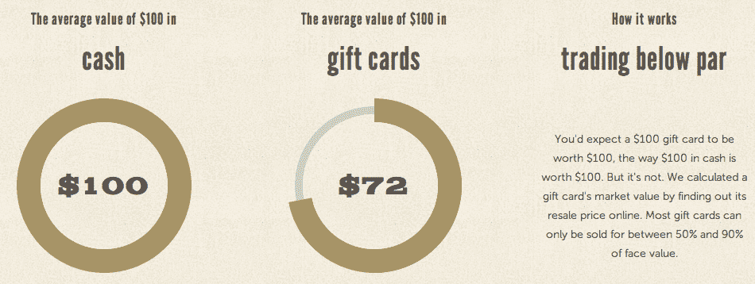

# 在天使轮的支持下，GiftRocket 超越了签到，使虚拟礼物赠送变得更加容易 TechCrunch

> 原文：<https://web.archive.org/web/https://techcrunch.com/2011/12/07/backed-by-angel-round-giftrocket-moves-beyond-the-check-in-to-make-virtual-gift-giving-even-easier/>

# 在天使轮的支持下，GiftRocket 超越了签到，使虚拟礼物赠送更加容易

今年 Y Combinator 春季班的毕业生 GiftRocket 发起了一个伟大的想法。这家初创公司希望将礼品卡与基于位置的服务结合起来，这样朋友们就可以互相发送礼品卡，只有在他们“入住”到某个位置后才能访问。因此，举例来说，如果你真的想让你的朋友在当地某家咖啡店试喝咖啡，你可以给他们一张去那家咖啡店的礼品卡，他们只能在咖啡店里兑换。

[正如 Robin 在 3 月](https://web.archive.org/web/20221004231549/https://beta.techcrunch.com/2011/03/21/giftrocket-lets-you-send-gifts-that-can-be-redeemed-only-at-specific-locations/)指出的，这个想法是 Venmo 的 Gifi 的简化版本，基本上是让用户结合 Venmo 和 Foursquare 应用程序来达到同样的效果。我说“曾经”,是因为 GiftRocket 如今正从其服务的“登记”部分转向一种更加简化和通用的发送个性化礼品卡的方式。

从今天开始，GiftRocket 用户可以通过电子邮件或脸书，使用 PayPal、银行转账或支票发送和接收数字礼品卡。基本上，GiftRocket 现在是一个简单的 P2P 捐款服务，因为用户可以决定在母亲节给他们的母亲寄 50 美元，并在个性化的电子邮件中说:“妈妈，这是 50 美元，供你在 Barnes & Nobles 使用”。GiftRocket 并不直接涉及商家，但 GiftRocket 的联合创始人 Kapil Kale 告诉我，他认为这种社会压力/证明因素将确保人们以预期的方式使用虚拟礼品卡。最棒的是。他们的礼品卡不会过期。

 如果你给朋友或爱人汇去 50 美元，没办法肯定他们会在预定地点使用这笔钱(Kale 说他们最初推出的签到服务变得过于复杂，阻碍了某些互动)，但有了爱人汇给你的钱，你就不太可能把钱用在其他地方。但是，嘿，你总是可以给他们回邮件问问。

GiftRocket 还推出了两个补充工具(一个在今天，一个在不久的将来)来帮助加强其服务，包括一个使用户能够识别零售商实体礼品卡的真实销售价值的功能。显然，根据商家的不同，礼品卡的价值通常在面值的 50%到 90%之间，主要原因是实体礼品卡通常只能在单一的指定零售商处兑换，否则就会丢失或过期。(这就是为什么未使用的礼品卡有一个强大的二级市场，其价值估计为 300 亿美元。)所以创业公司的计算器会帮你算出你卡的价值是多少。

第二个即将推出的是 GiftRocket 的 VIP 礼宾服务，它将根据送礼者和受礼者的偏好(以及未来可能的脸书历史)为他们推荐礼物创意。想知道婆婆生日聚餐应该送哪里？GiftRocket 可以帮忙。

至于这家初创公司是如何赚钱的，它收取礼物金额的 1 + 5%的费用。关于这一点，Kale 今天还告诉我们，这家初创公司已经筹集了 50 万美元的天使投资，以帮助扩大他们目前的三人团队。GiftRocket 一直处于精益创业模式，正在寻找新员工，Kale 告诉我，该公司的客户和销售额逐月增长了 70%。

点击这里查看。

【T2