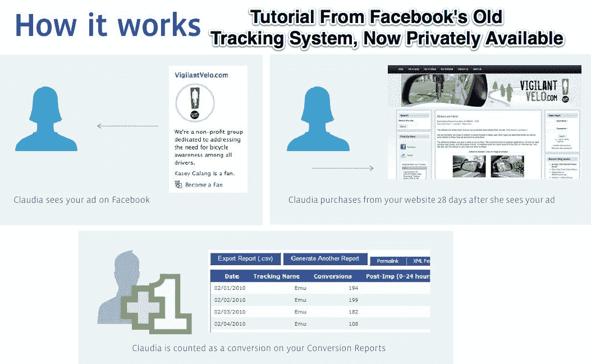

# 脸书悄悄向其最喜欢的广告商提供下游转化跟踪技术

> 原文：<https://web.archive.org/web/https://techcrunch.com/2011/12/07/conversion-tracking/>

2010 年 9 月，脸书公开停止了针对广告客户的[转化追踪](https://web.archive.org/web/20221006012402/http://www.insidefacebook.com/2010/01/26/facebook-testing-conversion-tracking-tool-for-advertisers/)项目。然而，我们刚刚发现并与脸书确认，它一直在悄悄地向一些顶级广告商提供一个特殊的下游转换跟踪系统。

脸书没有让广告商在他们的脸书广告中包含跟踪像素或删除 cookies，而是在广告商的转化页面上安装自己的像素，如电子商务结账或注册成功页面。脸书用谁看过什么广告的日志来引用谁触发了这个像素。这使得脸书可以跟踪广告点击率的直接转化，以及一个月后仅仅看到广告的人的间接转化。然后，它与广告商分享匿名的广告投资回报报告，显示转换的人中有多少比例以前看过某个公司的脸书广告。

因为没有 cookies 被丢弃，而且脸书是唯一能看到所有数据的人，所以隐私问题是有限的。尽管如此，一些人可能会发现只有特定的广告商知道这些有价值的数据是不公平的，因为衡量社交媒体的实际投资回报率是广告界的重中之重。

这个项目一直非常保密，以至于当我第一次问脸书时，很难获得细节。后来，该公司负责货币化的沟通经理布兰登·麦考密克告诉我，一些著名的广告商已经参与了这个私人项目，“我们不打算广泛提供这个项目。”

脸书 2010 年的转换跟踪测试实验允许广告商通过广告管理器创建自己的跟踪像素，然后将它们粘贴到他们网站的代码中。该系统已经停止使用，因为广告客户显然[发现使用起来太混乱](https://web.archive.org/web/20221006012402/http://www.insidefacebook.com/2010/09/28/advertiser-confusion-led-to-shutdown-of-facebook-conversion-tracking-tool/)，导致他们错误地计算了投资回报率，并对脸书广告的表现产生了不准确的印象。

脸书没有继续内部开发，而是让第三方有机会介入，通过 URL 跟踪标签提供直接的转化跟踪，这些标签可以识别外部网站的访问者是否来自脸书的广告点击。然而，他们不能像脸书的系统那样跟踪间接的下游转化或看到但没有点击广告的人。虽然人们认为该计划已经完全关闭，但脸书实际上开始托管和应用跟踪像素本身，以确保准确的使用。

关于广告客户从私人系统收到的数据，McCormick 回应道:“我们在我们这边进行分析，然后我们发布了一个幻灯片，显示有这么多人购买了这个[产品]，有这么多人在脸书上看到了这个广告。”为了保护用户，他告诉我“我们让广告客户签署合同(以保持数据隐私)，我们不与其他广告客户分享数据，我们不使用这些数据进行任何广告定位。纯粹是为了广告 ROI 分析。”然而，一些用户可能不会高兴地发现，他们的场外转换是参照他们的脸书广告印象。

那些承认该项目的广告商可能很高兴它仍然是有限的和私人的。它帮助他们优化总转化率，而不仅仅是点击量或即时转化率，从而使他们比竞争对手更有优势。然而，如果脸书真的想增加广告收入，它可能需要找到一种方法，使这种投资回报分析更广泛地可用，而不鼓噪隐私问题，这可能会使它在联邦贸易委员会遇到更多麻烦。

【T2