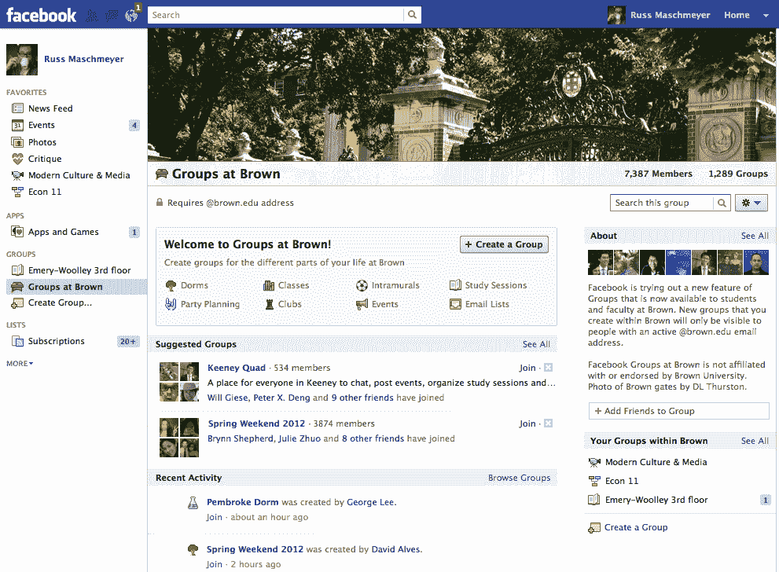

# 追根溯源，脸书测试。edu 专属团体 TechCrunch

> 原文：<https://web.archive.org/web/https://techcrunch.com/2011/12/09/groups-at-universities/>

# 追根溯源，脸书测试。edu 专属团体

很久以前，注册脸书需要一个大学的电子邮件地址，许多用户可以与学校网络中的每个人公开分享。为了在一个排外的社区中恢复安全分享的感觉，脸书已经开始测试一个新的“大学群体”功能。它允许用户创建仅对那些拥有经过身份验证的用户可见的组。他们学校的 edu 电子邮件地址。鼓励用户为他们的宿舍、班级、俱乐部、聚会等创建群组。

大学里的小组及其有限的可见性可能是为了让学生分享和讨论更广泛的内容——他们可能会使用私人电子邮件的内容。目前，只有布朗大学和范德比尔特大学的小组，但如果成功的话，脸书可能会向更多的学校推广这一功能

随着脸书向公众开放其服务，成年人最终开始加入，学生们可能已经开始分享较少与他们的学术生活相关的内容。关于学习会议或兄弟会聚会的状态更新可能在 2006 年到达更相关的受众。然而，到 2011 年，太多的家庭成员或雇主可能已经看到它，而没有仔细的隐私控制使用，导致学生自我审查或通过电子邮件讨论这些话题。脸书希望人们在它的网站上分享一切，大学里的团体可以帮助它收回一个核心用例。

已经在脸书注册的学生。edu 某学校的电子邮件地址在测试床上会看到被提醒的功能。一旦他们验证了自己的电子邮件地址，他们就可以创建与去年脸书推出的[标准群功能](https://web.archive.org/web/20221206234602/https://beta.techcrunch.com/2010/10/06/facebook-groups/)相同的开放、封闭或秘密设置的群，但他们学校以外的任何人都不能看到他们。在[大学]主页上的小组中，他们可以邀请同学加入该功能，并查看加入小组的建议和最近开放小组活动的提要。

布朗大学和范德比尔特大学被选中是因为他们对学生和校友使用不同的电子邮件地址。只有那些拥有当前学生地址的人才能进入，这使得粗略的应届毕业生无法闯入派对。

脸书正在努力应对自身无处不在的影响。其庞大的 8 亿用户数量可能会让每个用户更不愿意分享利基内容。像大学里的团体这样的功能可以帮助脸书抵挡只针对学生的社交网络和像 Path T3 这样的微型网络对目标分享的竞争。

