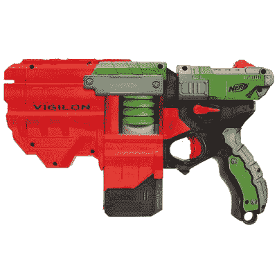
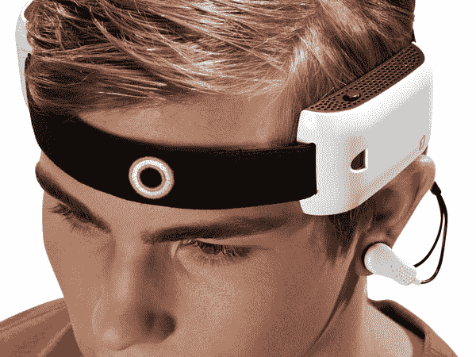
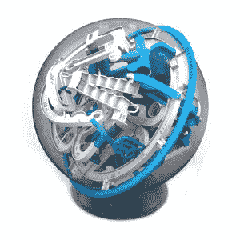

# 2011 年礼物指南:最佳玩具

> 原文：<https://web.archive.org/web/https://techcrunch.com/2011/12/09/techcrunch-gift-guide-2011-best-toys/>

# 2011 年 TechCrunch 礼品指南:最佳玩具

如果你是阿姨、叔叔、祖父、祖母、教母、教父、养父母，或者只是普通的老妈妈或爸爸，你可能会在你的假日购物清单上有一些孩子。这些是我今年遇到的一些有趣的玩具，都有一定的高科技优势，大人和孩子都可以享受。

LeapPad——99 美元——LeapPad 这样的蛙跳设备很受欢迎，也很有趣，但如果你有 4 到 6 岁的孩子，你想让他们远离 iPad，这款独立的平板电脑可能是正确的选择。它有一个内置摄像头，支持多种游戏，并且足够坚固，可以在地板上摔几次而不会摔坏。它甚至支持儿童电子书，所有这些都可以从 Leapfrog 获得。

* * *

[Nerf Vortex](https://web.archive.org/web/20230209124945/http://www.hasbro.com/nerf/en_US/vortex/)——23 美元起——Nerf Vortex 枪是对以前基于飞镖的枪的改进，以前的枪在各地的隔间居民和大学生中很受欢迎。这些枪远距离射击小型软盘相当准确。你可以在每一个片段中放入多个磁盘，然后像兰博一样向目标射击——这是不推荐的——你的妹妹。它们的大小和价格各不相同，所以在你拿起它之前，一定要知道预期的接收者父母对重炮的感受。

* * *

[Mindflex Duel](https://web.archive.org/web/20230209124945/http://mindflexgames.com/)——74.99 美元——我已经玩过几次 mind flex Duel，回来时有点困惑，但对这款复杂而又酷的游戏所采用的技术印象深刻。两名球员都戴着无线耳机，可以“感知”你的想法，让你沿着设定的轨道来回移动一个漂浮的球。挑战在于让球穿过各种环和洞，并独自用你的思想将它保持在高处。这是一款你第一次打开时很酷的游戏，但随着时间的推移可能会变得不那么有趣，这应该会让潜在的购买者暂停，特别是考虑到价格。网上查一下，自己决定要不要用脑子控制一个软泡沫球。

* * *

[Lite 精灵](https://web.archive.org/web/20230209124945/http://litesprites.com/)——15 美元起——没有多少高科技的女孩玩具，所以当我发现 Lite 精灵时，我特别高兴。这些 twee 塑料小精灵通过魔杖控制发出多种颜色的光，实际上可以从各种服务中采样颜色。例如，您可以将棒的底部放在一张彩纸上，顶部的 led 将尝试通过混合色调来重新创建该颜色。它总是有效吗？不，但它真的很酷。对于较大的玩具组，您可以将样本颜色发送到内部 led，照亮整个玩具组以匹配魔杖。

* * *

【YouTube = http://www . YouTube . com/watch？v=XKV-ZMb-Jxc#！]
——20 美元起——看上面的视频，你会觉得《轻击》非常震撼。作为一个 80 年代的孩子，我记得激光标签的喜爱掩盖了我玩这个相当简单的枪和靶玩具的实际次数。WowWee 在基本概念的基础上进行改进，创造了具有不同装载时间的枪，并可以使用特殊的附件，如望远镜瞄准具和雷达。

* * *

[令人困惑的史诗](https://web.archive.org/web/20230209124945/http://www.amazon.com/Perplexus-BL300-Epic/dp/B004H1V5RU)——30 美元——这款玩具非常简单，而且令人上瘾。它本质上是一个球内的三维迷宫。要解决它，你运行一个小金属 BB 通过各种洞，轨道和移动的杯子，不让它掉下来。这是一个有趣的思考玩具，适合喜欢专注于谜题而不是围着餐桌尖叫迪士尼歌曲歌词的孩子。

想要更多关于礼物的灵感，请点击这里查看我们的 [2011 年节日礼物指南。](https://web.archive.org/web/20230209124945/https://techcrunch.com/tag/gift-guide-2011)

