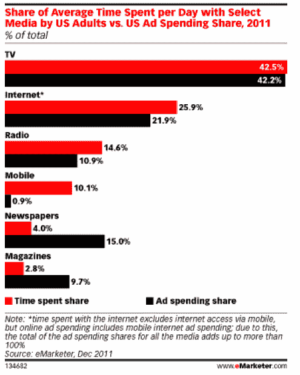

# 手机在花费的时间上超过了印刷品，但没有获得广告费 TechCrunch

> 原文：<https://web.archive.org/web/https://techcrunch.com/2011/12/12/time-spent-mobile-print/>

# 手机在花费的时间上超过了印刷品，但没有得到广告费

根据市场研究公司 eMarketer 的最新估计，就消费者花费的时间而言，网络很久以前就超过了印刷品，但 2011 年将是手机超过印刷品的第一年。现在，人们平均每天花在移动设备上的时间为 65 分钟，相比之下，每天花在印刷设备上的时间为 44 分钟(包括杂志和报纸)。去年，手机和报纸各 50 分钟，不分上下。

互联网上的时间为 2 小时 47 分钟(比 2010 年增加了 12 分钟)，但电视仍以平均 4 小时 34 分钟的时间占据主导地位。电视也能增加人们 10 分钟的时间。脐带切割理论到此为止。

然而，移动设备在花费时间上的绝对值和百分比都有最大的增长。这额外的 15 分钟转化为 30%的增长。美国成年人平均每天约有 10%的时间花在手机上，但手机广告仅占广告支出的 1%。预计移动营销人员在争取更大份额的广告预算时会指出这一差距。

与此同时，尽管花在媒体上的时间减少到只有 7 %,但印刷仍然占据了广告预算的巨大份额，占广告支出的 25%。这种差异不会永远持续下去。

