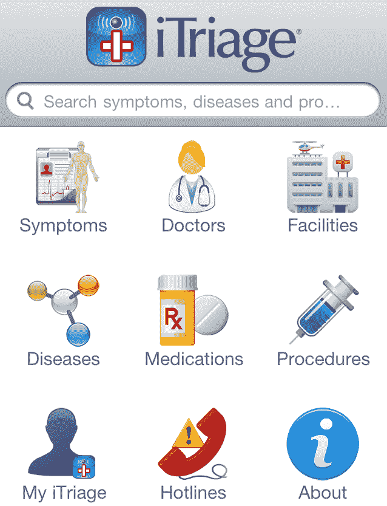

# Aetna 透露其收购了 Healthagen，后者是排名第一的移动健康应用 iTriage | TechCrunch 的开发者

> 原文：<https://web.archive.org/web/https://techcrunch.com/2011/12/16/aetna-itriage-healthagen/>

# Aetna 透露，它收购了排名第一的移动健康应用 iTriage 的开发商 Healthagen

在昨天的投资者会议上，健康保险和科技巨头[安泰](https://web.archive.org/web/20230331133329/http://www.aetna.com/)透露，它收购了移动应用程序 iTriage 的开发者 [Healthagen，尽管它没有透露价格。Aetna 的董事长、首席执行官和总裁 Mark Bertolini 告诉投资者，“大约一个半月前，我们收购了一家名为 iTriage 的小公司，这是当今医疗保健领域增长最快的消费者应用程序。”iTriage 允许用户检查症状、寻找医生、预约和进行医疗购物。它将增加新功能，并成为 Aetna 责任医疗组织的一部分。Bertolini 说“我们将开始改变医疗保健行业，给人们可以放在手掌上的工具。”](https://web.archive.org/web/20230331133329/http://www.itriagehealth.com/)

Aetna 的目标是通过 iTriage 让客户更多地参与到他们的医疗保健中，从而防止他们转向其他提供商。贝托里尼说，iTriage 将有助于“留住人才，这是增长的催化剂。”该应用程序的 300 万 iTunes 下载量也将为 Aetna 带来新的潜在客户，以及 Healthagen 与医院和紧急护理机构的数字关系。私人控股的 Lakewood，CO-based Healthagen 尚未宣布任何资助，也为 Android 平板电脑提供 iTriage。

iTriage 重现了 WebMD 等流行的基于网络的症状检查器的体验，但只针对移动设备。这些应用程序不仅可以充当昂贵商品和服务的门户，还可以收集有价值的流行疾病数据。考虑到 iTriage 在垂直应用领域的早期领先地位，此次收购看起来是安泰的一个明智之举。

[MobiHealthNews](https://web.archive.org/web/20230331133329/http://mobihealthnews.com/15324/why-aetna-acquired-itriage-app-maker-healthagen/) '对投资者会议的深度报道表明，Aetna 将在 iTriage 中增加成本估算。据安泰的战略多样化负责人查尔斯·桑德斯博士说，这将有助于安泰的客户“成为降低护理成本的合作伙伴”。这可能会大大降低安泰自身的成本。

此外，Bertolini 表示，关于 Aetna 的 iNexx 医疗保健应用程序平台，“我们将为消费者平台和提供商平台提供 SDK，以允许任何人编写在我们的平台上销售的应用程序。”这可能会在移动医疗技术市场创造更多的机会，预计到 2016 年移动医疗技术市场将翻两番，达到 4 亿美元。

