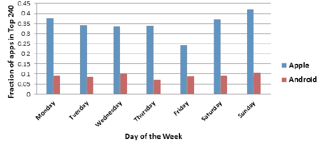

# 周日是发布移动应用 TechCrunch 的最佳时间

> 原文：<https://web.archive.org/web/https://techcrunch.com/2011/12/19/sunday-is-the-best-day-to-launch-your-mobile-app/>

根据移动分析服务 [Mobilewalla](https://web.archive.org/web/20230114073447/http://www.mobilewalla.com/) 的最新研究，周日是发布移动应用的最佳日期，但周三是开发者最受欢迎的一天。该公司研究了 2011 年 5 月 16 日至 9 月 8 日之间 17 周内 iTunes 应用商店和 Android Market 上发布的应用程序，以确定其发现。在此期间，有 91，754 个 iOS 应用程序发布到 iTunes 应用程序商店，122，220 个应用程序发布到 Android 市场。

没错，就是很多 app！该公司在 12 月早些时候报告称，所有四个平台(iOS、Android、黑莓和 Windows Phone)的应用数量增加到 987，863 个，目前平均每天增加 2，000 个应用。在过去的 12 个月里，iOS 应用从 338，000 增长到 589，148。安卓应用从 11.5 万增长到 31.9774 万。

在为期 119 天的研究中，Mobilewalla 按照应用程序发布的日期对它们进行分类。不过需要注意的是，在 Android 上，开发者控制发布日期，而 iOS 应用的发布日期受 iTunes 审核周期的影响。因此，宣布周三是开发人员普遍“喜爱”的一天可能是不公平的，因为他们并不总是能控制发布的时间框架。

即使周日并不总是开发者选择的发布日，Mobilewalla 发现那时发布的应用程序在统计上表现最好。也就是说，他们进入了前 240 名移动应用的名单。在这种情况下，Mobilewalls 将“前 240 名”应用程序定义为在各自商店中排名最高的应用程序。在周日发布的 iOS 应用中，42%进入了前 240 名，而 11%的 Android 应用也是如此。

与此同时，周四是在 Android 上发布应用程序最糟糕的一天，因为当时只有 7%的应用程序进入前 240 名。在 iOS 上，周五是最糟糕的，因为只有 10%的应用程序进入了前 240 名。

虽然与一周中发布的最佳和最差日期的趋势无关，但该公司在研究中偶然发现了一个相对令人悲伤的发现:苹果平台上的应用程序被发现的可能性**是安卓市场上的应用程序的四倍**。这说明了谷歌在更好地展示其应用商店中最好的新应用的能力方面仍然需要克服的挑战。

Mobilewalla 的创始人兼董事长阿尼迪亚·达塔博士解释说:“苹果用户比安卓用户更容易发现应用程序。虽然无法确定这种模式的确切原因，但用户可能会发现在周末启动的相对较少的应用程序中浏览项目更容易。”