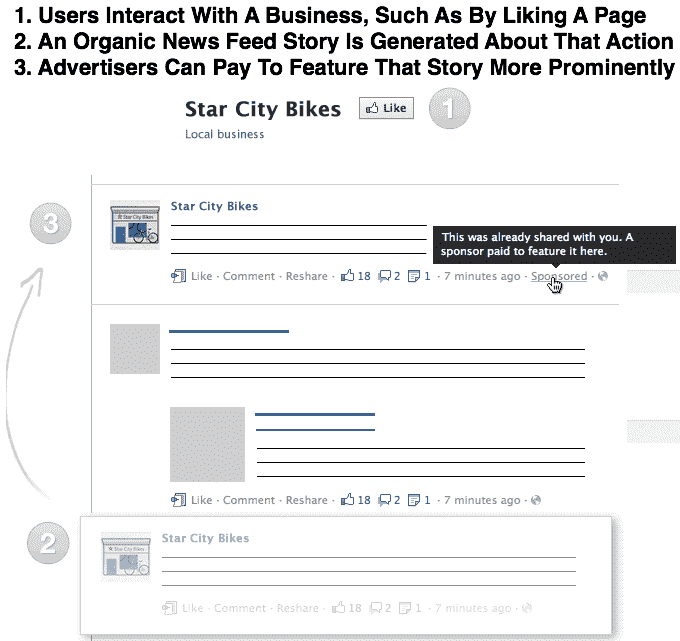

# 脸书赞助的故事广告将出现在 2012 年的网络新闻提要中

> 原文：<https://web.archive.org/web/https://techcrunch.com/2011/12/20/sponsored-stories-news-feed/>

该公司的一名代表告诉我们，从 2012 年 1 月开始，脸书将逐渐开始在网站网页版的主要新闻提要中显示[赞助故事](https://web.archive.org/web/20230315220937/http://www.facebook.com/ads/stories/)社交广告。自 2008 年以来，脸书就没有在新闻提要中显示广告，因此这对广告商和用户体验有很大影响。

广告将被标记为“赞助商”,一个费率限制将确保用户每天在新闻提要中看到不超过一个赞助商的故事。他们只会展示关于朋友的故事或者用户已经喜欢的页面。用户将不能选择不在新闻提要中看到赞助商的故事，也不能在新闻提要中使用他们的活动，但他们可以“x”掉个人广告。广告不会立即出现在移动新闻提要中，尽管脸书正在考虑这个想法，正如我们本月早些时候讨论的。

上面的截图显示了广告在新闻提要中的外观。在受欢迎且极易上瘾的新闻提要中显示推广内容和有机社交内容的能力是广告客户的圣杯。当用户聚精会神地浏览朋友的照片和更新时，他们最终也会消费广告。这些广告看起来与有机新闻报道非常相似，只在右下角标出——这是用户眼睛最后会扫描的地方。这意味着用户可能不会注意到区别，直到他们已经消化了广告的信息。

一些用户可能会对新闻提要中的广告感到愤怒，也可能会对他们的内容被如此直接地用来为脸书赚钱感到愤怒。其他人可能会认为，脸书免费向用户提供了一项有价值的服务，因此有权在它想去的地方展示广告。

就我个人而言，我更愿意看到能让我了解朋友活动的赞助故事，而不是相关性低得多的传统广告。然而，速率限制对于保持高质量的用户体验至关重要。如果每天显示太多新闻订阅源赞助的故事，订阅源可能会恶化成广告牌，用户可能不会再那么渴望访问脸书了。

从 2006 年开始，脸书测试允许广告商付费在新闻提要中显示[赞助的内容。脸书在 2008 年停止了这个项目，决定广告客户不应该付费在新闻提要中显示内容，除非它可以自然地出现在那里。](https://web.archive.org/web/20230315220937/http://www.facebook.com/press/releases.php?p=9176)

多年来，所有的广告都被限制在界面右侧的一个小侧边栏中。然而在 2011 年 1 月，脸书[推出了赞助故事](https://web.archive.org/web/20230315220937/http://www.insidefacebook.com/2011/01/24/sponsored-stories-feed-ads/)。它们允许广告商付费，将用户和企业之间互动产生的新闻故事转化为广告。这些操作可以包括用户喜欢某个页面、从他们已经喜欢的页面接收新闻订阅源更新、登录本地企业、从外部网站共享内容或使用应用程序。下面你可以看到赞助故事流是如何工作的，在这篇文章的底部是脸书的广告客户指南的摘录，显示了所有的广告类型。

【T2

今年秋天，赞助故事开始出现在自动收报机中，这是自 2008 年以来第一次将广告与社交内容混合在一起。用户没有积极抗议他们朋友的更新掺杂广告，这可能增强了脸书的信心，即它可以在主新闻提要中显示广告，而不会破坏用户体验。毕竟，广告只显示可能已经出现在提要中的内容。

从一月份开始，当广告商为这些赞助的故事付费时，他们将有资格出现在除广告侧边栏之外的主要新闻提要中。通过将它们与网站主页上的社交内容混合在一起，它们将更加引人注目，因此对广告商来说更有价值。“赞助商”一词将以灰色出现在广告故事的右下角。如果悬停在上面，它会显示“这已经与您共享。一个赞助商付钱让它在这里出现。脸书告诉我，它还将通过其他方式教育用户如何使用赞助故事，比如链接到帮助中心赞助故事部分的侧边栏广告。

鉴于脸书大约有 4 亿日常用户，其中一半在网络上，脸书可以将其每日广告库存增加多达 2 亿次。这种库存扩张可能会降低广告价格，尽管广告商对赞助故事需求的增加可能会抵消这一点。脸书还没有最终确定广告商是否可以选择特别要求在新闻提要中放置广告。研究表明，侧边栏赞助的故事比传统广告的点击率高 46%,你可以期待新闻源赞助故事的点击率会更高。

如果脸书能够经受住想要无广告新闻的用户的抗议，它将成功开辟一个重要的新收入来源。新闻供稿赞助故事的推出也可能是在线广告的一个重大转折点。凭借在世界上访问量最大的网站之一的显著位置，以及包括朋友的面孔和活动在内的对观众的吸引力，赞助商新闻供稿广告可以帮助脸书从付费搜索和谷歌 AdWords 和 AdSense 等传统展示中窃取广告支出。

更新:这篇文章最初说脸书以前从未在新闻提要中显示过广告。然而，正如这篇文章所反映的，脸书在 2006 年到 2008 年测试了新闻提要中的赞助内容。