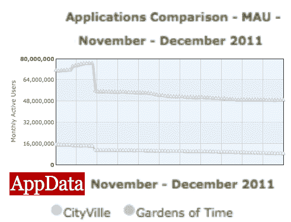

# 脸书冷落 Zynga 的 CityVille 成为最受欢迎的游戏，尽管 5X 用户的#1 时间花园 TechCrunch

> 原文：<https://web.archive.org/web/http://techcrunch.com/2011/12/21/facebook-top-games/>

Playdom 的《时间花园》在脸书 2011 年最受欢迎游戏排行榜中拔得头筹。但是等等，Zynga 的 CityVille 排名第三，尽管其月活跃用户数和日活跃用户数分别达到 1 亿和 2100 万——远远超过《时代花园》的 1700 万 MAU 和 400 万 DAU、[或 AppData](https://web.archive.org/web/20230204094204/http://www.appdata.com/compare/apps?compare_type=applications&compare1_name=CityVille&compare1_id=&compare2_name=Gardens+of+Time&compare2_id=&compare3_name=&compare3_id=&compare4_name=&compare4_id=&compare5_name=&compare5_id=&commit=Compare+%21) 的当前统计数据。这是因为脸书的榜单大多基于模糊描述的“推荐”，而几乎没有活跃用户。

这几乎就像是脸书使用了模糊的方法来阻止 Zynga 完全控制列表，因为马克·平卡斯机器目前拥有所有 5 款拥有最多 DAU 的脸书游戏，但仍然在脸书的列表中占据了前 10 名中的 4 名。

[ **太平洋标准时间 12/21/11** 晚上 9:25 更新:脸书整合了这篇文章的反馈，并[更新了](https://web.archive.org/web/20230204094204/https://www.facebook.com/notes/facebook-platform/top-games-on-facebook-in-2011/10150475844632302)其顶级游戏帖子，以更清楚地解释“最受欢迎”的含义。方法说明现在写道:“*这份名单是通过查看脸书上月活跃用户超过 10 万的顶级游戏，并优先考虑那些用户满意度得分最高的游戏而编制的。结果是 2011 年获得最多用户推荐的游戏列表。”只要它是透明的，我们很高兴看到脸书找到更多的方式来展示高质量的游戏，而不仅仅是那些拥有最多用户的游戏。]*

这是脸书公布的名单的图片和关于其方法论的注释:

脸书公关代表否认了我的理论。她告诉我，在方法论中，“最受推荐的应用程序(来自在画布上向用户展示的调查，用户可以回答是/否，‘你会把这个推荐给朋友吗？’”)…在最高月活跃用户数中排名更高。另一种说法是，这些应用程序在用户中的评分最高。"

但为什么不在帖子里说这是基于收视率，而不是活跃用户？该榜单本应标注“最满意的游戏”或“最值得推荐的游戏”，而非“最受欢迎的游戏”。失去头把交椅可能对上周首次公开募股的 [Zynga 的股票没有帮助。Zynga 和脸书已经合作多年，帮助 Zynga 实现流量目标。然而，这种关系可能会变得紧张，因为游戏公司计划直接向脸书平台之外的用户提供游戏。](https://web.archive.org/web/20230204094204/https://techcrunch.com/2011/12/19/zynga-shares-down-4-percent-on-second-day-of-trading/)

脸书本可以预测到，人们会问为什么排名第三的游戏比排名第一的游戏每月多 8000 万用户。如果 [CityVille](https://web.archive.org/web/20230204094204/https://apps.facebook.com/cityville/?ref=ts) 有 20%的平均“是”评分，而[时间花园](https://web.archive.org/web/20230204094204/https://www.facebook.com/GardensofTime)有 80%的平均“是”评分，那么很好，排名是合理的。但是，如果评级甚至有点接近，这似乎有点可疑的是，城市没有获得第一名，脸书没有透露实际的评级分数，甚至没有透露它们是该方法的核心。

要想在脸书平台上大获全胜，你需要一笔可观的营销预算、可以交叉推广的现有游戏，以及复杂的 A/B 测试技术。Zynga 拥有所有这些东西，而大多数开发者没有。排名第一的 Playdom 和排名第二的 EA(模拟人生社交游戏，峰值 MAU 为 6600 万，DAU 为 1100 万)也是如此。尽管如此，Zynga 坐上头把交椅将真正让人们明白，脸书的游戏业务是由大公司经营的。

这是一个问题，因为吸引中小型开发者的长尾对于留住总是寻找新玩法的游戏玩家至关重要。脸书想尽办法吸引规模较小的非硅谷开发商。它包括顶级后起之秀(Kixeye 的 Battle Pirates)和拥有 5 万至 10 万用户的最受欢迎游戏(超级老虎机)等类别。它还在给我们的一封电子邮件中引用了顶级体育应用 TopEleven，称其只有一支来自塞尔维亚的 30 人团队，并提到了来自德国、日本和布拉格的其他开发人员。

脸书促进开发者多样性并没有错，但是需要提前说明这个列表是如何计算出来的。避免让这个平台看起来像是赢家通吃或者像是依赖于 Zynga，这符合脸书的利益。通过模糊的方法，脸书不需要通过给 CityVille 第一名来强调这一点。

**太平洋标准时间 2011 年 12 月 21 日晚上 9:23 更新**:脸书编辑了它的顶级游戏帖子，整合了这篇文章的反馈。对最受欢迎榜单的方法，现在有了更透明的解释:“*这份榜单是通过查看脸书上月活跃用户超过 10 万的顶级游戏，并优先考虑那些用户满意度得分最高的游戏而编制的。结果是 2011 年获得最多用户推荐的游戏列表。”*