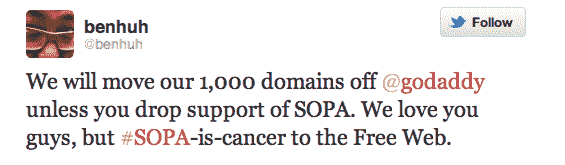

# Cheezburger 的 Ben Huh:如果 GoDaddy 支持 SOPA，我们将把 1000 多个域名转移到别处

> 原文：<https://web.archive.org/web/https://techcrunch.com/2011/12/22/cheezburgers-ben-huh-if-godaddy-supports-sopa-were-taking-our-1000-domains-elsewhere/>

# Cheezburger 的 Ben Huh:如果 GoDaddy 支持 SOPA，我们会把我们的 1000+域名带到别处

科技界精英的反 SOPA 集会仍在继续。

就在 Ycombinator 的保罗·格拉厄姆透露亲 SOPA 的公司[将被列入 YC 示威日](https://web.archive.org/web/20230326022751/https://techcrunch.com/2011/12/22/paul-graham-sopa-supporting-companies-no-longer-allowed-at-yc-demo-day/)的黑名单几分钟后，Cheezburger(如 I Can Has Cheeseburger，FAIL Blog，知道你的热图等。)首席执行官 Ben Huh 宣布，除非注册服务商放弃对该法案的支持，否则他们将从 GoDaddy 迁移 1000 多个域名。

Huh 的威胁足以让 GoDaddy 让步吗？可能不会:GoDaddy 是一家有很多争议的公司，所以他们更习惯于承受一点压力。也就是说，它*将*提高人们的意识，把你的域名(以及你的钱)带到别处是一种完全合法的抗议形式——事实上，Huh 的推文刚刚提醒我，我已经(让它有了)2 个域名在 GoDaddy 的院子里。谢谢你，本！

你可以在这里找到我们对 SOPA 的[全面报道，在这里](https://web.archive.org/web/20230326022751/https://techcrunch.com/tag/sopa/)和这里找到更多关于为什么这是一个如此糟糕的想法的信息。