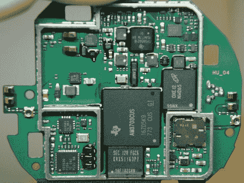

# Nest 恒温器拆卸展示美丽的内部结构、强大的 ARM CPU、Zigbee 无线电 TechCrunch

> 原文：<https://web.archive.org/web/http://techcrunch.com/2011/12/22/nest-arm-zigbee/>

# Nest 恒温器拆卸揭示美丽的内部结构，强大的 ARM CPU，Zigbee 无线电

Nest 恒温器是一件漂亮的环保电子产品。但就像你妈妈常说的，内在才是最重要的。那么，她会很高兴地发现鸟巢的内部和光滑的外表一样美丽。249 美元的恒温器可能很贵，但 SparkFun 上发布的一张拆解图显示了一个配得上这个价格的设备的内部结构。它不仅构造良好，而且 Nest 还带来了强大的处理能力和连接选项。愚蠢的夸张警告:鸟巢是游戏规则的改变者。

当你滚动浏览 [SparkFun 的图片](https://web.archive.org/web/20230209124851/http://www.sparkfun.com/tutorials/334)时，你会清楚地看到鸟巢的设计和制造着眼于细节。似乎没有电线或连接器随意放置。那是可以预料的。它的创造者托尼·法德尔在产品生命的最初几年里监督 iPod 的设计和生产。

Nest 的主印刷电路板上有一系列令人惊讶的芯片。中间那个巨大的是 Sitara AM37x ARM Cortex-A8，可以运行 Linux、Android 和 Windows Embedded CE，并且由于 PowerVR 内核，还支持 OpenGL ES 2.0。还有一种 ZigBee SoC 似乎目前尚未使用，这支持了 Nest 正在开发其他设备并将使用 ZigBee 进行无线连接的理论。

正如法德尔在 TCTV 采访中向莎拉·莱西解释的那样，鸟巢从用户行为中学习，并最终根据之前的活动调整房屋的气候控制。这需要大量的处理能力，但 Nest 有足够的 CPU 能量来驱动智能手机。额外的净空无疑增加了恒温器的可靠性，同时也允许公司在未来扩展其功能集。

Nest Labs 很快就在第一轮中销售一空。[另一批](https://web.archive.org/web/20230209124851/http://store.nest.com/)将于 2012 年上市，价格同样为 249 美元。我将第一个承认，恒温器的高额前期成本可能会抵消它通过智能调节家庭的加热和冷却系统而节省的任何费用。但是，我面带微笑地说，我很乐意扔掉钱，只是为了在我的墙上挂一个恒温器，它的处理能力足以胜过许多传统的计算设备。