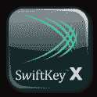

# 2011 年 30 大安卓应用和游戏 TechCrunch

> 原文：<https://web.archive.org/web/https://techcrunch.com/2011/12/24/top-30-android-apps-2011/>

**编者按:** *撰稿人布拉德·斯皮里森(Brad Spirrison)是移动应用发现服务 [Appolicious](https://web.archive.org/web/20230103023554/http://appolicious.com/) 、 [AndroidApps](https://web.archive.org/web/20230103023554/http://androidapps.com/) 和 [AppVee](https://web.archive.org/web/20230103023554/http://appvee.com/) 的执行主编。在研究了 2011 年最佳的 iOS 应用程序和游戏之后，Spirrison 现在将注意力转向了年度最佳的 Android 应用程序。*

* * *

Android 应用程序有各种形状和大小——毫不夸张。

与基本上为两种外形设计的 iOS 应用程序不同，Android 应用程序需要考虑几十种(如果不是几百种)设备类型来开发。除此之外，不一致的操作系统版本仍然会把事情搞得一团糟。虽然所有这些碎片化都让开发者头疼，但是忽视一个拥有 50%市场份额的平台最终会导致他们的危险。

因此，最好的 Android 应用程序是那些既能推动技术发展，又能让绝大多数用户使用的应用程序。这绝非易事。

我们将 30 款最佳安卓应用分成了四个不同的类别。排名前十的应用程序来自第三方开发者，如果不是专为 Android 开发的，也主要是为该平台开发的。其他部分包括谷歌最好的新应用或重大更新的应用，以及最早出现在 iOS 上但后来在 2011 年出现在 Android 上的最好的应用和游戏。

就像我们列出的 2011 年最佳 iOS 应用和游戏一样，数百款其他游戏也值得考虑。我们的前 30 名展示了过去一年 Android 应用的成长和成熟。它们也值得下载。

 ** 1。** [任意。DO: To Do List |任务列表](https://web.archive.org/web/20230103023554/https://market.android.com/details?id=com.anydo&feature=search_result#?t=W251bGwsMSwyLDEsImNvbS5hbnlkbyJd)(完整 [AndroidApps 回顾](https://web.archive.org/web/20230103023554/http://www.androidapps.com/finance/apps/912115-any-do-to-do-list-task-list-any-do))

由谷歌执行董事长埃里克·施密特资助。DO 是专为 Android 设备量身定制的最佳生产力和待办应用。该应用程序优雅的界面经过优化，可以通过语音驱动的命令来限制实际输入。用户可以在完成每个任务时滑动，并摇动手机将其从屏幕上清除。该应用程序还提供(大部分)与谷歌账户的无缝集成。

 ** 2。** [灯箱——照片&特效](https://web.archive.org/web/20230103023554/https://market.android.com/details?id=com.lightbox.android.photos&feature=search_result#?t=W251bGwsMSwyLDEsImNvbS5saWdodGJveC5hbmRyb2lkLnBob3RvcyJd)(完整[安卓应用回顾](https://web.archive.org/web/20230103023554/http://www.androidapps.com/apps/697454-lightbox-photos-effects-lightbox))

Lightbox 不仅仅是一个用于 Android 的 Instagram，它还提供了照片日志等功能，以及按照个人时间表排列照片的能力，这使它变得独一无二，对某些人来说是不可或缺的。该应用程序令人惊叹的视觉显示和在多种 Android 设备上的兼容性为该平台上的照片共享应用程序设定了标准。

 ** 3。**亚马逊 MP3 (完整 [AndroidApps 评论](https://web.archive.org/web/20230103023554/http://www.androidapps.com/apps/286396-amazon-mp3-amazon-com))

除了谷歌音乐(见下文)，亚马逊 MP3 是安卓智能手机和平板电脑用户戒除 iTunes 习惯的最佳方式。该应用程序提供了近 2000 万首歌曲的曲库，5GB 的免费存储空间，以及可靠的离线收听。亚马逊云驱动服务的订阅费用是 20 美元/年，20GB 的存储空间，但是你可以订阅任意多的音乐。

 ** 4。** [AirDroid](https://web.archive.org/web/20230103023554/https://market.android.com/details?id=com.sand.airdroid&feature=search_result#?t=W251bGwsMSwyLDEsImNvbS5zYW5kLmFpcmRyb2lkIl0.) (完整 [AndroidApps 评论](https://web.archive.org/web/20230103023554/http://www.androidapps.com/tech/apps/949224-airdroid-sand-studio))

Android 设备提供了如此多的定制功能，有时使用更大的屏幕、鼠标和全尺寸键盘将帮助您充分利用智能手机或平板设备。这款免费应用让用户可以通过连接 Wi-Fi 的电脑操作智能手机。此外，AirDroid 强调隐私保护，每次使用都要更改密码。

 ** 5。** [ SwiftKey X 键盘](https://web.archive.org/web/20230103023554/https://market.android.com/details?id=com.touchtype.swiftkey&feature=search_result#?t=W251bGwsMSwxLDEsImNvbS50b3VjaHR5cGUuc3dpZnRrZXkiXQ..)(完整 [AndroidApps 点评](https://web.archive.org/web/20230103023554/http://www.androidapps.com/finance/apps/381696-swiftkey-x-keyboard-touchtype-ltd))

在去年推出测试版应用程序后，SwiftKey X 于 2011 年登陆 Android 智能手机和平板电脑。这款应用拥有比 Androids 更大的密钥，以及更高级的单词和句子预测算法。SwiftKey 还可以从以前输入的电子邮件和信息中学习，并提供三种配色方案来简化过程和照亮事物。

 ** 6。**Skitch(完整 [AndroidApps 评论](https://web.archive.org/web/20230103023554/http://www.androidapps.com/finance/apps/769861-skitch-evernote-corp))

Skitch 被 Evernote 收购后，用户可以用草图、图像和文字来注释照片。该应用程序有非常简单的编辑工具，用户可以用多色蜡笔画画。Skitch 是一款非常棒的儿童应用，同时也是一款实用而独特的照片分享服务。

 ** 7。** [蓝山云接](https://web.archive.org/web/20230103023554/https://market.android.com/details?id=com.bluestacks.appsyncer&feature=search_result#?t=W251bGwsMSwxLDEsImNvbS5ibHVlc3RhY2tzLmFwcHN5bmNlciJd)(完整 [AndroidApps 点评](https://web.archive.org/web/20230103023554/http://www.androidapps.com/tech/apps/839727-bluestacks-cloud-connect-bluestacks))

BlueStacks 还在 Alpha 测试阶段，就展示了 Android 应用如何在基于 Windows 的电脑上运行。Android 应用程序与基于 Windows 的 BlueStacks 应用程序播放器协同工作，在 PC 上运行移动应用程序。这家风险投资支持的公司和应用程序自推出以来吸引了超过 50 万名早期用户，预计将在 2012 年推出 Mac OS 版本。

 ** 8。**Qello(完整 [AndroidApps 评论](https://web.archive.org/web/20230103023554/http://www.androidapps.com/tech/apps/713252-qello-hd-concert-films))

Qello 可作为 Android 智能手机和[平板电脑](https://web.archive.org/web/20230103023554/https://market.android.com/details?id=com.qello.tablet&feature=search_result#?t=W251bGwsMSwxLDEsImNvbS5xZWxsby50YWJsZXQiXQ..)的独立应用程序，提供了一个高清音乐会的伟大目录(主要是摇滚，但也有其他流派)。用户可以免费试用 500 多种图书，也可以每周(1.99 美元)或每月(4.99 美元)租赁其中任何一种。

 ** 9。** [ AccuWeather for 蜂巢](https://web.archive.org/web/20230103023554/https://market.android.com/details?id=com.accuweather.android.tablet&feature=search_result#?t=W251bGwsMSwxLDEsImNvbS5hY2N1d2VhdGhlci5hbmRyb2lkLnRhYmxldCJd)(完整 [AndroidApps 评论](https://web.archive.org/web/20230103023554/http://www.androidapps.com/apps/609326-accuweather-for-honeycomb-accuweather-com))

这款全包天气应用专为基于蜂巢的平板设备开发，在更大的外形上展示了 Android 的美丽和实用。生活方式部分，通知用户是骑车的好天气还是过敏的坏天气，是一个很好的人性化的触摸。

 ** 10。** [高清小工具](https://web.archive.org/web/20230103023554/https://market.android.com/details?id=cloudtv.hdwidgets&feature=search_result#?t=W251bGwsMSwxLDEsImNsb3VkdHYuaGR3aWRnZXRzIl0.)(完整[安卓应用点评](https://web.archive.org/web/20230103023554/http://www.androidapps.com/apps/788981-hd-widgets-cloud-tv))

Android 完全是定制化的，没有比这个更好更全面的 widget 应用程序了。HD Widgets 针对 Android 平板电脑和智能手机进行了优化，非常适合 Android 专家和新手。用户也会欣赏开发者“狂热”的客户服务。

以下是 2011 年发布或获得重大更新的谷歌开发的五款最佳安卓应用。

 ** 11。** [谷歌电流](https://web.archive.org/web/20230103023554/https://market.android.com/details?id=com.google.android.apps.currents&feature=search_result#?t=W251bGwsMSwyLDEsImNvbS5nb29nbGUuYW5kcm9pZC5hcHBzLmN1cnJlbnRzIl0.)(完整 [AndroidApps 评论](https://web.archive.org/web/20230103023554/http://www.androidapps.com/apps/982452-google-currents-google-inc))

只要 Flipboard 仍然是 iOS 设备的专属，谷歌的这一新版本就可以作为 Android 智能手机和平板电脑上的首要新闻阅读器。比起社交杂志，Google Currents 更像是一个快速而优雅的聚合器，它得益于有组织的布局和非常简单的第三方发布平台。令人震惊的是，它还与 Google+进行了很好的整合，包括来自罗伯特·斯考伯和盖伊·川崎等人的精选内容。

 ** 12。**T5【谷歌+】(完整[安卓应用点评](https://web.archive.org/web/20230103023554/http://www.androidapps.com/tech/apps/711565-google-google-inc))

随着 Google+的成功推出，谷歌今年成为社交网络的重要参与者。虽然这项服务也可以作为 iPhone 应用程序以及通过黑莓、Windows 和 Symbian 平台的网络应用程序使用，但可以理解的是，谷歌将自己的平台视为同类平台中的佼佼者。例如，商务签到首先在安卓应用上推出。

 ** 13。** [谷歌地图](https://web.archive.org/web/20230103023554/https://market.android.com/search?q=google+maps&c=apps)(完整[安卓应用点评](https://web.archive.org/web/20230103023554/http://www.androidapps.com/apps/297692-google-maps-google-inc))

这款开创性应用的 11 月更新为移动设备引入了室内地图功能。谷歌地图 6.0 帮助用户更容易在机场、购物中心和其他 GPS 技术不完善的地方导航。

 ** 14。** [谷歌文档](https://web.archive.org/web/20230103023554/https://market.android.com/details?id=com.google.android.apps.docs&feature=search_result#?t=W251bGwsMSwyLDEsImNvbS5nb29nbGUuYW5kcm9pZC5hcHBzLmRvY3MiXQ..)(完整[安卓应用点评](https://web.archive.org/web/20230103023554/http://www.androidapps.com/finance/apps/661859-google-docs-google-inc))

虽然没有手机应用程序能在台式机或笔记本电脑上比得上 Google Docs，但 Android 的官方版本已经非常接近了。如果你是一个谷歌文档的铁杆用户，这个应用程序将帮助你摆脱办公桌，仍然可以在飞行中阅读和编辑文档和电子表格。

 ** 15。** [谷歌音乐](https://web.archive.org/web/20230103023554/https://market.android.com/details?id=com.google.android.music&feature=search_result#?t=W251bGwsMSwyLDEsImNvbS5nb29nbGUuYW5kcm9pZC5tdXNpYyJd)(完整[安卓应用点评](https://web.archive.org/web/20230103023554/http://www.androidapps.com/apps/670989-google-music-google-inc))

就像上面提到的亚马逊 MP3 一样，谷歌音乐是 Android 用户轻松切断 iTunes(至少在他们的移动设备上)的一种方式。该应用程序允许用户在云中免费存储多达 20，000 首歌曲，其中一部分可供离线访问。

接下来的 10 款应用最初是为 iOS 设备发布的。它们因其实用性、娱乐价值和对 Android 生态系统的影响而被纳入本文。

 ** 16。** [亚马逊](https://web.archive.org/web/20230103023554/https://market.android.com/details?id=com.amazon.pricecheck&feature=search_result#?t=W251bGwsMSwyLDEsImNvbS5hbWF6b24ucHJpY2VjaGVjayJd)价格查询(完整[安卓应用点评](https://web.archive.org/web/20230103023554/http://www.androidapps.com/shine/apps/930612-price-check-by-amazon-amzn-mobile-llc))

当亚马逊在黑色星期五之前向 Android 设备推出这款比价应用时，该公司的零售死亡之星开始全面运营。当然，一年前 iPhone 用户就可以使用价格查询，所有主要移动平台上都有类似的应用。但是拥有一个 Android 应用程序让亚马逊在这一类别中获得了临界质量，并使该公司(再次)颠覆了我们所知的实体零售。这包括在比较时在手机上向消费者提供折扣。

 ** 17。**T5【网飞】T6【完整 [AndroidApps 评论](https://web.archive.org/web/20230103023554/http://www.androidapps.com/tech/apps/672845-netflix-netflix-inc))

2011 年，网飞做了很多可怕的错事。为智能手机和平板设备发布一款杀手级安卓应用并不在其中。随着 Android 平板电脑进入黄金时段，并更有可能与 iPad 竞争，像网飞这样的娱乐应用将会蓬勃发展。

 ** 18。** [配乐](https://web.archive.org/web/20230103023554/https://market.android.com/details?id=com.schematiclabs.soundtracking&feature=search_result#?t=W251bGwsMSwyLDEsImNvbS5zY2hlbWF0aWNsYWJzLnNvdW5kdHJhY2tpbmciXQ..)(完整[安卓应用回顾](https://web.archive.org/web/20230103023554/http://www.androidapps.com/tech/apps/980424-soundtracking-schematiclabs))

今年最具创新性的音乐检测和发现应用程序终于在 12 月份登陆 Android。SoundTracking 不仅能识别用户正在听的歌曲，还能与脸书、Twitter 和 foursquare 的朋友和粉丝分享。相对于今年早些时候推出的 iOS 版本，Android 应用的优势在于，使用 Spotify 和 Rdio 的用户可以听完整首歌曲(而不是 iTunes 中的 30 秒片段)。

 ** 19。** [ Hipmunk 航班搜索](https://web.archive.org/web/20230103023554/https://market.android.com/details?id=com.hipmunk.android&feature=search_result#?t=W251bGwsMSwxLDEsImNvbS5oaXBtdW5rLmFuZHJvaWQiXQ..)(完整 [AndroidApps 评论](https://web.archive.org/web/20230103023554/http://www.androidapps.com/apps/828651-hipmunk-flight-search-hipmunk))

Hipmunk 通过预测您的旅行可能会有多痛苦来区别于一般的航班搜索应用程序。该应用的“痛苦指数”考虑了价格以外的因素，包括飞行时间、Wi-Fi 接入和其他变量。一旦用户选择了最不痛苦的航班，该应用程序就可以直接预订，并提供第三方服务。

 ** 20。** [ Fooducate 购物扫描仪](https://web.archive.org/web/20230103023554/https://market.android.com/details?id=com.fooducate.nutritionapp&feature=search_result#?t=W251bGwsMSwxLDEsImNvbS5mb29kdWNhdGUubnV0cml0aW9uYXBwIl0.)(完整 [AndroidApps 评论](https://web.archive.org/web/20230103023554/http://www.androidapps.com/apps/690950-fooducate-shopping-scanner-fooducate-ltd))

这个应用程序将食品包装上的营养信息翻译成简单的英语，并提供一个字母等级来衡量一种食品的健康或有害程度。该应用程序通过扫描条形码，全面覆盖主流品牌和小众美食。最棒的是？该应用为最严重的违规者提供了更健康、相似的替代方案。

 ** 21。** [漫威漫画](https://web.archive.org/web/20230103023554/https://market.android.com/details?id=com.marvel.comics&feature=search_result#?t=W251bGwsMSwyLDEsImNvbS5tYXJ2ZWwuY29taWNzIl0.)(完整 [AndroidApps 评论](https://web.archive.org/web/20230103023554/http://www.androidapps.com/omg/apps/839269-marvel-comics-marvel-comics))

在这个应用程序中阅读经典漫画几乎可以在任何尺寸的 Android 屏幕上工作——这不是一件容易的事情。Marvel Comics 还提供逐面板查看功能，以美丽的艺术和更清晰的文字气球为特色。虽然大多数书籍都需要订阅，但有大量的经典漫画是免费的。

 ** 22。** [Syncplicity](https://web.archive.org/web/20230103023554/https://market.android.com/details?id=com.syncplicity.android&feature=search_result#?t=W251bGwsMSwyLDEsImNvbS5zeW5jcGxpY2l0eS5hbmRyb2lkIl0.) (完整 [AndroidApps 评论](https://web.archive.org/web/20230103023554/http://www.androidapps.com/finance/apps/925649-syncplicity-syncplicity-inc))

对于在 Android、iOS 和 Windows 支持的多种设备和操作系统上存储和共享文件的数字混杂用户，Syncplicity 是管理所有这些设备和操作系统中的库的有用方法。与许多基于云的替代方案不同，Syncplicity 使用加密来保护文件。

 ** 23。**T5【星巴克】T6(完整 [AndroidApps 评论](https://web.archive.org/web/20230103023554/http://www.androidapps.com/shine/apps/696751-starbucks-starbucks-coffee-company))

在最初在 iOS 和黑莓智能手机上推出后，星巴克官方应用程序终于在今年早些时候登陆 Android。亡羊捕牢，未为晚也。该应用程序允许用户管理他们的星巴克卡，并在美国近 7，000 个地方购买咖啡等。

 ** 24。** [LinkedIn](https://web.archive.org/web/20230103023554/https://market.android.com/details?id=com.linkedin.android&feature=search_result#?t=W251bGwsMSwyLDEsImNvbS5saW5rZWRpbi5hbmRyb2lkIl0.) (全文 [AndroidApps 评论](https://web.archive.org/web/20230103023554/http://www.androidapps.com/tech/apps/644645-linkedin-linkedin))

在经历了似乎漫长的测试期后，LinkedIn 终于推出了一款 Android 应用，准备在春季的黄金时段推出。虽然不完美，LinkedIn 应用程序比该公司更有限的移动网站好得多。最后，这个不可或缺的专业网络服务在 Android 上找到了一份全职工作。

 ** 25。** [路径](https://web.archive.org/web/20230103023554/https://market.android.com/details?id=com.path&feature=search_result#?t=W251bGwsMSwyLDEsImNvbS5wYXRoIl0.)(完整 [AndroidApps 回顾](https://web.archive.org/web/20230103023554/http://www.androidapps.com/tech/apps/713824-path-path-inc))

这个社交博客应用在 Android 和 iOS 设备上的重大更新是对其热情和直言不讳的追随者的早期节日礼物。除了分享照片，用户现在还可以告诉世界他们在听什么音乐和做什么活动。该应用程序的新设计和“自动”功能，可以识别用户何时偏离日常计划，也可以将 Path 与 pack 分开。

最后，我们展示了 2011 年将登陆 Android 设备的五款最佳游戏。值得注意的是，它们都首次出现在 iPhone、iPad 和 iPod Touch 上。

 ** 26。** [斩断绳索](https://web.archive.org/web/20230103023554/https://market.android.com/details?id=com.zeptolab.ctr.paid&feature=search_result#?t=W251bGwsMSwyLDEsImNvbS56ZXB0b2xhYi5jdHIucGFpZCJd)(完整 [AndroidApps 点评](https://web.archive.org/web/20230103023554/http://www.androidapps.com/games/apps/712692-cut-the-rope-zeptolab))

虽然《砍断绳子》不像《愤怒的小鸟》那样家喻户晓，但它是有史以来最令人上瘾、最受欢迎的手机游戏之一。图形和音乐都是一流的，并且在更大的 Android 平板设备上进行了优化和播放。这是(愤怒的小鸟)发行商 Chillingo 的又一个多平台大满贯。

 ** 27。** [咕的世界](https://web.archive.org/web/20230103023554/https://market.android.com/details?id=com.twodboy.worldofgoofull&feature=search_result#?t=W251bGwsMSwyLDEsImNvbS50d29kYm95Lndvcmxkb2Znb29mdWxsIl0.)(完整 [AndroidApps 评论](https://web.archive.org/web/20230103023554/http://www.androidapps.com/games/apps/962722-world-of-goo-2d-boy))

11 月下旬，一款最具原创性、制作精良的基于物理学的益智游戏终于登陆安卓设备。最初是个人电脑上的独立热门游戏，《咕的世界》是一款建筑游戏，用户必须将咕球连接在一起建造结构，以便其他咕球可以到达每个阶段的终点。抽象艺术和图像本身就值得花五美元去下载。

 ** 28。** [我的水呢？](https://web.archive.org/web/20230103023554/https://market.android.com/search?q=where%27s+my+water%3F&c=apps)(完整[安卓应用回顾](https://web.archive.org/web/20230103023554/http://www.androidapps.com/games/apps/950714-where-s-my-water-disney))

一个聪明和令人上瘾的迪斯尼益智游戏，我的水在哪里？结合异想天开的设计与杀手游戏。玩家的任务是让一只名叫沼泽的下水道鳄鱼保持干净和原始，同时引导他穿过城市地形。说起来容易做起来难，尤其是有沼泽的鳄鱼朋友挡着路。

 ** 29。** [植物大战僵尸](https://web.archive.org/web/20230103023554/https://market.android.com/details?id=com.popcap.pvz_na&feature=search_result#?t=W251bGwsMSwyLDEsImNvbS5wb3BjYXAucHZ6X25hIl0.)(完整 [AndroidApps 评论](https://web.archive.org/web/20230103023554/http://www.androidapps.com/games/apps/990705-plants-vs-zombies-electronic-arts-inc))

这款来自 PopCap 的经典游戏于今年 7 月被艺电收购，今年早些时候通过亚马逊应用商店首次登陆 Android。它在亚马逊上独家销售，直到 12 月初。卡通塔防御游戏的粉丝将喜欢在 Android 设备上玩植物大战僵尸。

 ** 30。** [沥青 6:肾上腺素 HD](https://web.archive.org/web/20230103023554/https://market.android.com/details?id=com.gameloft.android.ANMP.GloftA6HP&feature=search_result#?t=W251bGwsMSwxLDEsImNvbS5nYW1lbG9mdC5hbmRyb2lkLkFOTVAuR2xvZnRBNkhQIl0.) (全 [AndroidApps 回顾](https://web.archive.org/web/20230103023554/http://www.androidapps.com/games/apps/674927-asphalt-6-adrenaline-hd-gameloft))

《沥青 6:肾上腺素 HD》是适用于 Android 设备的最佳赛车游戏，结合了大量的汽车和游戏模式——包括迷幻的“肾上腺素”刺激——以及最出色的视觉效果和游戏性。这一个值得方格旗。