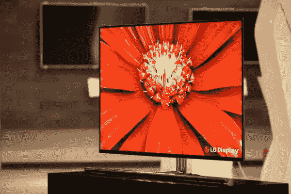

# 55 英寸:LG 将在 CES 2012 TechCrunch 上展示世界上最大的 OLED 电视

> 原文：<https://web.archive.org/web/https://techcrunch.com/2011/12/26/55-inch-lg-oled/>

# 55 英寸:LG 将在 CES 2012 上展示世界上最大的 OLED 电视

至少从索尼在 2007 年推出酷酷的(但太小的) [XEL-1](https://web.archive.org/web/20221003114334/https://beta.techcrunch.com/tag/xel-1/) 以来，我们一直在等待大尺寸的[有机发光二极管](https://web.archive.org/web/20221003114334/https://beta.techcrunch.com/tag/oled)电视。各种[更大的](https://web.archive.org/web/20221003114334/https://beta.techcrunch.com/2011/10/04/ceatec-2011-mitsubishi-showcases-semispherical-display-2-7m-diameter/)[OLED](https://web.archive.org/web/20221003114334/https://beta.techcrunch.com/2011/04/12/sonys-outs-two-new-oled-monitors/)和[【突破】](https://web.archive.org/web/20221003114334/https://beta.techcrunch.com/2011/11/21/sumitomo-chemical-reports-breakthrough-in-large-sized-oled-tv-mass-production/)在之后的几年里成为新闻，现在 LG 表示它准备在 [CES 2012](https://web.archive.org/web/20221003114334/http://www.cesweb.org/) (将于 1 月 10 日开幕)上展示世界上最大的 OLED 电视。

据 LG 称，该面板尺寸为 55 英寸，对比度为 100，000:1，采用[氧化物 TFT](https://web.archive.org/web/20221003114334/http://en.wikipedia.org/wiki/Oxide_thin_film_transistor) 技术开发。该公司一直在开发更大的有机发光二极管设备，例如超薄的 31 英寸型号(去年[展示过](https://web.archive.org/web/20221003114334/https://beta.techcrunch.com/2010/09/02/exciting-video-lgs-oled-tv-is-the-thinnest-in-the-world/))。

到目前为止，一切都很好，但不幸的是，LG 表示，他们认为该设备是普及大尺寸有机发光二极管电视概念的一个进步。换句话说，这款电视目前只是一个原型，既没有价格标签，也没有发布日期，我们可能需要等待数年才能真正购买到一台。

通过[引擎获取](https://web.archive.org/web/20221003114334/http://www.engadget.com/2011/12/25/lgs-55-inch-worlds-largest-oled-hdtv-panel-is-official-comi/#continued)