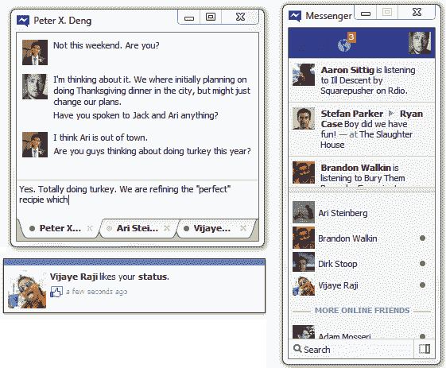

# 更新:脸书正式发布“视窗版信使”桌面客户端

> 原文：<https://web.archive.org/web/https://techcrunch.com/2011/12/29/facebook-chat-windows/>

# 更新:脸书正式发布“信使视窗”桌面客户端泄漏后

**【更新于 2011 年 12 月 29 日下午 5:20**:脸书告诉我他们已经在[帮助中心](https://web.archive.org/web/20230326022229/https://www.facebook.com/help/?faq=140228902751098#What-is-Messenger-for-Windows?-)公开了[的 Messenger 下载链接](https://web.archive.org/web/20230326022229/https://fbcdn_dragon-a.akamaihd.net/cfs-ak-ash4/84995/940/FacebookMessengerSetup.exe)。用户还可以在那里了解客户端的详细信息。尽管如此，仍然没有 Mac 版本的迹象。]

“Facebook Messenger for Windows”的测试组刚刚变得更大了。以色列博客 [TechIT](https://web.archive.org/web/20230326022229/http://techit.co.il/2011/12/%D7%91%D7%9C%D7%A2%D7%93%D7%99-facebook-messenger-%D7%A2%D7%91%D7%95%D7%A8-%D7%9E%D7%A2%D7%A8%D7%9B%D7%AA-%D7%94%D7%94%D7%A4%D7%A2%D7%9C%D7%94-windows-%D7%9C%D7%94%D7%95%D7%A8%D7%93%D7%94/) 泄露了脸书桌面聊天客户端[的 CDN](https://web.archive.org/web/20230326022229/https://techcrunch.com/2011/11/21/messenger-for-windows/) [下载链接](https://web.archive.org/web/20230326022229/http://dragon.ak.fbcdn.net/cfs-ak-ash4/84995/940/FacebookMessengerSetup.exe)脸书上个月开始对少量用户进行测试。客户端包括通知和链接回 Facebook.com 的滚动条，因此可以推动网站的参与度。Messenger 还可能从 AOL Instant Messenger 和 Windows Live Messenger 等其他桌面聊天客户端夺走市场份额。

客户将在两个核心方面帮助脸书:

*   持续访问聊天会增加主要用户的参与度，也会吸引他们的朋友花更多时间在脸书上
*   持续访问启动 Facebook.com 的通知、消息和好友请求，可能会比用户随意访问网站查看这些提醒带来更多的回访

我刚刚测试了 Windows 客户端版本 2.0.4373 的 Facebook Messenger。它很快而且功能直观。它可以浮动，也可以很容易地贴在桌面的工具条上。与脸书今年夏天发布的独立手机信使应用类似，经常联系的朋友会自动进入在线朋友完整列表上方的收藏夹部分。我唯一的不满是注销按钮相对来说很难找到。

AIM 和 Windows Live Messenger 应该担心了。在好友列表中对神秘的屏幕名称进行排序无法与经过认证的身份聊天客户端的用户体验相匹配。脸书的客户端还可以向接收者当前使用的任何设备发送信息。这意味着，即使收件人当前没有登录，他们也可以轻松访问他们的邮件。

AIM 和 Live Messenger 仍然有助于与不是你真正朋友的网友保持联系，但 Messenger for Windows 严重降低了这些服务的独特价值。存在跨不同平台处理聊天的客户端，但是为了与脸书一起工作，它们需要进行配置，这可能会混淆和阻止主流用户。

脸书可能会取消下载链接，以阻止该应用在正式发布前接触到更多用户。所以，如果你想要的话，[现在就下载吧](https://web.archive.org/web/20230326022229/http://dragon.ak.fbcdn.net/cfs-ak-ash4/84995/940/FacebookMessengerSetup.exe)。即便如此，脸书也可以发布应用程序的更新，并停止对这个泄露版本的支持。然而，这将中断它的测试，并迫使那些它实际上想要访问的人重新下载。

可能有一些看不见的安全或稳定性缺陷需要修复。尽管如此，脸书不应该太担心这个泄漏，因为产品看起来不错。相反，它应该考虑通过现在的软发射来利用泄露的压力。【**更新 2011 年 12 月 29 日下午 5:20**:脸书已经这么做了。一个[官方下载链接](https://web.archive.org/web/20230326022229/https://fbcdn_dragon-a.akamaihd.net/cfs-ak-ash4/84995/940/FacebookMessengerSetup.exe)现已在其[帮助中心](https://web.archive.org/web/20230326022229/https://www.facebook.com/help/?faq=140228902751098#What-is-Messenger-for-Windows?-)公开。]

*新闻来源:[The Verge](https://web.archive.org/web/20230326022229/http://www.theverge.com/apps/2011/12/29/2668290/facebook-messenger-for-windows-download)*

