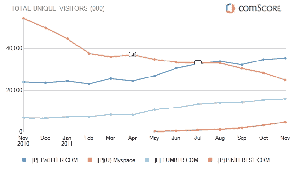
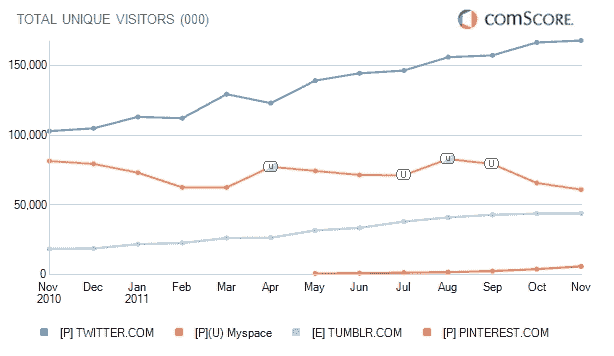

# 社交兴趣网站的新时代:Twitter、Tumblr 和 Pinterest 在 2011 年发展壮大 TechCrunch

> 原文：<https://web.archive.org/web/https://techcrunch.com/2011/12/30/twittertumblrpinterest/>

comScore 的 2011 年社交网络报告中最有趣的趋势之一是迎合用户兴趣的社交网站的新增长，而不是他们现实生活中的社交图表。特别是，根据 comScore 的数据，微博平台 [Twitter](https://web.archive.org/web/20230209125048/http://twitter.com/) 和 [Tumblr](https://web.archive.org/web/20230209125048/http://tumblr.com/) 已经爆发多年，新的在线 pinboard 网站 [Pinterest](https://web.archive.org/web/20230209125048/http://pinterest.com/) 也加入了它们的行列。

但是所有这些增长似乎并没有以牺牲脸书为代价。该网站的流量增长似乎只是在缺乏新用户的地方放缓(而不是下降)。遭受打击的网站是 MySpace。可能以前使用该网站表达自己并关注他们所关心的名人的用户现在在其他网站上做同样的事情。

推特上有最迷人的故事。这种短消息服务在 2009 年初成为主流，并受到了媒体的大量炒作——但 comScore 等第三方测量公司自那以来在美国的流量基本持平，根据 comScore 的数据，每月的访问量在 2000 万到 2500 万之间。

甚至今年开始也很缓慢。4 月份，该公司有 2450 万独立访客。但是，从 5 月到 11 月，该公司增长到 3550 万。Twitter 的全球数字看起来也同样强劲。在过去的 12 个月中，它已经从 1.03 亿个 uniques 增长到 1.679 亿个。是的，这种增长可能部分是由于它与 iOS 5 的集成，该公司最近表示，这导致注册人数增加了 25%。然而，这种集成在 10 月份才上线，这并不能解释整个夏天所有的新用法。

更有趣的是，该公司自己一直表示，第三方服务低估了其流量。例如，9 月份，它宣布，根据谷歌分析统计，全球[的独立访客已经从年初的 2.5 亿增长到 4 亿。它的许多访问者实际上并不发微博，或者甚至没有注册。当时它说自己有 1 亿活跃用户(并在 12 月重申了同样的数字)。](https://web.archive.org/web/20230209125048/https://techcrunch.com/2011/09/08/twitter-has-100m-monthly-active-users-and-40-of-active-users-dont-tweet/)

因此，comScore 的访问者数量与内部的不完全匹配，但趋势是相同的:比以往任何时候都有更多的人阅读推文。这家成立五年的公司似乎终于熬过了炒作周期的起伏，成为主流人群使用网络的一个坚实且不断增长的部分。

明年年初将满五岁的 Tumblr 也已经成熟。从 2010 年 11 月到上个月，美国的独立访客已经从 690 万增长到 1590 万。在世界范围内，它的新流量同样显著，同期从 1860 万增加到 4400 万。

一个新的以兴趣为导向的网站也加入了进来:Pinterest。尽管该公司自 2008 年就已经成立，但直到 2010 年初才开始发出邀请。根据 comScore 的数据，今年 uniques 的销量已经从 5 月份的不到 100 万个上升到 11 月份的 600 多万个。

MySpace 可能不会因为这些伪竞争对手而直接失去用户，但它肯定会继续受到伤害。世界范围内，从 11 月到 11 月，从 8150 万下降到 6100 万。在美国，下降更为明显，从 5440 万下降到 2500 万。

基于所有这些数字，2011 年看起来像是下一个公众自我表达和分享时代的标志性一年。过去几年里，MySpace 上丑陋的、被黑客攻击的用户资料比以往任何时候都不那么受欢迎，用户们正忙着通过他们漂亮的 Tumblr 主题、通过 Twitter 简单的 140 个字符的消息服务以及通过他们的在线 Pinterest 公告板进行分享。

2012 年我们可以期待什么？脸书新的公共分享功能，比如它的订阅按钮，能吸引其他网站的关注吗？早期迹象表明是的。所有这些用法都去哪里了呢？2011 年可能只是一个新时代的开始，普通互联网用户乐于与公众分享他们认为有趣的一切，并关注他们最感兴趣的人，而不仅仅是将他们在现实生活中遇到的人加为好友。

[上面的图，我应该注意的是 10 月到 10 月，而不是 11 月到 11 月，是通过 comScore 的 2011 年社交网络报告，你可以在这里下载。]