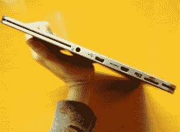
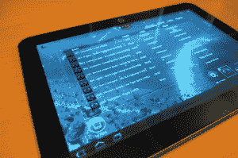

# 东芝新推出的 Excite X10 平板电脑是目前世界上最薄的 10 英寸平板电脑

> 原文：<https://web.archive.org/web/https://techcrunch.com/2012/01/08/toshibas-new-excite-x10-tablet-is-worlds-thinnest-10-inch-for-now/>

太激动了。这是我第一次参加 CES，虽然 [MG 可能是正确的](https://web.archive.org/web/20230310152006/https://techcrunch.com/2012/01/05/best-ces-ever/)认为我的一些科技博主同事觉得这次旅行有点乏味，但我很高兴刚刚来到这里。但我已经对 CES 兴奋了几个星期了，自从我去见了东芝，看了一眼他们最新的平板电脑。

Excite X10 是目前世界上最薄的 10 英寸平板电脑，厚度仅为 0.3 英寸，重量仅为 1.2 磅。但不要忘记，iPad 3 可能就在眼前(本周还有相当多的 Android 平板电脑)，所以任何事情都可能改变。背面采用拉丝镁合金表面，正面采用康宁大猩猩玻璃，以防划伤。真的是美人。

在引擎盖下，您会发现 TI OMAP 4420 1.2GHz 双核处理器以及 1GB 内存。然而，就操作系统而言，东芝有点不确定。这款平板电脑要么在 Q1 中部推出 Android 3.2 蜂巢系统，要么稍晚推出 Android 4.0 冰淇淋三明治系统。我不知道你怎么想，但是我宁愿多等一会儿吃冰淇淋三明治。

10 英寸的屏幕拥有 1280×800 的分辨率，并采用特殊的直接粘合技术制造，实现了如此薄的外形。如果你喜欢视频聊天，会有一个 200 万像素的前置摄像头，而一个 500 万像素的摄像头可以在标签的背面找到。

 东芝的所有关于端口，已经与[每一款平板电脑一同发售](https://web.archive.org/web/20230310152006/https://techcrunch.com/2011/06/07/toshiba-tablet-gets-formal-introduction-and-a-name/)的[上市](https://web.archive.org/web/20230310152006/https://techcrunch.com/2011/12/17/toshiba-thrive-7-review-cute-and-comfy-but-thick/)。使用 Excite X10，您可以访问微型 USB、微型 HDMI 输出和微型 SD 卡插槽。显然，全尺寸端口更容易访问，但将这些较小的连接点安装在如此薄的平板电脑上仍然值得称赞。

东芝也相当擅长不干涉安卓系统，因此很少开发自己的软件。这包括它自己的具有 DNLA 兼容性的媒体播放器(已经对以前的版本进行了改进，看起来更干净)，东芝的文件管理器，网飞和 QuickOffice。东芝还增加了一个应用程序，让你可以抓取屏幕，这是安卓系统长期以来一直缺失的功能，我都不敢想象。

Android 平板电脑在过去的一年里相当失败(Kindle Fire 算是个例外)，但如果这是我们将要看到的东西，我对 2012 年的 Android 平板电脑有很好的感觉。

这个家伙的定价还不清楚，但鉴于它的高端地位，我认为它将比 Kindle Fire 更能对抗 iPad。

(图片说明:Regza 是这款平板电脑的亚洲名字，不会出现在美国设备上)

