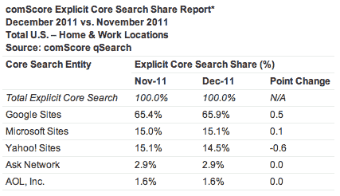

# 微软必应搜索查询 12 月首次超过雅虎

> 原文：<https://web.archive.org/web/https://techcrunch.com/2012/01/11/microsoft-bing-search-queries-overtake-yahoo-for-the-first-time-in-december/>

# 微软必应搜索查询在 12 月首次超过雅虎

comScore 已经发布了 2011 年 12 月的搜索数据，谷歌继续以 65.9%的份额占据主导地位，而 2011 年 11 月和 2010 年 12 月的份额分别为 65.4%和 66.6%。与去年同期相比，12 月份的查询量增长了 9.7%。

雅虎查询的市场份额为 14.5%，而 2011 年 11 月和 2010 年 12 月的市场份额分别为 15.1%和 16.0%。去年 12 月，微软的必应搜索份额为 15.1%，而 2011 年 11 月和 2010 年 12 月的份额分别为 15%和 12.0%。自必应为雅虎搜索提供支持以来，两家搜索引擎的搜索份额之和为 29.6%，而 2011 年 11 月为 30.1%。去年 12 月，美国在线的查询量下降了 8%，份额为 1.6%。

花旗(Citi)分析师马克马哈尼(Mark Mahaney)表示，就搜索查询而言，这是必应在搜索查询方面首次超过雅虎。这两个搜索门户都是由相同的技术驱动的，但显然雅虎搜索流量正在下降，这只是新首席执行官斯科特·汤普森为公司列出的问题清单上的又一个问题。

正如马哈尼在他引用新数据的报告中所写的，“斯科特·汤普森有他的工作要做。”

comScore 还报告称，12 月份进行了超过 182 亿次“显性”核心搜索(增长了 2%)(显性搜索不包括上下文驱动的搜索，这些搜索不
反映特定用户与搜索结果互动的意图)。谷歌网站以 120 亿次搜索(增长 3%)排名第一，其次是微软的 27 亿次(增长 2%)和雅虎的 26 亿次。Ask Network 提供了 5.31 亿次搜索(增长 3%)，而 AOL 当月提供了 2.87 亿次搜索。

美国人在 12 月进行了 205 亿次核心搜索查询(增长 3%)。谷歌有 136 亿次搜索(增长 4%)，其次是雅虎 33 亿次(增长 2%)和微软 28 亿次(增长 2%)。

