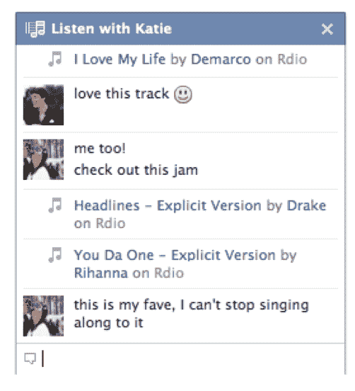
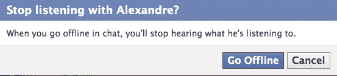
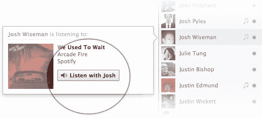

# 脸书推出转盘调频风格同步音乐和聊天技术

> 原文：<https://web.archive.org/web/https://techcrunch.com/2012/01/12/facebook-listen-with/?fb_comment_id=fbc_10150525925937520_20682862_10150526175802520>

脸书[今日推出](https://web.archive.org/web/20221005194605/http://blog.facebook.com/blog.php?post=10150457932027131)自己的同步音乐收听群组聊天室功能。聊天和新闻故事中新的“收听”按钮允许你选择一个朋友作为你的个人 DJ。点击后，你将立即启动 Spotify 或 Rdio，并开始实时听取朋友播放的任何内容。其他朋友也可以加入您的群组聊天聆听室，在那里您可以讨论和热烈谈论您听到的内容，就像您亲自一起聆听一样。

Listen With 将于今天晚些时候面向 Spotify 用户推出，Rdio 将在未来几天内获得支持，脸书计划很快增加更多音乐合作伙伴。这一新功能将迫使[转盘. fm](https://web.archive.org/web/20221005194605/http://turntable.fm/) 专注于公共试听室和名人 DJ，因为与朋友同步收听现在将是脸书的领域。Listen With 可以显著增加该功能用户的脸书现场时间，因为他们需要整天打开脸书浏览器窗口以保持音乐流畅。

**更新** : Turntable.fm 回应——[“turntable . FM 创始人说他很荣幸能和脸书一起聆听，但他们是不同的”](https://web.archive.org/web/20221005194605/https://beta.techcrunch.com/2012/01/12/turntable-facebook-listen-with/)
此外，查看[脸书“一起聆听”艺术家页面链接将帮助音乐人赚钱](https://web.archive.org/web/20221005194605/https://beta.techcrunch.com/2012/01/12/listen-with-musicians/)

这项功能可能会推动流媒体服务的注册，因为用户不想错过与朋友分享的收听体验。以前，我可以接受你的推荐，通过 iTunes、盗版下载或不同的服务单独收听。需要安装相同的音乐应用程序现在，我需要注册您正在使用的任何服务，以加入您的“聆听”房间。通过让用户注册多种流媒体服务，这可能会削弱 Spotify 的赢家通吃地位。不过，技术问题阻碍了对 Rdio 的支持，无助于基于浏览器的服务赶上来。

脸书已经有了“听”按钮，但它们启动了异步播放。虽然公司总是说他们对新功能的推出感到“兴奋”，但产品设计师 Alexandre Roche 尤其热情。他说脸书的内部测试得到了“非常积极的反馈”。大家真的很喜欢。”当被问及脸书是否会推出通过 Hulu 和网飞观看视频的类似功能时，Roche 说那会很酷，“也许在未来”。

该功能的工作方式是，[任何你允许查看你的音乐收听活动的人](https://web.archive.org/web/20221005194605/http://www.facebook.com/help/?faq=100159030107509%5D)也会在聊天中看到你名字旁边的音乐笔记图标，如果你正在收听的话。当点按或悬停在上面时，他们正在播放的歌曲的名称和“收听”按钮会出现。如果有人点了你的“聆听”按钮，他们将会同时听到和你完全一样的音符。该功能将为你们两个打开一个聊天室，并向你的朋友发布一个新闻故事“乔希正在和亚历山大·罗奇一起听音乐。”

多达 50 个朋友可以加入您的听力聊天室。当 DJ 从一首歌换到另一首歌时，每个人都会跟着唱。要中断共享体验，听众可以暂停、切换歌曲、关闭音乐应用程序、关闭脸书或在聊天中离线。该功能目前唯一明显的缺点是，如果聊天室里有人想为其他人播放一些东西，你不能替换一个新的 DJ。然而，从一个 DJ 到另一个 DJ 迁移一个房间可能会弄乱隐私，所以不允许切换是有道理的。

Roche 说他是 Turntable.fm 的粉丝，在收听生态系统中仍然会有它的一席之地。他认为“Turntable.fm 更多的是寻找你喜欢的流派”，从陌生人那里发现音乐。

我认为 Turntable.fm 需要让自己与众不同，因为一个核心用例已经被一个更广泛采用的服务所包含。它有漂亮的图形、头像和游戏化，但用途是一样的。由于 Listen With 是纯社交网站，Turntable.fm 应该增加更多探索功能，比如按流派标记试听室，以便于浏览。

**更新**:我被列入了白名单，一直在试用“一起听”。坦白说，我喜欢它。倾听是直观产品设计的一个很好的例子。随着 f8 脸书音乐的推出，社交音乐发现和分享体验的目标实现了。

【T2